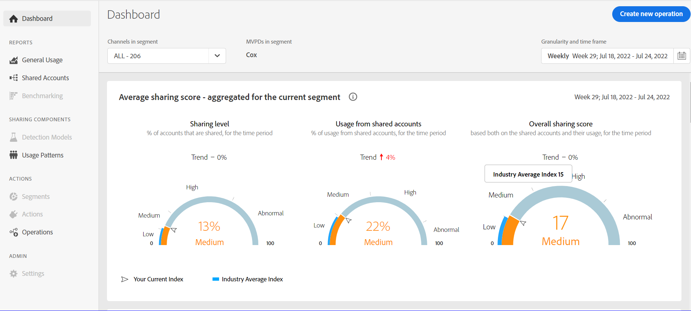

# O painel {#dashboard}

O Painel resume e agrega dados em uma coleção de gráficos e relatórios criada para fornecer uma visão geral de alto nível do escopo e impacto do compartilhamento de conta. Ele fornece uma única página contendo os principais relatórios e métricas do QI da conta.

+++Programador- painel

Figura: O painel para usuários programadores

+++

+++MVPD- painel

O painel para usuários de MVPD é um pouco diferente dos usuários do programador.

Figura: O painel para usuários do MVPD

+++

## Pontuação média de compartilhamento - agregada para o segmento atual {#aggregated-sharing}

O painel Pontuação de compartilhamento agregada fornece uma leitura de linha superior resumindo a quantidade e o impacto do compartilhamento em termos de contas e volume de streaming.

Os valores ajudam você a entender a magnitude do compartilhamento de credenciais pelos assinantes, fornecendo uma medida da necessidade de agir de acordo com ela.

*Figura: Painel de pontuação de compartilhamento médio - agregado para o segmento atual*

As três métricas a seguir são componentes da Pontuação média de compartilhamento.

### Nível de compartilhamento {#sharing-level}

O medidor de nível de compartilhamento mostra a porcentagem de todas as contas de assinantes (no segmento definido) que foram compartilhadas durante o intervalo de tempo selecionado.

Um valor calculado com base na média da probabilidade de compartilhamento calculada para cada conta no conjunto de MVPDs selecionados que foram transmitidos de um dos canais de programador selecionados durante o intervalo de tempo selecionado.

*Figura: Nível de compartilhamento*

O indicador de Tendência mostra a mudança de porcentagem no valor da métrica em em relação ao período anterior.

### Uso de contas compartilhadas {#usage-from-shared-accounts}

Esse medidor indica qual é a porcentagem do uso de todas as contas de assinante das contas compartilhadas para o segmento e período de tempo definidos. O medidor marca os intervalos de uso (de contas compartilhadas) na escala de 0 a 100%. Esses intervalos — chamados de Baixo, Médio, Alto e Anormal — são baseados na média do setor.

Você também pode ver o indicador de Tendência, que descreve um aumento ou queda no uso de contas compartilhadas em comparação ao período anterior.

*Figura: Uso de contas compartilhadas*

### Pontuação de compartilhamento geral {#overall-sharing-score}

A pontuação de compartilhamento geral é composta de pontuações de compartilhamento, incluindo &quot;Nível de compartilhamento&quot; e &quot;Uso z de contas compartilhadas&quot;.

Ele fornece um valor para refletir o impacto relativo do compartilhamento em comparação com o setor. Seu propósito é semelhante ao de uma pontuação de crédito, resumindo a situação com um único número. Mas, neste caso, quanto maior o número, maior o dano potencial.

*Figura: Pontuação de compartilhamento geral*

<!--### MVPDs in segment {#mvpd-in-segment}

It is a table of risk indices and accounts totals for the top MVPDs ranked by overall usage or account sharing.

-->

## Pontuações de compartilhamento em todo o setor para MVPDs {#top-mvpds}

Esta tabela fornece uma exibição comparativa das diferentes Pontuações de Compartilhamento Agregado para os MVPDs no segmento.

>[!NOTE]
>
>Esta tabela utiliza dados gerais do setor para fins comparativos, não os dados representados por esses MVPDs no segmento.

*Figura: Principais MVPDs no segmento por pontuação geral*

## Compartilhamento de pontuação por canais e MVPDs {#sharin-score-by-channels-and-mvpds}

Esta tabela fornece uma exibição comparativa das pontuações de compartilhamento dos canais selecionados para os MVPDs no segmento atual.

*Figura: Compartilhamento de pontuações por canais e MVPDs*

## Probabilidade de compartilhamento de contas {#accounts-sharing-probability}

Este gráfico divide-se em intervalos de probabilidade de compartilhamento de quintis de muito baixo (0-20%) a muito alto (80=100%).

>[!NOTE]
>
>O gráfico de barras usa uma escala logarítmica.

*Figura: Números e porcentagens de contas de assinantes em diferentes intervalos de probabilidade de compartilhamento*

## Número de contas e utilização por nível de probabilidade de compartilhamento {#number-of-accounts-usage-sharing-probability}

Esse painel fornece uma exibição tabular de contas particionadas em intervalos de probabilidade de compartilhamento de quintis de muito baixo (0-20%) a muito alto (80-100%) com o uso associado de cada quintil a partir de contas compartilhadas.

*Figura: Número de contas, tendências e usos que caíram em vários intervalos de probabilidade*

<!--
+++Dashboard for programmers

*Figure: The dashboard*

>>>>>>> 7ab48cf61552febab21a5d5c05586e0aefe8ce17
## Average sharing score - aggregated for the current segment {#aggregated-sharing}

The Aggregated Sharing Score panel provides a top line readout summarizing the quantity and impact of sharing in terms of accounts and streaming volume.

The values help you understand the magnitude of credential sharing by your subscribers, hence providing a measure of the need to act upon it.

*Figure: Average sharing score panel - aggregated for the current segment*

The following three metrics are components of the Average Sharing Score.

### Sharing level {#sharing-level}

The sharing level gauge shows the percentage of all your subscriber accounts (in the defined segment) that are shared, during the selected time frame.  

A value calculated based on an average of the sharing probability computed for every account for the selected MVPD(s) that has streamed from a one of the selected programmer channels during the selected time frame.

*Figure: Sharing level*

The Trend indicator shows the percentage change in the value of the metric in from the previous time frame.

### Usage from shared accounts {#usage-from-shared-accounts}

This gauge indicates what percent of the usage of all the subscriber accounts is from the shared accounts for the defined segment and time period. The gauge marks the ranges of usage (from shared accounts) on the scale of 0 to 100%. These ranges (named Low, Medium, High, and Abnormal) are based on the industry average.

You can also see the Trend indicator, which depicts a rise or fall in the usage from shared accounts as compared to the previous time frame.

*Figure: Usage from shared accounts*

### Overall sharing score {#overall-sharing-score}

Overall sharing score is composite of sharing scores including "Sharing level" and "Usage from shared accounts".

It provides a value meant to reflect the relative impact of sharing when compared to the industry. Its purpose is similar to that of a credit score, summarizing the situation with a single number. But in this case, the higher the number the greater the potential harm.

*Figure: Overall sharing score*

## Industrywide overall sharing scores {#mvpd-in-segment}

+++Programmer- MVPDs in segment

This table provides a comparative view of the different Aggregated Sharing Scores for the MVPDs in the segment.

*Figure: Panel showing top MVPDs in a segment*

>[!NOTE]
>
>This table uses overall industry data for comparative purposes, not the data represented by those MVPDs in the segment.

+++

+++MVPD- Programmers in segment

This table provides a comparative view of the different Aggregated Sharing Scores for the programmers in the segment.

*Figure: Panel showing top programmers in a segment*

+++

## Sharing score by channels and MVPDs {#sharin-score-by-channels-and-mvpds}

+++Programmer- MVPDs in segment

This table provides a comparative view of sharing scores of the selected channels for the MVPDs in the current segment.

*Figure: Sharing scores by channels and MVPDs*

>[!NOTE]
>
>**Sharing score by channels and MVPDs** panel is available only for programmer login.

+++

## Accounts sharing probability distribution{#accounts-sharing-probab-dist}

This panel partitions accounts into ranges of sharing probability quintiles from very low (0-20%) to very high (80-100%).

Pie chart shows the proportions (in term of percentages) of user accounts in various sharing probability ranges. Whereas, column chart shows the absolute numbers of accounts in different probability ranges.

>[!NOTE]
>
>The column chart uses a logarithmic scale.

*Figure: Percentages and number of subscriber accounts in different sharing probability ranges*

### Accounts over threshold in current segment {#acc-over-threshold-in-segment}

You can select a level of sharing probability, out of the following to view number and percentage of accounts above it:

* Over very low (0%-20%) probability

* Over low (20%-40%) probability

* Over moderate (40%-60%) probability

* Over high (60%-80%) probability

## Number of accounts and usage by sharing probability level {#number-of-accounts-usage-sharing-probability}

This panel provides tabular view of  accounts partitioned into ranges of sharing probability quintiles from very low (0-20%) to very high (80-100%) with each quintile's associated usage from shared accounts.

*Figure: Number of accounts, trends, and usages falling in various probability ranges*

-->