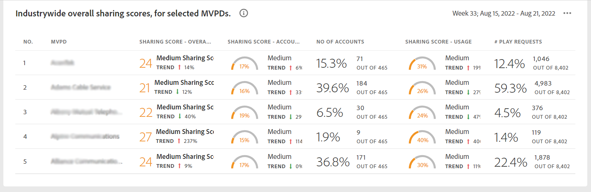

# O painel {#dashboard}

O Painel resume e agrega dados em uma coleção de gráficos e relatórios criada para fornecer uma visão geral de alto nível do escopo e impacto do compartilhamento de conta. Ele fornece uma única página contendo os principais relatórios e métricas do QI da conta.

## Pontuação média de compartilhamento - agregada para o segmento atual {#aggregated-sharing}

O painel Pontuação de compartilhamento agregada fornece uma leitura de linha superior resumindo a quantidade e o impacto do compartilhamento em termos de contas e volume de streaming.

Os valores ajudam você a entender a magnitude do compartilhamento de credenciais pelos assinantes, fornecendo uma medida da necessidade de agir de acordo com ela.

As três métricas a seguir são componentes da Pontuação de compartilhamento agregada.

### Nível de compartilhamento {#sharing-level}

O medidor de nível de compartilhamento mostra a porcentagem de todas as contas de assinantes (no segmento definido) que foram compartilhadas durante o intervalo de tempo selecionado.

Um valor calculado com base na média da probabilidade de compartilhamento calculada para cada conta no conjunto de MVPDs selecionados que foram transmitidos de um dos canais de programador selecionados durante o intervalo de tempo selecionado.

O indicador de Tendência mostra a mudança de porcentagem no valor da métrica em em relação ao período anterior.

### Uso de contas compartilhadas {#usage-from-shared-accounts}

Esse medidor indica qual é a porcentagem do uso de todas as contas de assinante das contas compartilhadas para o segmento e período de tempo definidos. O medidor marca os intervalos de uso (de contas compartilhadas) na escala de 0 a 100%. Esses intervalos — chamados de Baixo, Médio, Alto e Anormal — são baseados na média do setor.

Você também pode ver o indicador de Tendência, que descreve um aumento ou queda no uso de contas compartilhadas em comparação ao período anterior.

### Pontuação de compartilhamento geral {#overall-sharing-score}

A pontuação de compartilhamento geral é composta de pontuações de compartilhamento, incluindo &quot;Nível de compartilhamento&quot; e &quot;Uso z de contas compartilhadas&quot;.

Ele fornece um valor para refletir o impacto relativo do compartilhamento em comparação com o setor. O objetivo é semelhante ao de uma pontuação de crédito, resumindo a situação com um único número. Mas, neste caso, quanto maior o número, maior o dano potencial.

<!--### MVPDs in segment {#mvpd-in-segment}

It is a table of risk indices and accounts totals for the top MVPDs ranked by overall usage or account sharing.

-->

### Pontuações de compartilhamento em todo o setor para MVPDs {#top-mvpds}

Esta tabela fornece uma exibição comparativa das diferentes Pontuações de Compartilhamento Agregado para os MVPDs no segmento.

>[!NOTE]
>
>Esta tabela utiliza dados gerais do setor para fins comparativos, não os dados representados por esses MVPDs no segmento.

### Compartilhamento de pontuação por canais e MVPDs {#sharin-score-by-channels-and-mvpds}

Esta tabela fornece uma exibição comparativa das pontuações de compartilhamento dos canais selecionados para os MVPDs no segmento atual.

### Probabilidade de compartilhamento de contas {#accounts-sharing-probability}

Este gráfico divide-se em intervalos de probabilidade de compartilhamento de quintis de muito baixo (0-20%) a muito alto (80=100%).

>[!NOTE]
>
>O gráfico de barras usa uma escala logarítmica.

### Número de contas e utilização por nível de probabilidade de compartilhamento {#number-of-accounts-usage-sharing-probability}

Esse painel fornece uma exibição tabular de contas particionadas em intervalos de probabilidade de compartilhamento de quintis de muito baixo (0-20%) a muito alto (80=100%) com o uso associado de cada quintil a partir de contas compartilhadas.

