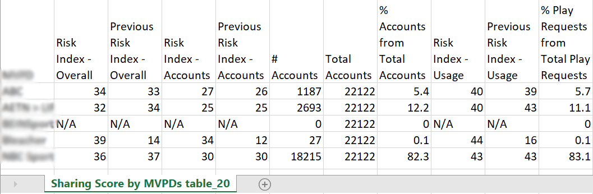

# Exportar métricas para um MVPD e programadores selecionados {#export-metric}

O Painel no Account IQ exibe tabelas e gráficos para as estatísticas de compartilhamento de credenciais das contas de assinantes no segmento selecionado. Além de visualizar os padrões de compartilhamento e pontuações, você também pode exportar as métricas de uso da conta e compartilhar pontuações para os assinantes dos MVPDs e canais no segmento selecionado a partir dessas tabelas.

Para exportar métricas para um MVPD e programadores selecionados, uma vez que você esteja conectado como um usuário autorizado do MVPD:

1. Defina um segmento desejado seguindo as etapas em [Como definir segmentos e selecionar período](/help/AccountIQ/howto-select-segment-timeframe.md) para avaliação de [segmento e período](/help/AccountIQ/segments-timeframe.md) painel.

1. Vá para um dos seguintes painéis:

   * Programadores no segmento
      

   * Número de contas e utilização por nível de probabilidade de compartilhamento

      

1. Selecionar **Exportar** disponível no canto superior direito do painel.

Os dados são exportados no formato CSV e o arquivo é baixado localmente no dispositivo. Você pode usar o visualizador e o editor de CSV desejados para abrir os relatórios exportados.

* Programadores no segmento

   

* Número de contas e utilização por nível de probabilidade de compartilhamento

   
