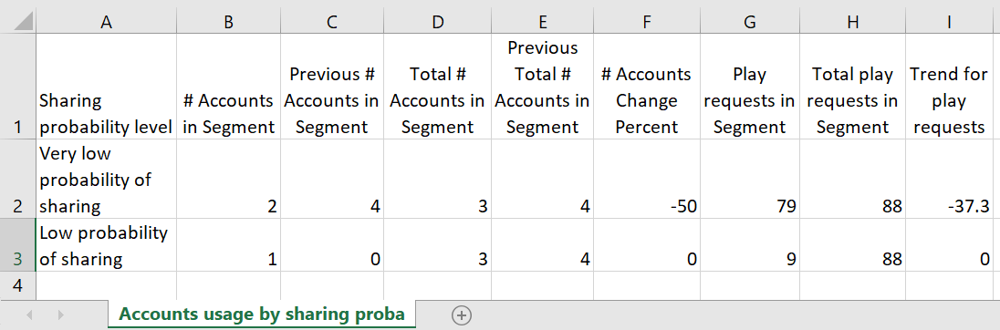

# Exportar métricas para um programador e MVPDs selecionados em um segmento {#export-metric}

O Painel no Account IQ exibe tabelas e gráficos para estatísticas de compartilhamento de credenciais das contas do assinante no segmento selecionado. Além de visualizar os padrões e pontuações de compartilhamento, você também pode exportar as métricas de uso da conta e as pontuações de compartilhamento para os assinantes dos MVPDs e canais no segmento selecionado dessas tabelas.

Para exportar métricas para programadores específicos e os MVPDs selecionados no segmento, depois de fazer logon como um usuário programador autorizado:

1. Defina um segmento desejado seguindo as etapas em [Como definir um segmento e selecionar o período](/help/AccountIQ/howto-select-segment-timeframe.md) para avaliação de [segmento e período](/help/AccountIQ/segments-timeframe.md) painel.

1. Vá para um dos seguintes painéis:

   * Pontuações gerais de compartilhamento do setor para MVPDs selecionados
     

   * Pontuação de compartilhamento por canais e MVPDs

     

   * Número de contas e uso por nível de probabilidade de compartilhamento

     

1. Selecionar **Exportar** opção disponível no canto superior direito do painel.

Os dados são exportados em formato CSV e o arquivo é baixado localmente no dispositivo. Você pode usar o visualizador e o editor de CSV desejados para abrir os relatórios exportados.

* Pontuações de compartilhamento no nível do setor para MVPDs selecionados

  

* Pontuação de compartilhamento por canais e MVPDs no segmento

  

* Número de contas e uso por nível de probabilidade de compartilhamento

  
