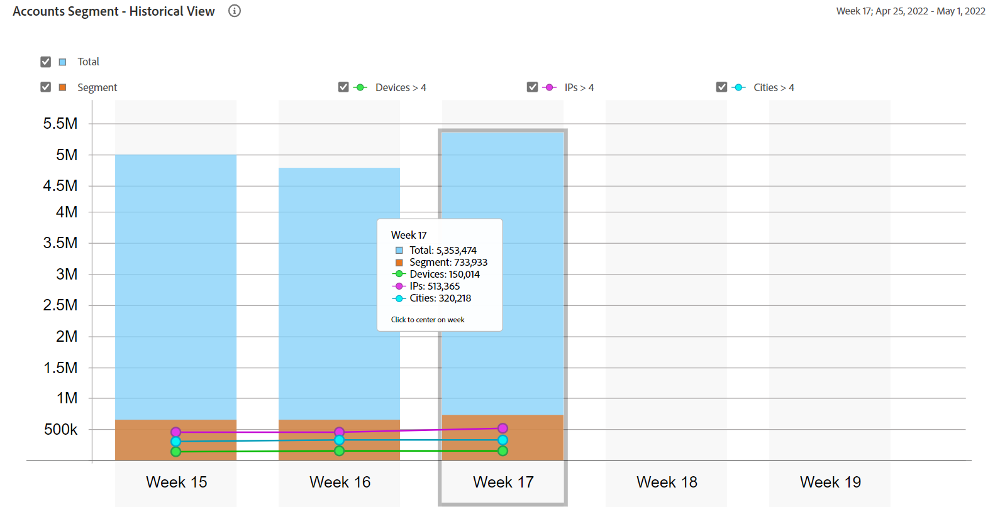

# Relatórios de uso geral {#general-usage-reports}

Relatórios de QI da conta são ferramentas de análise básicas e relatórios que permitem detalhar os dados para isolá-los [coortes](/help/AccountIQ/product-concepts.md#segmet-def), identifique anomalias e crie uma compreensão das características da sua conta.

A página Relatórios de uso geral fornece ferramentas para desenhar métricas de subgrupos com base no número de dispositivos de conta em uso, IPs detectados e respectivos códigos postais.

<!--Divide the content in cohorts.

Content filters
device filters

segment and definition replicate to cohorts. Number of people and number of account that ......
content consumption.....-->

Todos os relatórios se baseiam no segmento atual selecionado usando [Segmentos e período](/help/AccountIQ/howto-select-segment-timeframe.md) painel. Você pode ajustar sua seleção e refinar ainda mais especificando (número de dispositivos, número de IPs e número de CEPs) limites em [Visão Geral do Instantâneo - Contas acima de limites](#snapshot-overview) painel.

<!--To view General Usage Reports:

1. Select the desired MVPDs from the **MVPDs in Segment** option.

2. Select the desired programmer channels from the **Channels in Segment** Option.

3. Select an appropriate time frame from the **Granularity and time frame** option.

   Using the above options you have defined segments for your analysis. Based on your segment selection, following graphs and reports are displayed.

4. You can fine tune your selection and further narrow it down by specifying (number of devices, number of IPs, and number of zip codes) thresholds in [Snapshot Overview - Accounts above thresholds](#snapshot-overview) widget/panel.-->

## AuthN OK / AuthZ OK / Play Requests / Unique Subscribers {#authn-authz-playreq-uniquesubs}

Os gráficos de linha aqui fornecem uma visão das alterações em valores AuthN OK, AuthZ OK, Reproduzir solicitações e Assinantes únicos ao longo do tempo em um intervalo de tempo selecionado para o segmento definido.

+++Programador- **AuthN OK / AuthZ OK / Play Requests / Unique Subscribers**

*Figura: AuthN OK / AuthZ OK / Play Requests / Unique Subscribers for programmer user*

+++

+++MVPD- **AuthN OK / AuthZ OK / Assinantes únicos**

*Figura: AuthN OK / AuthZ OK / Assinantes únicos para usuário MVPD*

+++

O eixo x apresenta as unidades dentro do período atual e o eixo y representa as métricas básicas de atividade do assinante durante esse período. Os gráficos de linha permitem comparar os seguintes valores para assinantes de MVPDs e canais selecionados no painel de seleção de segmentos:

* **AuthN OK**

   AuthN OK é o número de autenticações bem-sucedidas. Para obter mais informações e definições, consulte [Conceitos do produto: AuthN OK](/help/AccountIQ/product-concepts.md#authn-ok-def).

* **AuthZ OK**

   AuthZ OK é o número de autorizações bem-sucedidas. Para obter mais informações e definições, consulte [Conceitos do produto: AuthZ OK](/help/AccountIQ/product-concepts.md#authz-ok-def).

* **Reproduzir solicitações**

   Reproduzir solicitações é o número de Solicitações. Para obter mais informações e definições, consulte [Conceitos do produto: Reproduzir solicitações](/help/AccountIQ/product-concepts.md#play-requests-def)

   >[!NOTE]
   >
   >O gráfico de linha de solicitações de reprodução não está disponível para usuários do MVPD.

* **Assinantes únicos**

   Assinantes únicos são o número de assinantes únicos bem-sucedidos. Para obter mais informações e definições, consulte [Conceitos do produto: Assinantes únicos](/help/AccountIQ/product-concepts.md#unique-subscriber-def)

   >[!NOTE]
   >
   >O número total de assinantes únicos também inclui o número de dispositivos exclusivos se o uso de Adobe TempPass (que é uma visualização gratuita) por um programador fizer parte do segmento.

## Visão Geral do Instantâneo - Contas acima de limites {#snapshot-overview}

Ajuste suas análises e relatórios usando este filtro adicional para definir vários limites de uso. Depois de definir seu segmento (ou coorte) para análise selecionando os MVPDs e canais desejados, você também pode usar os seguintes filtros para analisar o comportamento dos assinantes:

* Limite de dispositivos

* Limite de IPs

* Limite do número de códigos postais

Ao atualizar valores de limite em [Segmento de contas - com base em limites selecionados](#account-segments-basedon-segments) , é possível visualizar o efeito em:

* [Dispositivos por semana (ou mês) por conta](#devices-week-account)

* [Locais por semana (ou mês) por conta](#locations-week-account)

* [IPs por semana (ou mês) por conta](#ip-week-account)

* [Exibição histórica do segmento de contas](#account-segment-historical-view)

>[!NOTE]
>
>O valor padrão para cada limite é 4. Ou seja, a página Uso geral mostra a análise para MVPDs com assinantes usando quatro (e mais de quatro) dispositivos, consumindo conteúdo de quatro (e mais) localizações geográficas diferentes e quatro (e mais) códigos postais diferentes.

### Segmento de contas - com base em limites selecionados {#account-segments-basedon-segments}

O **Segmento de contas - com base em limites selecionados** fornece opções para definir limites (entre 1 e 10) para o número de dispositivos, número de IPs e número de CEPs.

O gráfico mostra o seguinte:

* número absoluto de contas de assinantes, e

* porcentagem do total de contas de assinantes nesse segmento,

   que estão usando X número de dispositivos, Y número de IPs e Z número de CEPs para consumir conteúdo do seu canal para os (segmento definido de) MVPDs, por um período.

## Dispositivos por semana (ou mês) por conta {#devices-week-account}

O **gráfico de barras** O fornece insights do comportamento de uso em termos de como os assinantes estão usando seus dispositivos para acessar conteúdo.

O eixo x representa o número de contas e o eixo y representa o número de dispositivos. Com base no limite definido para o número de dispositivos por conta, ele marca o número absoluto de contas de assinantes que consomem conteúdo de um número específico de dispositivos na duração de uma semana.

Ao passar o mouse sobre uma barra (específica para o número de dispositivos), é exibido um rótulo que fornece informações sobre o número de contas de assinantes (e a porcentagem do total de contas de assinantes no segmento) que estão transmitindo o conteúdo do canal usando esses muitos dispositivos em uma semana.

O gráfico também marca o seguinte:

* Uma linha vermelha para marcar o limite definido.

* Uma linha verde para marcar a média do número de diferentes dispositivos usados por uma conta de assinante por semana (ou mês).

Você pode comparar o nível do limite com a média semanal do número de diferentes dispositivos usados por uma conta para avaliar o nível de compartilhamento.

O gráfico também mostra a porcentagem de contas de assinantes que estão usando mais dispositivos do que o limite definido.

O gráfico de rosca ajuda você a avaliar a magnitude das contas de assinantes que consomem conteúdo de canal usando dispositivos que excedem o limite definido (em um período) rapidamente.

## Locais por semana (ou mês) por conta {#locations-week-account}

Like [Dispositivos por semana (ou mês) por conta](#devices-week-account), os Locais por semana (ou mês) por métrica de Conta ajudam a analisar o uso da conta do assinante de diferentes locais, para identificar mais detalhadamente o compartilhamento de senha. O eixo x representa o número de contas e o eixo y representa o número de locais.

Resultados dessa métrica combinados com o número de [Dispositivos por semana (ou mês) por conta](#devices-week-account) e número de [IPs por semana (ou mês) por conta](#ip-week-account) Ajudar você a julgar com mais precisão as instâncias de compartilhamento de senha; de forma que os usuários autênticos não sejam contados.

Depois de definir um segmento e definir o limite para o número de locais, é possível identificar no gráfico:

* Número (e porcentagem) de assinantes que estão consumindo conteúdo de (um específico) x número de locais em uma semana.

* Porcentagem do total de contas de assinantes que estão visualizando conteúdo de mais locais do que o limite.

* Compare a média semanal (número de locais diferentes para uma conta) com o Limite.

## IPs por semana (ou mês) por conta {#ip-week-account}

Semelhante a [Dispositivos por semana (ou mês) por conta](#devices-week-account) e [Locais por semana (ou mês) por conta](#locations-week-account), o **Número de IPs por semana por conta** permite analisar o compartilhamento de senha com mais precisão e granularidade.

O eixo x representa o número de contas e o eixo y representa o número de IPs.

Depois de definir um segmento (selecionando MVPDs e canais) e definir o limite para o número de IPs, é possível identificar no gráfico:

* Número (e porcentagem) de assinantes que estão consumindo conteúdo de (um específico) x número de IP em uma semana.

* Porcentagem do total de contas de assinantes que estão visualizando conteúdo de mais endereços IP do que o limite.

* Compare a média semanal (número de IPs diferentes para uma conta) com o Limite.

## Segmento de contas - Exibição histórica {#account-segment-historical-view}

O gráfico de barras Exibição histórica ajuda você a comparar as métricas de uso em diferentes intervalos de tempo. Além disso, ele representa coletivamente as várias métricas de uso, como [Dispositivos por semana (ou mês) por conta](#devices-week-account), [Locais por semana (ou mês) por conta](#locations-week-account)e [IPs por semana (ou mês) por conta](#ip-week-account).

* O eixo x representa o período e o eixo y representa o número de contas de assinantes, dispositivos, locais e IPs.

* As barras coloridas laranja significam segmentos em vários intervalos de tempo.

* O gráfico de linhas representa as alterações em [Dispositivos por semana (ou mês) por conta](#devices-week-account), [Locais por semana (ou mês) por conta](#locations-week-account)e [IPs por semana (ou mês) por conta](#ip-week-account) valores no período com base no limite.

* As barras azuis significam o número total de assinantes ativos no setor por um período.

* É possível selecionar legendas específicas e elas ajudam a dimensionar o gráfico.

>[!MORELIKETHIS]
>
>* Saiba como exportar relatórios para os 1000 principais assinantes no segmento selecionado usando filtros no Relatório de uso geral usando [Exportar as 1000 contas principais](/help/AccountIQ/export-acc-information.md) opção.

