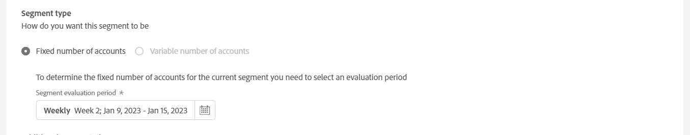

# Criar uma operação em um segmento de usuário {#operation-to-track-segment}

Cada página de relatórios no Account IQ tem uma **Criar nova operação** opção para ajudar a criar workflows para automatizar (e simplificar) várias ações (em massa) em contas de assinantes; definir regras para especificar uma amostra, definir ações e registrar e analisar os efeitos dessas ações. Na página para criar operações, você pode definir a amostra de grupos de usuários nos quais as operações serão executadas e agendar a operação para execução em uma data futura.

Para criar uma operação:

1. Defina seu segmento (coorte) para análise em qualquer página de relatórios ou painéis, usando as etapas em [Definição de segmentos e período](/help/AccountIQ/howto-select-segment-timeframe.md).

1. Selecionar **Criar nova operação** opção disponível em qualquer uma das páginas de relatórios ou painéis. A variável **Criar nova operação** é exibida.

   
   *Figura: Página para criar uma nova operação*

1. No **Criar nova operação** preencha os detalhes nos campos de formulário para:

   * [Nome da operação](#operation-details) em Detalhes da operação
   * Segmento no qual executar a operação [Segmento de público alvo](#segment) e refinar o segmento usando [Segmentação adicional](#additional-segmentation)
   * [Tipo de segmento](#segment-type) em [Segmento de público alvo](#segment)
   * [Ação](#action)
   * [Agendar ativação](#schedule)

1. [Salvar a operação](#save-operation).

## Detalhes da operação {#operation-details}

+++Programador- detalhes da operação

Nomeie a nova operação em **Nome da operação** em Detalhes da operação. Por exemplo, &quot;*Teste o efeito da autenticação multifator nos assinantes do MVPD X&quot; ou &quot;Limite o número de fluxos no Monitoramento de simultaneidade&quot; ou &quot;Limite os assinantes do MVPD D que visualizam o canal &#39;N&#39; de 20 dispositivos adicionais*&quot;.

+++

+++MVPD- detalhes da operação

Nomeie a nova operação em **Nome da operação** em Detalhes da operação. Por exemplo, &quot;*Teste o efeito da autenticação multifator nos visualizadores do canal N&quot; ou &quot;Limite o número de fluxos no Monitoramento de simultaneidade&quot; ou &quot;Limite os assinantes que visualizam o canal &#39;N&#39; em 20 dispositivos adicionais*&quot;.

+++

## Segmento de público alvo {#segment}

+++Programador- Segmento de público alvo

A variável **Segmento** aqui define os usuários que serão operados por esta operação; ou o grupo de exemplo para a sua operação. O segmento padrão é o **segmento** você selecionou usando [painel segmento e período](/help/AccountIQ/howto-select-segment-timeframe.md) em relatórios ou painéis principais na etapa 1 acima.

<!--* The first segment entry in the **Segment** section, by default, shows the **segment** you selected in the step 1.

* The **segment evaluation period** is the time period of analysis you selected in step 1 from **Granularity and Timeframe** option.

*Figure: Segment and timeframe selection on the main page*-->

Esse segmento define os assinantes que serão afetados pela operação que está sendo criada. Por exemplo, o segmento selecionado pode especificar *todas as contas de assinantes do MVPD chamadas &#39;C&#39; que visualizam o canal &#39;N Sports&#39;*.

+++

+++MVPD- Segmento de público alvo

A variável **Segmento** aqui define os usuários que serão operados por esta operação; ou o grupo de exemplo para a sua operação. O segmento padrão é o **segmento** você selecionou usando [painel segmento e período](/help/AccountIQ/howto-select-segment-timeframe.md) em relatórios ou painéis principais na etapa 1 acima.

<!--* The first segment entry in the **Segment** section, by default, shows the **segment** you selected in the step 1.

* The **segment evaluation period** is the time period of analysis you selected in step 1 from **Granularity and Timeframe** option.

*Figure: Segment and timeframe selection on the main page*-->

Esse segmento define os assinantes (que são visualizadores de canais específicos) que serão afetados pela operação que está sendo criada. Por exemplo, seu segmento (padrão) inclui *todas as contas de assinantes que visualizam o canal &#39;N Sports&#39;*.
+++

### Segmentação adicional {#additional-segmentation}

Além disso, você pode refinar seu segmento do target adicionando mais métricas. Por exemplo, você pode adicionar uma Probabilidade de compartilhamento maior que 90% como outra métrica. Então, agora a descrição do problema diz: *&quot;crie uma operação para contas de assinante do MVPD chamadas &#39;C&#39; que estejam visualizando o canal &#39;N Sports&#39; com uma probabilidade de compartilhamento maior que 90%&quot;*.

*Figura: Segmentação adicional*

Além disso, se você refinar a operação adicionando outra métrica para o número de dispositivos, a declaração de problema atualizada será *&quot;criar uma operação para contas de assinantes do MVPD chamadas &#39;C&#39; que estejam visualizando o canal &#39;N Sports&#39; com uma pontuação de compartilhamento superior a 90 e que estejam usando mais de 5 dispositivos para exibir conteúdo durante o período de avaliação&quot;*.

*Figura: Segmento de exemplo refinado com pontuação geral de compartilhamento e número de métricas de dispositivos*

Ao fazer isso, o grupo de usuários se torna mais refinado. Portanto, ao adicionar mais métricas e condições, você está qualificando ainda mais o segmento para definir as contas nas quais operar.

### Tipo de segmento {#segment-type}

Tipo de Segmento é a maneira como um segmento é tratado durante o período de avaliação da operação.

*Figura: Refine o número de segmentos para operar usando o Tipo de segmento*

<!--The segment type option allows you to further refine your segment based on the evaluation period (or time).

**Fixed number of accounts** 

When you select **Fixed number of accounts** segment type, then you need to specify an evaluation period as well.

By doing so, you are fixing the sample size for evaluation in terms of numbers. You are making Account IQ identify a specific set of users (that meet the criteria of defined evaluation period and segment metrics) to operate on. The analysis and graphs will be generated for this specific set of users only (identified initially) throughout the operation.

**Variable number of accounts**

When you select **Variable number of accounts** segment type, you do not limit the number of accounts in segment. The accounts which fall under the defined segment metrics are the part of the segment, and the number of accounts will change continuously during the course of operation.-->

>[!IMPORTANT]
>
>Você só pode usar **Número fixo de contas** opção, a partir de agora. A opção para selecionar **Número variável de contas** estará disponível em versões futuras.

<!--

you tell Account IQ in the beginning of the operation which number of accounts to operate on.

Account IQ system only has a segment definition, and during the operation it looks into all the accounts that fit that segments.

the number of accounts in segment is not limited, the accounts that fall under defined segment metrics will be part of the segment, and the no of accounts will change continuously, as there are no specific limitations - like an evaluation period in the past.When the segment is defined (which in this example is, subscriber accounts of MVPD 'C' who are viewing the channel 'N Sports' that have a sharing score above 80 and are using 10 different IPs) and we also identified a time period to evaluate a segment. This identifies X number of accounts as sample (for example 5000). How many devices they are using?
It identifies x-number of accounts (5000)...a very specific set of users that meet this criteria.
for every period that we schedule (within that operation) during that operation) we will look at those 5K users that are originally identified and we will present graph about them. How are the sharing scores coming up?u We identified a period. Are their sharing scores going up? Are there fewer of them who are meeting this definition?
Fixed versus variable is the way the treated in fixed or variable way.

1. we identified a fixed set of accounts.
2. we evaluate those specific accounts on criteria throughout the operation.

General idea independent of graph is that we will evaluate a set of accounts identified initially, for no of periods during operation and generate graphs against that.
Those are the 5000 users for which I will create graphs for for every period of the operation.

**Variable number of accounts**
We do not identify any initial set of accounts, we just have a segment definition.
Each period during the operation, we go and look into all the accounts that fit that segments.
If it is not a fixed segment, I won't initially evaluate it. I won't have an initial set of 5000. Instead at every period during the evaluation I will evaluate the segment then, and then I will produce graph about the next 3000 users.
the......will vary from period to period.

if not fixed segment, then I won't initially evaluate or have initial set of 5000, instead at every period during an operation and the.-->

## Ação {#action}

A variável **Ação** define qual operação será executada no segmento definido.

Há dois tipos de ações que você pode realizar:

* Ações que usam sistemas integrados ao Account IQ; como **Monitoramento de simultaneidade** <!--[Concurrency Monitoring](https://tve.helpdocsonline.com/concurrency-monitoring-introduction), or Adobe Target-->.

* Ações para criar e processar fluxos de trabalho externos ao Account IQ e não integrados ao sistema Account IQ. Por exemplo, uma ação para o programador de canal &quot;N&quot; enviar emails em massa para todos os assinantes do MVPD &quot;C&quot;.

>[!NOTE]
>
>Ao criar operações, você não só especifica ações e define seu escopo, mas também começa a registrar o efeito dessas operações.

## Agendar{#schedule}

Você pode agendar a ativação da operação definindo datas de início e término.

>[!NOTE]
>
>A data inicial e a data final têm uma granularidade igual à granularidade selecionada para a avaliação ao definir o segmento usando **painel segmento e período**, na etapa 1.
>
>
>Portanto, se você selecionou a granularidade como Semana, as datas de início e término estão em termos de semana (por exemplo, Semana 14); se você selecionou a granularidade como Mês, as datas de início e término estão em termos de meses.

>[!IMPORTANT]
>
>A data de início deve ser posterior ao período de avaliação e também posterior à data atual. Da mesma forma, a data final também deve ser posterior à data Inicial e à data atual.

### Salvar a operação {#save-operation}

Quando você salva a operação, uma tela de mensagem é exibida informando que o segmento definido nessa operação também é salvo para o futuro. No entanto, é necessário nomear esse segmento.

*Figura: Salvar a operação e especificar o nome do segmento*

>[!NOTE]
>
>É uma prática recomendada nomear sua operação com base na ação que você está executando em combinação com o segmento em que você atuará.

<!--In future you can select this saved segment when defining a segment for your analysis on the main reports page. Moreover, the saved segment is also listed when you create an operation the next time.

*Figure: Saved segments in segment selector on Create new operations page* 

>[!IMPORTANT]
>
>When creating an operation, if you select a segment that was previously created then you cannot add new metrics to it and refine it.
>
>Adding new metrics creates a new segment, but you cannot modify an existing segment.-->

Depois de criada, uma operação será executada da data de início até a data de término especificada.

Os detalhes da operação salva podem ser vistos na página [Operações](/help/AccountIQ/operations.md) página.

*Figura: a operação recém-criada é listada na página principal de Operações*
