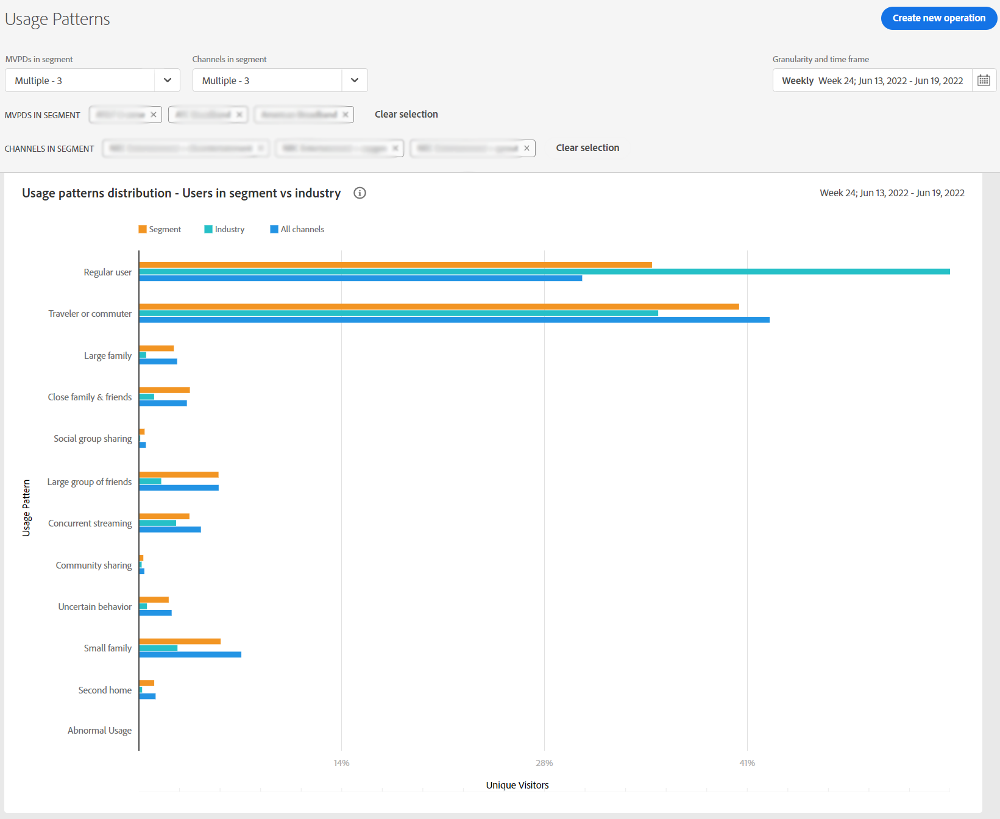

# Exibir relatórios de compartilhamento de conta para um MVPD específico <!--and programmer--> {#report-sp-mvpd}

Se você estiver conectado ao aplicativo Account IQ como um [programador](/help/AccountIQ/product-concepts.md#programmer-def), você poderá exibir relatórios de compartilhamento nos seus canais para [MVPD](/help/AccountIQ/product-concepts.md#mvpd-def) assinantes.

Para exibir relatórios no Account IQ, depois de fazer logon no aplicativo como programador:

1. Selecione o MVPD específico conforme define o segmento do assinante para análise e exibição de relatórios usando as etapas do [Como definir um segmento](/help/AccountIQ/howto-select-segment-timeframe.md).

   >[!NOTE]
   >
   >Você pode selecionar um, dois ou vários canais, ou até mesmo a seleção padrão dos 10 canais principais (compartilhando pontuação, uso ou contas).
   >
   >
   >No entanto, é possível selecionar [no máximo 10 canais](/help/AccountIQ/limitations.md) no seletor de canais na caixa [painel segmento e intervalo de tempo](/help/AccountIQ/segments-timeframe.md).

1. Selecione uma página de relatórios desejada na navegação à esquerda:

* [Uso geral](/help/AccountIQ/general-usage-reports.md)

   
* [Contas compartilhadas](/help/AccountIQ/shared-acc-reports.md)

   
* [Padrões de uso](/help/AccountIQ/usage-patterns.md)

   

* [Painel](/help/AccountIQ/dashboard.md) (o painel fornece uma visão geral dos gráficos selecionados das diferentes páginas de relatórios).

   

Cada uma dessas páginas refletirá a atividade do segmento selecionado.

