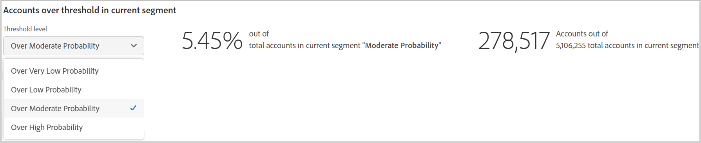

# Relatórios de contas compartilhadas {#shared-accounts-reports}

Os Relatórios de contas compartilhadas detalham as métricas, como o número de dispositivos e tipos de dispositivos, pelo intervalo selecionado de probabilidade de compartilhamento, por exemplo **Sobre a probabilidade moderada** e **Muito baixa probabilidade** para o segmento atual.

Esses intervalos podem servir como limites definidos pelo usuário e os gráficos são atualizados com base nos limites selecionados.

O Account IQ classifica todas as contas de assinantes do segmento definido nas contas com as cinco categorias a seguir com base em suas probabilidades de compartilhamento:

* Muito alto (80% - 100%)
* Alto (60% - 80%)
* Moderado (40% - 60%)
* Baixo (20% - 40%)
* Muito baixo (0% - 20%)

## Probabilidade de compartilhamento de contas {#accounts-sharing-probability}

O gráfico de rosca categoriza e mostra as porcentagens (e números absolutos) das contas de assinantes de várias categorias de probabilidade.

A linha vermelha marca o intervalo de limite selecionado pelos usuários em [Contas acima do limite no segmento atual](#threshold-selector) painel.

O gráfico de barras representa o número de contas no eixo y para várias categorias de probabilidades de compartilhamento (plotadas no eixo x).

A linha vermelha marca o intervalo de limite e pode ser ajustada no gráfico de barras. O limite ajustado no gráfico de barras reflete no intervalo de limite no gráfico de rosca.

<!---->

### Contas acima do limite no segmento atual{#threshold-selector}

Esse painel permite selecionar um intervalo do seguinte como limite para contas de assinantes (com base em suas probabilidades de compartilhamento):

* Contas **muito baixo** compartilhamento **probabilidade**

* Contas **acima de** compartilhamento **probabilidade**

* Contas **sobre moderado** compartilhamento **probabilidade**

* Contas **acima de** compartilhamento **probabilidade**

Depois que você selecionar o limite, o painel mostrará a porcentagem (e o número) das contas de todos os assinantes para os MVPDs selecionados no segmento.

## Segmento - Reproduzir solicitações do total {#play-request-out-total}

O gráfico de rosca mostra a porcentagem (e o número) de solicitações de reprodução feitas pelos assinantes no segmento; e permite comparar as solicitações de reprodução feitas por assinantes que não estão no segmento definido.

Ao mover o cursor no gráfico de rosca, ele também mostra porcentagens e números de assinantes de vários intervalos de probabilidade.

<!---->

## Segmento - Número médio de dispositivos por conta{#avg-devices-account}

O gráfico de barras mostra o número médio de dispositivos de cada tipo de dispositivo em uso pelos assinantes no segmento atual e assinantes que não estão no segmento atual.

## Segmento - CEPs por Período por Conta {#zip-codes-period-account}

Esse gráfico informa você sobre o número de assinantes que estão consumindo conteúdo de diferentes locais em um período.

É possível ampliar para baixo e visualizar as especificidades de uma barra no gráfico que representa uma variedade de locais.

<!---->

## Segmento - Área geográfica / Período / Conta {#geo-span-period-account}

Este gráfico de barras representa o número de contas de assinantes em relação a diferentes faixas geográficas em milhas. O intervalo baseia-se na distância máxima entre os locais a partir dos quais um assinante fez a transmissão durante o intervalo de tempo.

<!--Total number of users ...

How many accounts are within 99 miles of each other.....and how many are apart. 

Based on points on the map.-->

Ao selecionar uma barra que representa uma faixa de distância geográfica, ela expande a faixa para mostrar mais detalhes.

<!---->