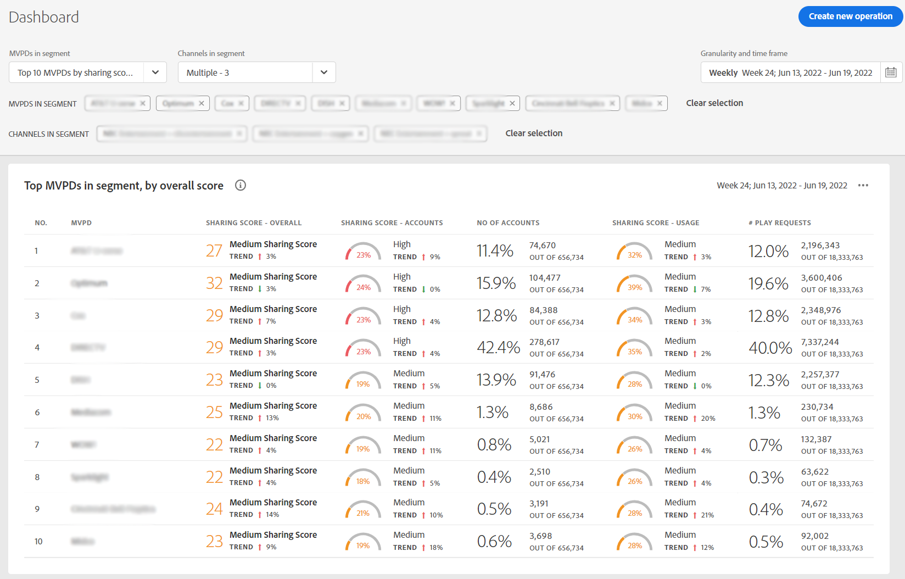

# Exibir relatórios de compartilhamento de conta dos 10 MVPDs principais <!--and Programmers--> {#view-top-10-mvpd-reports}

O Account IQ tem recursos para ajudá-lo a visualizar e analisar estatísticas de compartilhamento de conta para os 10 principais MVPDs (em um [segmento](/help/AccountIQ/product-concepts.md#segmet-def)) com:

* porcentagem mais alta de assinantes que estão compartilhando contas

* assinantes com uso máximo de contas compartilhadas

* assinantes com a maior magnitude (pontuação de compartilhamento geral) do compartilhamento de senha

>[!NOTE]
>
>A base dos cálculos, para obter a lista dos principais MVPDs de um segmento, são os dados de toda a indústria de streaming de vídeo e não apenas do MVPD de um programador específico.

>[!NOTE]
>
>Somente os MVPDs que têm no mínimo 50.000 contas de assinantes ativas são considerados para obter esses relatórios.

Para um usuário programador conectado, as três seleções padrão (para exibir relatórios dos dez MVPDs principais) estão disponíveis:

* [Os 10 MVPDs principais por pontuação de compartilhamento](#top-10mvpds-sharingscore)

* [Os 10 MVPDs principais por utilização](#top-10mvpds-usage)

* [Os 10 MVPDs principais por conta](#top-10mvpds-accounts)

## Os 10 MVPDs principais por pontuação de compartilhamento {#top-10mvpds-sharingscore}

Ao usar a seleção **os 10 MVPDs principais por pontuação de compartilhamento** para definir seu segmento, o sistema de QI da conta identifica 10 MVPDs de todo o setor para listar no máximo dez MVPDs (juntamente com suas métricas correspondentes) na ordem decrescente de seus [pontuação de compartilhamento geral](/help/AccountIQ/product-concepts.md#overall-sharing-score)

Para exibir a lista e os relatórios dos dez principais MVPDs compartilhando a pontuação do seu canal:

1. Use o [painel de segmento e período](/help/AccountIQ/segments-timeframe.md), para definir um segmento seguindo as etapas em [Como definir segmentos e selecionar período](/help/AccountIQ/howto-select-segment-timeframe.md) para avaliação. Para esta avaliação, selecione **os 10 MVPDs principais por pontuação de compartilhamento** na lista de MVPDs.

1. Selecione uma página de relatórios em uma das [Uso geral](/help/AccountIQ/general-usage-reports.md), [Contas compartilhadas](/help/AccountIQ/shared-acc-reports.md), [Padrões de uso](/help/AccountIQ/usage-patterns.md)ou [Painel](/help/AccountIQ/dashboard.md) (o painel dá uma ideia dos gráficos selecionados de diferentes páginas de relatórios).

Cada uma dessas páginas refletirá a atividade.

## Os 10 MVPDs principais por utilização {#top-10mvpds-usage}

Ao usar a seleção **10 MVPDs principais por utilização** para definir seu segmento, o sistema de QI da conta identifica 10 MVPDs de todo o setor para listar no máximo dez MVPDs (juntamente com suas métricas correspondentes) na ordem decrescente de seus [uso de contas compartilhadas](/help/AccountIQ/product-concepts.md)

Para exibir a lista e os relatórios dos dez principais MVPDs compartilhando a pontuação do seu canal:

1. Use o [painel de segmento e período](/help/AccountIQ/segments-timeframe.md), para definir um segmento seguindo as etapas em [Como definir segmentos e selecionar período](/help/AccountIQ/howto-select-segment-timeframe.md) para avaliação. Para esta avaliação, selecione **10 MVPDs principais por utilização** na lista de MVPDs.

1. Selecione uma página de relatórios em uma das [Uso geral](/help/AccountIQ/general-usage-reports.md), [Contas compartilhadas](/help/AccountIQ/shared-acc-reports.md), [Padrões de uso](/help/AccountIQ/usage-patterns.md)ou [Painel](/help/AccountIQ/dashboard.md) (o painel dá uma ideia dos gráficos selecionados de diferentes páginas de relatórios).

Cada uma dessas páginas refletirá a atividade.

## Os 10 MVPDs principais por conta {#top-10mvpds-accounts}

Ao usar a seleção **10 MVPDs principais por contas** para definir seu segmento, o sistema de QI da conta identifica 10 MVPDs de todo o setor para uma lista de no máximo dez MVPDs (juntamente com suas métricas correspondentes) na ordem decrescente de seus [nível de compartilhamento](/help/AccountIQ/product-concepts.md)

Para exibir a lista e os relatórios dos dez principais MVPDs por número de contas compartilhadas para o seu canal:

1. Use o [painel de segmento e período](/help/AccountIQ/segments-timeframe.md), para definir um segmento seguindo as etapas em [Como definir segmentos e selecionar período](/help/AccountIQ/howto-select-segment-timeframe.md) para avaliação. Para esta avaliação, selecione **10 MVPDs principais por conta** na lista de MVPDs.

1. Selecione uma página de relatórios em uma das [Uso geral](/help/AccountIQ/general-usage-reports.md), [Contas compartilhadas](/help/AccountIQ/shared-acc-reports.md), [Padrões de uso](/help/AccountIQ/usage-patterns.md)ou [Painel](/help/AccountIQ/dashboard.md) (o painel dá uma ideia dos gráficos selecionados de diferentes páginas de relatórios).

Cada uma dessas páginas refletirá a atividade.

