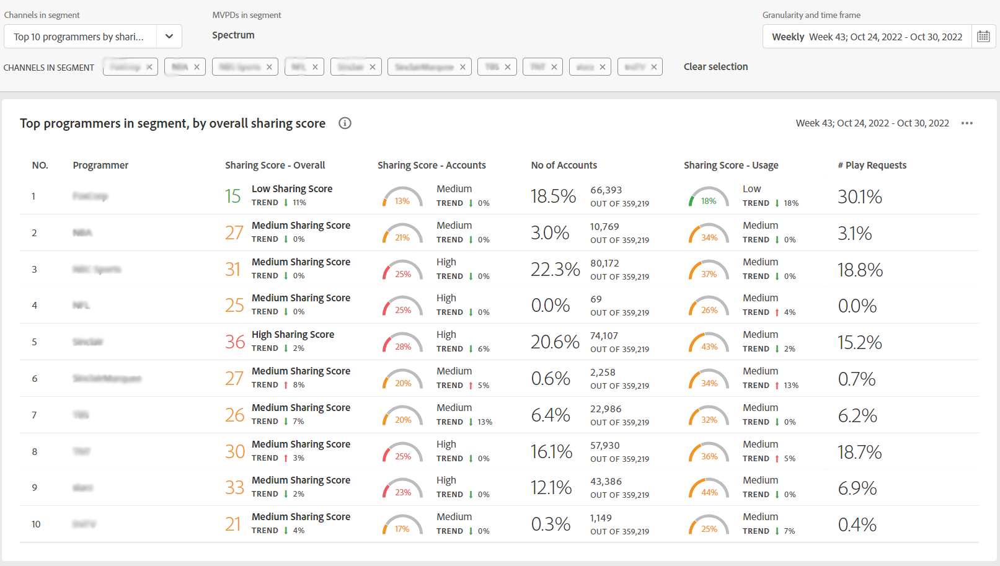

# Exibir relatórios de compartilhamento de conta dos 10 principais programadores {#view-top-10-programmer-reports}

O Account IQ tem recursos para ajudá-lo a visualizar e analisar estatísticas de compartilhamento de conta de seus assinantes dos 10 principais programadores (em um [segmento](/help/AccountIQ/product-concepts.md#segmet-def)) com:

* porcentagem mais alta de assinantes que estão compartilhando contas

* assinantes com uso máximo de contas compartilhadas

* assinantes com a maior magnitude (pontuação de compartilhamento geral) do compartilhamento de senha

>[!NOTE]
>
>A base dos cálculos, para obter a lista dos principais programadores de um segmento, são os dados de toda a indústria de streaming de vídeo e não apenas dos programadores específicos do MVPD.

<!--
>[!NOTE]
>
>Only the MVPDs that have a minimum of 50,000 active subscriber accounts are considered to obtain these reports.
-->

Para um usuário MVPD conectado, as três seleções padrão a seguir (para exibir relatórios dos dez MVPDs principais) estão disponíveis:

* [Os 10 principais programadores por pontuação de compartilhamento](#top-10prog-sharingscore)

* [Os 10 programadores principais por uso](#top-10prog-usage)

* [Os 10 programadores principais por conta](#top-10prog-accounts)

## Os 10 principais programadores por pontuação de compartilhamento {#top-10prog-sharingscore}

Ao usar a seleção **os 10 principais programadores por pontuação de compartilhamento** para definir seu segmento, o sistema de QI da conta identifica 10 MVPDs de todo o setor para listar no máximo dez MVPDs (juntamente com suas métricas correspondentes) na ordem decrescente de seus [pontuação de compartilhamento geral](/help/AccountIQ/product-concepts.md#overall-sharing-score)

Para exibir a lista e os relatórios dos dez principais MVPDs compartilhando a pontuação do seu canal:

1. Use o [painel de segmento e período](/help/AccountIQ/segments-timeframe.md), para definir um segmento seguindo as etapas em [Como definir segmentos e selecionar período](/help/AccountIQ/howto-select-segment-timeframe.md) para avaliação. Para esta avaliação, selecione **os 10 principais programadores por pontuação de compartilhamento** na lista de MVPDs.

1. Selecione uma página de relatórios em uma das [Uso geral](/help/AccountIQ/general-usage-reports.md), [Contas compartilhadas](/help/AccountIQ/shared-acc-reports.md), [Padrões de uso](/help/AccountIQ/usage-patterns.md)ou [Painel](/help/AccountIQ/dashboard.md) (o painel dá uma ideia dos gráficos selecionados de diferentes páginas de relatórios).

Cada uma dessas páginas refletirá a atividade.

## Os 10 programadores principais por uso {#top-10prog-usage}

Ao usar a seleção **os 10 principais programadores por uso** para definir seu segmento, o sistema de QI da conta identifica 10 MVPDs de todo o setor para listar no máximo dez MVPDs (juntamente com suas métricas correspondentes) na ordem decrescente de seus [uso de contas compartilhadas](/help/AccountIQ/product-concepts.md)

Para exibir a lista e os relatórios dos dez principais MVPDs compartilhando a pontuação do seu canal:

1. Use o [painel de segmento e período](/help/AccountIQ/segments-timeframe.md), para definir um segmento seguindo as etapas em [Como definir segmentos e selecionar período](/help/AccountIQ/howto-select-segment-timeframe.md) para avaliação. Para esta avaliação, selecione **os 10 principais programadores por uso** na lista de MVPDs.

1. Selecione uma página de relatórios em uma das [Uso geral](/help/AccountIQ/general-usage-reports.md), [Contas compartilhadas](/help/AccountIQ/shared-acc-reports.md), [Padrões de uso](/help/AccountIQ/usage-patterns.md)ou [Painel](/help/AccountIQ/dashboard.md) (o painel dá uma ideia dos gráficos selecionados de diferentes páginas de relatórios).

Cada uma dessas páginas refletirá a atividade.

## Os 10 programadores principais por conta {#top-10prog-accounts}

Ao usar a seleção **os 10 principais programas por conta** para definir seu segmento, o sistema de QI da conta identifica 10 MVPDs de todo o setor para uma lista de no máximo dez MVPDs (juntamente com suas métricas correspondentes) na ordem decrescente de seus [nível de compartilhamento](/help/AccountIQ/product-concepts.md)

Para exibir a lista e os relatórios dos dez principais MVPDs por número de contas compartilhadas para o seu canal:

1. Use o [painel de segmento e período](/help/AccountIQ/segments-timeframe.md), para definir um segmento seguindo as etapas em [Como definir segmentos e selecionar período](/help/AccountIQ/howto-select-segment-timeframe.md) para avaliação. Para esta avaliação, selecione **os 10 principais programadores por conta** na lista de MVPDs.

1. Selecione uma página de relatórios em uma das [Uso geral](/help/AccountIQ/general-usage-reports.md), [Contas compartilhadas](/help/AccountIQ/shared-acc-reports.md), [Padrões de uso](/help/AccountIQ/usage-patterns.md)ou [Painel](/help/AccountIQ/dashboard.md) (o painel dá uma ideia dos gráficos selecionados de diferentes páginas de relatórios).

Cada uma dessas páginas refletirá a atividade.

