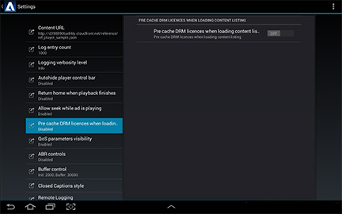

# Proteção de conteúdo DRM {#drm-content-protection}

O player Primetime oferece suporte à integração do Primetime DRM como workflows DRM personalizados. Isso significa que seu aplicativo deve implementar os workflows de autenticação DRM antes de reproduzir o fluxo.

Para habilitar isso, o TVSDK fornece o gerenciador de DRM para autenticação. A implementação de referência fornece um exemplo dos seguintes workflows:

* Como carregar e reproduzir fluxos HLS com proteção de conteúdo do Access, otimizado para taxas de erro baixas e start rápido.
* Como carregar e reproduzir fluxos HLS com proteção de conteúdo AES128.
* Como carregar e reproduzir fluxos HLS com proteção de conteúdo PHLS, otimizado para taxas de erro baixas e start rápido.

Todo o conteúdo protegido por DRM é manipulado automaticamente pelas bibliotecas DRM incorporadas ao TVSDK. Entretanto, é possível expor a manipulação de erros, a otimização da individualização de dispositivos e a aquisição de licenças usando retornos de chamada da API TVSDK.

## Adicionar proteção de conteúdo ao player {#section_F1FC4322C35C4FE8A3B47FDC0A74221B}

Você pode adicionar proteção de conteúdo ao player criando um gerenciador de reprodução ou usando a fábrica do gerenciador.

Para criar um gerenciador de proteção de conteúdo:

* Inicialize o sistema DRM.

   O exemplo de código a seguir mostra a chamada de `loadDRMServices` na função `onCreate()` do aplicativo, para garantir que qualquer inicialização necessária para o sistema DRM seja iniciada antes do início da reprodução.

   ```java
   @Override 
    public void onCreate() { 
        super.onCreate();  
        DrmManager.loadDRMServices(getApplicationContext()); 
    }
   ```

* Pré-carregar as licenças de DRM.

   O exemplo de código a seguir mostra o carregamento de `VideoItems` quando a lista de conteúdo terminou de ser carregada. Isso resultará na aquisição de licenças DRM do servidor de licenças e no cache local, para que, ao reproduzir start, o conteúdo seja carregado com o atraso mínimo.

   ```java
   DrmManager.preLoadDrmLicenses(item.getUrl(),  
     new MediaPlayerItemLoader.LoaderListener() { 
   
       @Override 
       public void onLoadComplete(MediaPlayerItem item) { 
           Player.logger.w(LOG_TAG + "::DRMPreload#onLoadComplete", item.getResource().getUrl()); 
       } 
   
       @Override 
       public void onError(MediaErrorCode errorCode, String s) { 
           Player.logger.e(LOG_TAG + "::DRMPreload#onError", s); 
       } 
   } 
   ```

   >[!NOTE]
   >
   >Você pode definir licenças de DRM com precisão como ON na interface do usuário de Configurações para pré-armazenar as licenças de DRM ao carregar o conteúdo. No entanto, a prática recomendada é pré-carregar um item específico em vez de pré-carregar todas as licenças no catálogo.
   >
   >

* Para usar `ManagerFactory` para implementar a manipulação de erros do DRM, verifique se a seguinte linha de código está no arquivo [!DNL PlayerFragment.java]:

   ```java
   drmManager = ManagerFactory.getDrmManager(config, mediaPlayer);
   ```

**Documentação da API relacionada**

* [Classe DrmManager](https://help.adobe.com/en_US/primetime/api/reference_implementation/android/javadoc/com/adobe/primetime/reference/manager/DrmManager.html)
* [DrmManagerEventListener](https://help.adobe.com/en_US/primetime/api/reference_implementation/android/javadoc/com/adobe/primetime/reference/manager/DrmManager.DrmManagerEventListener.html)