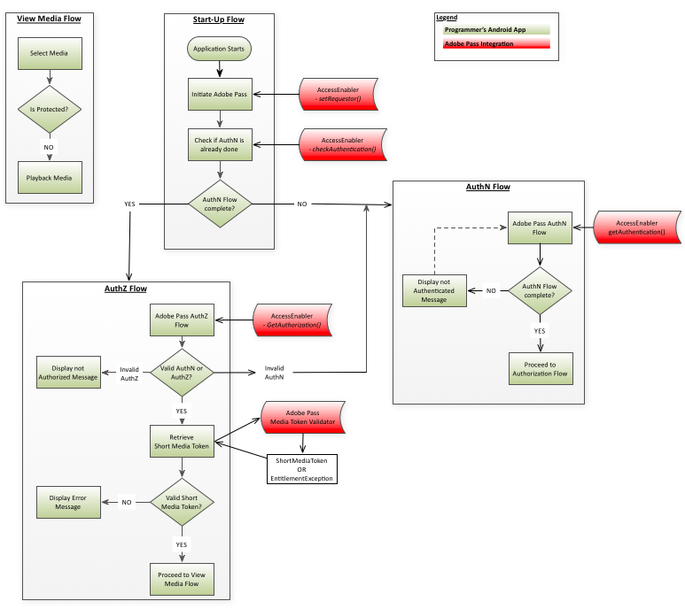

# Guia de integração do Amazon FireOS {#amazon-fireos-integration-cookbook}

>[!NOTE]
>
>O conteúdo desta página é fornecido apenas para fins informativos. O uso desta API requer uma licença atual do Adobe. Não é permitida nenhuma utilização não autorizada.

 

## Introdução {#intro}

Este documento descreve os workflows de direito que um aplicativo de nível superior do programador pode implementar por meio das APIs expostas pela biblioteca Amazon FireOS AccessEnabler.

A solução de direito de autenticação da Adobe Primetime para o Amazon FireOS está dividida em dois domínios:

- O domínio da interface do usuário — essa é a camada de aplicativo de nível superior que implementa a interface do usuário e usa os serviços fornecidos pela biblioteca do AccessEnabler para fornecer acesso ao conteúdo restrito.
- O domínio AccessEnabler - é aqui que os workflows de direito são implementados no formato de:
   - Chamadas de rede feitas para servidores back-end do Adobe
   - Regras de lógica de negócios relacionadas aos workflows de autenticação e autorização
   - Gerenciamento de vários recursos e processamento do estado do fluxo de trabalho (como o cache de token)

O objetivo do domínio AccessEnabler é ocultar todas as complexidades dos workflows de direito e fornecer ao aplicativo de camada superior (por meio da biblioteca AccessEnabler) um conjunto de primitivos de direito simples com os quais você implementa os workflows de direito:

1. Definir a identidade do solicitante
1. Verificar e obter autenticação em relação a um provedor de identidade específico
1. Verificar e obter autorização para um recurso específico
1. Sair

A atividade de rede do AccessEnabler ocorre em um thread diferente, de modo que o thread de interface do usuário nunca é bloqueado. Como resultado, o canal de comunicação bidirecional entre os dois domínios de aplicativos deve seguir um padrão totalmente assíncrono:

- A camada de aplicativo da interface envia mensagens para o domínio AccessEnabler por meio das chamadas de API expostas pela biblioteca AccessEnabler.
- O AccessEnabler responde à camada da interface do usuário por meio dos métodos de retorno de chamada incluídos no protocolo AccessEnabler que a camada da interface do usuário registra na biblioteca AccessEnabler.

## Fluxos de Direitos {#entitlement}

1. [Pré-requisitos](#prereqs)
1. [Fluxo de inicialização](#startup_flow)
1. [Fluxo de autenticação](#authn_flow)
1. [Fluxo de autorização](#authz_flow)
1. [Exibir fluxo de mídia](#media_flow)
1. [Fluxo de saída](#logout_flow)

### A. Pré-requisitos {#prereqs}

1. Crie suas funções de retorno de chamada:
   - [`setRequestorComplete()`](#$setRequestorComplete)

      - Acionado por `setRequestor()`, retorna sucesso ou falha.     Success indica que você pode continuar com chamadas de direito.

   - [displayProviderDialog(mvpds)](#$displayProviderDialog)

      - Acionado por `getAuthentication()` somente se o usuário não tiver selecionado um provedor (MVPD) e ainda não estiver autenticado. A variável `mvpds` é uma matriz de provedores disponíveis para o usuário.

   - [&quot;setAuthenticationStatus(status, motivo)&quot;](#$setAuthNStatus)

      - Acionado por `checkAuthentication()` sempre. Acionado por `getAuthentication()` somente se o usuário já estiver autenticado e tiver selecionado um provedor.

      - O status retornado é autenticado ou não é autenticado, o motivo descreve uma falha de autenticação ou uma ação de logout.

   - [navigateToUrl(url)](#$navigateToUrl)

      - Ignorado no SDK do AmazonFireOS, o método é usado em plataformas Android, onde é acionado por `getAuthentication()` após o usuário selecionar um MVPD.  A variável `url` fornece a localização da página de logon do MVPD.

   - [&quot;sendTrackingData(event, data)&quot;](#$sendTrackingData)

      - Acionado por `checkAuthentication(), getAuthentication(), checkAuthorization(), getAuthorization(), setSelectedProvider()`.
A variável `event` indica qual evento de direito ocorreu;o parâmetro `data` parameter é uma lista de valores relacionados ao evento.

   - [`setToken(token, resource)`](#$setToken)

      - Acionado por `checkAuthorization()` e `getAuthorization()` após uma autorização bem-sucedida para visualizar um recurso.
      - A variável `token` é o token de mídia de vida curta;a variável `resource` parâmetro é o conteúdo que o usuário está autorizado a visualizar.

   - [&quot;tokenRequestFailed(resource, code, description)&quot;](#$tokenRequestFailed)

      - Acionado por `checkAuthorization()` e `getAuthorization()` após uma autorização malsucedida.
      - A variável `resource` é o conteúdo que o usuário estava tentando visualizar; a variável `code` é o código de erro que indica que tipo de falha ocorreu; a variável `description` descreve o erro associado ao código de erro.

   - [`seletedProvider(mvpd)`](#$selectedProvider)

      - Acionado por `getSelectedProvider()`.
      - A variável `mvpd` O parâmetro fornece informações sobre o provedor selecionado pelo usuário.

   - [`setMetadataStatus(metadados, chave, argumentos)`](#$setMetadataStatus)

      - Acionado por `getMetadata().`
      - A variável `metadata` fornece os dados específicos solicitados; a variável `key` é a chave usada na variável `getMetadata()` pedido; e a `arguments` é o mesmo dicionário que foi passado para `getMetadata()`.

   - [&quot;preauthorizedResources(resources)&quot;](#$preauthResources)

      - Acionado por `checkPreauthorizedResources()`.
      - A variável `authorizedResources` Este parâmetro apresenta os recursos que o usuário está autorizado a visualizar.

### B. Fluxo de inicialização {#startup_flow}

1. Inicie o aplicativo de nível superior.
1. Iniciar autenticação do Adobe Primetime
   1. Chame [`getInstance`](#$getInstance) para criar uma única instância do AccessEnabler de autenticação do Adobe Primetime.

      - **Dependência:** Biblioteca nativa do Amazon FireOS de autenticação da Adobe Primetime (AccessEnabler)

   2. Chame` setRequestor()` para estabelecer a identificação do Programador; passar no `requestorID` e (opcionalmente) uma matriz de endpoints de autenticação da Adobe Primetime.

      - **Dependência:** RequestorID de autenticação válida do Adobe Primetime (trabalhe com seu Gerente de conta de autenticação da Adobe Primetime para organizar isso.)

      - **Acionadores:** retorno de chamada setRequestorComplete()

   Nenhuma solicitação de direito pode ser concluída até que a identidade do solicitante seja totalmente estabelecida. Isso significa que, enquanto setRequestor() ainda estiver em execução, todas as solicitações de direito subsequentes (por exemplo,`checkAuthentication()`) estiverem bloqueados.

   Você tem duas opções de implementação: depois que as informações de identificação do solicitante são enviadas ao servidor de backend, a camada de aplicativo da interface do usuário pode escolher uma das duas abordagens a seguir:

   1. Aguarde o acionamento do `setRequestorComplete()` retorno de chamada (parte do delegado AccessEnabler).  Essa opção oferece a maior certeza de que `setRequestor()` concluído, portanto, é recomendado para a maioria das implementações.

   1. Continuar sem esperar o acionamento do `setRequestorComplete()` retorno de chamada e comece a emitir solicitações de direito. Essas chamadas (checkAuthentication, checkAuthorization, getAuthentication, getAuthorization, checkPreauthorizedResource, getMetadata, logout) são enfileiradas pela biblioteca AccessEnabler, que fará as chamadas de rede reais após o `setRequestor()`. Ocasionalmente, essa opção pode ser interrompida se, por exemplo, a conexão de rede estiver instável.

1. Chame [checkAuthentication()](#$checkAuthN) para verificar uma autenticação existente sem iniciar o fluxo de Autenticação completa.  Se essa chamada for bem-sucedida, você poderá prosseguir diretamente para o Fluxo de autorização.  Caso contrário, prossiga para o Fluxo de autenticação.

- **Dependência:** Uma chamada bem-sucedida para `setRequestor()` (essa dependência também se aplica a todas as chamadas subsequentes).

- **Acionadores:** retorno de chamada setAuthenticationStatus()

### C. Fluxo de autenticação {#authn_flow}

1. Chame [`getAuthentication()`](#$getAuthN) para iniciar o fluxo de autenticação ou obter a confirmação de que o usuário já está autenticado.

   **Acionadores:**

   - O retorno de chamada setAuthenticationStatus(), se o usuário já estiver autenticado.  Nesse caso, prossiga diretamente para o [Fluxo de autorização](#authz_flow).
   - O retorno de chamada displayProviderDialog(), se o usuário ainda não estiver autenticado.

1. Apresentar ao usuário a lista de provedores enviada para `displayProviderDialog()`.

1. Depois que o usuário selecionar um provedor, um WebView abrirá a página do provedor para que o usuário faça logon

   **Nota:** Nesse momento, o usuário tem a oportunidade de cancelar o fluxo de autenticação. Se isso ocorrer, o AccessEnabler limpará seu estado interno e redefinirá o Fluxo de autenticação.

1. Após um logon bem-sucedido do usuário, o WebView será fechado.

1. chamar `getAuthenticationToken(),` que instrui o AccessEnabler a recuperar o token de autenticação do servidor back-end.

1. [Opcional] Chame [`checkPreauthorizedResources(resources)`](#$checkPreauth) para verificar quais recursos o usuário está autorizado a visualizar. A variável `resources` é uma matriz de recursos protegidos associada ao token de autenticação do usuário.\
   **Acionadores:** `preAuthorizedResources()` retorno de chamada\
   **Ponto de execução:** Após a conclusão do fluxo de autenticação

1. Se a autenticação tiver sido bem-sucedida, prossiga para o Fluxo de autorização.

### D. Fluxo de autorização {#authz_flow}

1. Chame [`getAuthorization()`](#$getAuthZ) para iniciar o fluxo de autorização.

   Dependência: ResourceID(s) válido(s) acordado(s) com o(s) MVPD(s).

   **Nota:** ResourceIDs devem ser os mesmos usados em quaisquer outros dispositivos ou plataformas e serão os mesmos em MVPDs.

1. Validar autenticação e autorização.

   - Se a variável `getAuthorization()` Chamada bem-sucedida: o usuário tem tokens AuthN e AuthZ válidos (o usuário é autenticado e autorizado a assistir à mídia solicitada).
   - Se `getAuthorization()` failed: examine a exceção lançada para determinar seu tipo (AuthN, AuthZ ou algo mais):
      - Se foi um erro de autenticação (AuthN), reinicie o fluxo de autenticação.
      - Se foi um erro de autorização (AuthZ), o usuário não está autorizado a assistir à mídia solicitada, e algum tipo de mensagem de erro deve ser exibido para o usuário.
      - Se houver algum outro tipo de erro (erro de conexão, erro de rede etc.) em seguida, exiba uma mensagem de erro apropriada para o usuário.

1. Valide o token de mídia curta.

   Use a biblioteca Verificador de token de mídia de autenticação do Adobe Primetime para verificar o token de mídia de curta duração retornado do `getAuthorization()` chame acima:

   - Se a validação for bem-sucedida: Reproduza a mídia solicitada para o usuário.
   - Se a validação falhar: O token AuthZ era inválido, a solicitação de mídia deve ser recusada e uma mensagem de erro deve ser exibida ao usuário.

1. Retorne ao fluxo normal do aplicativo.

### E. Fluxo de mídia de visualização {#media_flow}

1. O usuário seleciona a mídia a ser exibida.
1. A mídia está protegida?  Seu aplicativo verifica se a mídia selecionada está protegida:
   - Se a mídia selecionada estiver protegida, o aplicativo iniciará o [Fluxo de autorização](#authz_flow) acima.
   - Se a mídia selecionada não estiver protegida, reproduza a mídia para o usuário.

### F. Fluxo de logout {#logout_flow}

1. Chame [`logout()`](#$logout) para desconectar o usuário.\
   O AccessEnabler limpa todos os valores e tokens em cache obtidos pelo usuário para o MVPD atual em todos os solicitantes que compartilham o logon por meio do Logon único. Depois de limpar o cache, o AccessEnabler faz uma chamada de servidor para limpar as sessões do lado do servidor.  Como a chamada do servidor pode resultar em um redirecionamento SAML para o IdP (isso permite a limpeza da sessão no lado do IdP), essa chamada deve seguir todos os redirecionamentos. Por esse motivo, essa chamada será tratada em um controle WebView, invisível para o usuário.

   **Nota:** O fluxo de logout difere do fluxo de autenticação na medida em que o usuário não é obrigado a interagir com o WebView de nenhuma forma. Assim, é possível (e recomendado) tornar o controle do WebView invisível (ou seja: oculto) durante o processo de logout.
