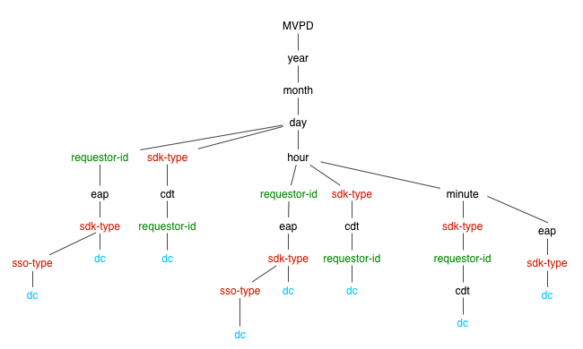

# API de monitoramento do serviço de qualificação {#entitlement-service-monitoring-api}

>[!NOTE]
>
>O conteúdo desta página é fornecido apenas para fins informativos. O uso desta API requer uma licença atual do Adobe. Não é permitida nenhuma utilização não autorizada.

## Visão geral da API {#api-overview}

O Entitlement Service Monitoring (ESM) é implementado como um WOLAP (Baseado na Web [Processamento analítico online](https://en.wikipedia.org/wiki/Online_analytical_processing){target=_blank}) projeto. O ESM é uma API da Web genérica para relatórios de negócios apoiada por um data warehouse. Ela age como uma linguagem de consulta HTTP que permite que operações OLAP típicas sejam executadas RESTfully.

>[!NOTE]
>
>A API ESM geralmente não está disponível. Entre em contato com o representante da Adobe para tirar dúvidas sobre disponibilidade.

A API ESM fornece uma exibição hierárquica dos cubos OLAP subjacentes. Cada recurso ([dimension](#esm_dimensions) na hierarquia da dimensão, mapeado como um segmento de caminho de URL) gera relatórios com (agregado) [métricas](#esm_metrics) para a seleção atual. Cada recurso aponta para seu recurso pai (para roll-up) e seus sub-recursos (para drill-down). O corte e a divisão são obtidos por meio de parâmetros de sequência de consulta que fixam dimensões a valores ou intervalos específicos.

A API REST fornece os dados disponíveis dentro de um intervalo de tempo especificado na solicitação (recorrendo aos valores padrão se nenhum for fornecido), de acordo com o caminho da dimensão, os filtros fornecidos e as métricas selecionadas. O intervalo de tempo não será aplicado a relatórios que não contêm dimensões de tempo (ano, mês, dia, hora, minuto, segundo).

O caminho raiz do URL do ponto de extremidade retornará as métricas agregadas gerais em um único registro, juntamente com os links para as opções de detalhamento disponíveis. A versão da API é mapeada como o segmento à direita do caminho URI do endpoint. Por exemplo, `https://mgmt.auth.adobe.com/*v2*` significa que os clientes acessarão o WOLAP versão 2.

Os caminhos de URL disponíveis são detectáveis por meio de links contidos na resposta. Os caminhos de URL válidos são mantidos para mapear um caminho na árvore de detalhamento subjacente que contém (pré-) métricas agregadas. Um caminho no formulário `/dimension1/dimension2/dimension3` refletirá uma pré-agregação dessas três dimensões (o equivalente a uma `clause GROUP` POR `dimension1`, `dimension2`, `dimension3`). Se essa pré-agregação não existir e o sistema não puder calculá-la dinamicamente, a API retornará uma resposta 404 Não encontrado.

## Árvore de detalhamento {#drill-down-tree}

As árvores de detalhamento a seguir ilustram as dimensões (recursos) disponíveis no ESM 2.0 para [Programadores] (#esm_dimensions) e [MVPDs](#esm_dimensions_mvpd).


### Dimension disponível para programadores {#progr-dimensions}


### Dimension disponível para MVPDs {#mvpd-dimensions}



Uma GET para o `https://mgmt.auth.adobe.com/v2` O endpoint da API retornará uma representação que contém:

* Links para os caminhos de drill-down raiz disponíveis:

   * `<link rel="drill-down" href="/v2/dimensionA"/>`

   * `<link rel="drill-down" href="/v2/dimensionB"/>`

* Um resumo (valores agregados) de todas as métricas (no intervalo padrão, como nenhum parâmetro de cadeia de caracteres de consulta é fornecido, veja abaixo).


Seguindo um caminho detalhado (passo a passo):
`/dimensionA/year/month/day/dimensionX` recupera a seguinte resposta:

* Links para &quot;`dimensionY`&quot; e &quot;`dimensionZ`&quot; opções de detalhamento

* Um relatório contendo agregados diários para cada valor de `dimensionX`


### Filtros

Exceto para as dimensões de data/hora, qualquer dimensão disponível para a projeção atual (caminho da dimensão) pode ser filtrada usando seu nome como um parâmetro de sequência de consulta.

As seguintes opções de filtro estão disponíveis:

* **Igual a** os filtros são fornecidos definindo o nome da dimensão para um valor específico na string de consulta.

* **IN** os filtros podem ser especificados adicionando o mesmo parâmetro de nome de dimensão várias vezes com valores diferentes: dimension=value1\&amp;dimension=value2

* **Não é igual** os filtros devem usar o caractere &#39;\!&#39; símbolo após o nome da dimensão que resulta no caractere &#39;\!=&#39; &quot;operator&quot;: dimension\!=valor

* **NÃO EM** os filtros exigem o caractere &#39;\!operador =&#39; a ser usado várias vezes, uma vez para cada valor no conjunto: dimension\!=value1\&amp;dimension\!=value2&amp;...

Também há um uso especial para os nomes de dimensão na sequência de consulta: se o nome da dimensão for usado como um parâmetro da sequência de consulta sem valor, isso instruirá a API a retornar uma projeção que inclua essa dimensão no relatório.

### Exemplo de consultas ESM

| *URL* | *Equivalente SQL* |
|---|---|
| /dimension1/dimension2/dimension3?dimension1=value1 | SELECT * da projeção WHERE dimension1 = &#39;value1&#39; </br> GROUP BY dimension1, dimension2, dimension3 |
| /dimension1/dimension2/dimension3?dimension1=value1&amp;dimension1=value2 | SELECT * da projeção WHERE dimension1 IN (&#39;value1&#39;, &#39;value2&#39;) </br> GROUP BY dimension1, dimension2, dimension3 |
| /dimension1/dimension2/dimension3?dimension1!=value1 | SELECT * da projeção WHERE dimension1 &lt;> &#39;value1&#39; | </br> GROUP BY dimension1, dimension2, dimension3 |
| /dimension1/dimension2/dimension3?dimension1!=valor1&amp;dimensão2!=value2 | SELECT * da projeção WHERE dimension1 NOT IN (&#39;value1&#39;, &#39;value2&#39;) | </br> GROUP BY dimension1, dimension2, dimension3 |
| Supondo que não haja caminho direto: /dimension1/dimension3 </br> mas há um caminho: /dimension1/dimension2/dimension3 </br> </br> /dimension1?dimension3 | SELECT * da projeção GROUP BY dimension1, dimension3 |

>[!NOTE]
>
>Nenhuma dessas técnicas de filtragem funcionará para `date/time` dimensões. A única maneira de filtrar `date/time` dimensões é definir a variável `start` e `end` parâmetros da string de consulta (descritos abaixo) para os valores necessários.

Os parâmetros de cadeia de caracteres de consulta a seguir têm significados reservados para a API (e, portanto, não podem ser usados como nomes de dimensão, caso contrário, nenhuma filtragem será possível para essa dimensão).

### Parâmetros de string de consulta reservados para a API ESM

| Parâmetro | Opcional | Descrição | Valor padrão | Exemplo |
| --- | ---- | --- | ---- | --- |
| access_token | Sim | Caso a proteção IMS OAuth esteja habilitada, o token IMS pode ser passado como um token de portador de autorização padrão ou como um parâmetro de sequência de consulta. | Nenhum | access_token=XXXXXX |
| dimension-name | Sim | Qualquer nome de dimensão - contido no caminho de URL atual ou em qualquer subcaminho válido; o valor será tratado como um filtro igual. Se nenhum valor for fornecido, isso forçará a dimensão especificada a ser incluída na saída mesmo se não estiver incluída ou adjacente ao caminho atual | Nenhum | someDimension=someValue&amp;someOtherDimension |
| fim | Sim | Hora final do relatório em milhões | Hora atual do servidor | end=30/07/2012 |
| formato | Sim | Usado para negociação de conteúdo (com o mesmo efeito, mas precedência inferior ao caminho &quot;extensão&quot; - consulte abaixo). | None: a negociação de conteúdo tentará as outras estratégias | format=json |
| limite | Sim | Número máximo de linhas a serem retornadas | Valor padrão relatado pelo servidor no autolink se nenhum limite for especificado na solicitação | limit=1500 |
| métricas | Sim | Lista separada por vírgulas de nomes de métricas a serem retornados; isso deve ser usado para filtrar um subconjunto das métricas disponíveis (para reduzir o tamanho do conteúdo) e também para forçar a API a retornar uma projeção que contenha as métricas solicitadas (em vez da projeção ideal padrão). | Todas as métricas disponíveis para a projeção atual serão retornadas caso esse parâmetro não seja fornecido. | metrics=m1,m2 |
| start | Sim | Hora de início do relatório como ISO8601; o servidor preencherá a parte restante se apenas um prefixo for fornecido: por exemplo, start=2012 resultará em start=2012-01-01:00:00:00 | Relatado pelo servidor no autolink; o servidor tenta fornecer padrões razoáveis com base na granularidade de tempo selecionada | start=15/07/2012 |

O único método HTTP disponível atualmente é o GET. Suporte para métodos OPTIONS / HEAD pode ser fornecido em versões futuras.

## Códigos de status da API ESM {#esm-api-status-codes}

| Código de status | Frase de motivo | Descrição |
|---|---|---|
| 200 | OK | A resposta conterá links de &quot;roll-up&quot; e &quot;drill-down&quot; (se aplicável). O relatório será renderizado como um atributo do recurso: um elemento/propriedade de &quot;relatório&quot; aninhado. |
| 400 | Solicitação inválida | O corpo da resposta conterá uma mensagem de texto explicando o que há de errado com a solicitação. </br> </br> Um status 400 de Solicitação incorreta é acompanhado por um texto explicativo no corpo da resposta (tipo de mídia de texto/simples) que fornece informações úteis sobre o erro do cliente. Além dos cenários triviais, como formatos de data inválidos ou filtros aplicados a dimensões não existentes, o sistema também se recusará a responder a consultas que exigem que um grande volume de dados seja retornado ou agregado em tempo real. |
| 401 | Não autorizado | Causado por uma solicitação que não contém os cabeçalhos OAuth adequados para autenticar o usuário |
| 403 | Proibido | Indica que a solicitação não é permitida no contexto de segurança atual; isso ocorre quando o usuário é autenticado, mas não tem permissão para acessar as informações solicitadas |
| 404 | Não encontrado | Ocorre caso um caminho de URL inválido seja fornecido com a solicitação. Isso nunca deve ocorrer se o cliente seguir os links &quot;detalhar&quot;/&quot;detalhar&quot; fornecidos com 200 respostas |
| 405 | Método não permitido | Sinaliza que um método sem suporte foi usado na solicitação. Embora atualmente apenas o método GET seja suportado, as versões futuras podem permitir HEAD ou OPTIONS |
| 406 | Não aceitável | Sinaliza que um tipo de mídia sem suporte foi solicitado pelo cliente |
| 500 | Erro interno do servidor | &quot;Isso nunca deve acontecer&quot; |
| 503 | Serviço indisponível | Sinaliza um erro no aplicativo ou em suas dependências |

## Formatos de dados {#data-formats}

Os dados estão disponíveis nos seguintes formatos:

* JSON (padrão)
* XML
* CSV
* HTML (para fins de demonstração)

As estratégias de negociação de conteúdo a seguir podem ser usadas pelos clientes (a precedência é dada pela posição na lista - primeiros itens primeiro):

1. Uma &quot;extensão de arquivo&quot; anexada ao último segmento do caminho do URL: por exemplo, `/esm/v2/media-company/year/month/day.xml`. Se o URL contiver uma cadeia de caracteres de consulta, a extensão deverá vir antes do ponto de interrogação: `/esm/v2/media-company/year/month/day.csv?mvpd= SomeMVPD`
1. Um parâmetro de string de consulta de formato: por exemplo, `/esm/report?format=json`
1. O cabeçalho padrão HTTP Accept: por exemplo, `Accept: application/xml`

A &quot;extensão&quot; e o parâmetro de consulta suportam os seguintes valores:

* xml
* json
* csv
* html

Se nenhum tipo de mídia for especificado por nenhuma das estratégias, a API produzirá o conteúdo JSON por padrão.

## Idioma do Aplicativo de Hipertexto {#hypertext-application-language}

Para JSON e XML, a carga será codificada como HAL, conforme descrito aqui:  <http://stateless.co/hal_specification.html>.

O relatório real (uma tag/propriedade aninhada chamada &quot;relatório&quot;) consistirá na lista real de registros que contém todas as dimensões e métricas selecionadas/aplicáveis com seus valores, codificados da seguinte maneira:

### JSON

```JSON
 "report": [
  {
    "dimension1": "d1",
    ...
    "metric1": "m1",
    ...
  }, {
    ...
  }
]
```

### XML

```XML
 <report>
  <record dimension1="d1" ... metric1="m1" ... />
  ...
</report
```

Para formatos XML e JSON, a ordem dos campos (dimensões e métricas) em um registro não é especificada, mas é consistente (a ordem será a mesma em todos os registros). No entanto, os clientes não devem confiar em nenhuma ordem específica dos campos em um registro.

O link de recurso (o rel &quot;self&quot; em JSON e o atributo de recurso &quot;href&quot; em XML) contém o caminho atual e a sequência de consulta usada para o relatório em linha. A sequência de consulta revelará todos os parâmetros implícitos e explícitos, para que a carga aponte explicitamente o intervalo de tempo usado, os filtros implícitos (se houver) e assim por diante. O restante dos links no recurso conterá todos os segmentos disponíveis que podem ser seguidos para detalhar os dados atuais. Um link para roll-up também será fornecido e apontará para o caminho principal (se houver). A variável `href` o valor dos links de drill-down/roll-up contém apenas o caminho do URL (ele não inclui a sequência de consulta, portanto, ela precisa ser anexada pelo cliente, se necessário). Observe que nem todos os parâmetros da cadeia de caracteres de consulta usados (ou implícitos) pelo recurso atual serão aplicáveis a links de &quot;acúmulo&quot; ou &quot;detalhamento&quot; (por exemplo, os filtros podem não se aplicar a sub ou superrecursos).

Exemplo (supondo que tenhamos uma única métrica chamada `clients` e há uma pré-agregação para `year/month/day/...`):

* https://mgmt.auth.adobe.com/esm/v2/year/month.xml

```XML
   <resource href="/esm/v2/year/month?start=2012-07-20T00:00:00&end=2012-08-20T14:35:21">
   <links>
   <link rel="roll-up" href="/esm/v2/year"/>
   <link rel="drill-down" href="/esm/v2/year/month/day"/>
   </links>
   <report>
   <record month="6" year="2012" clients="205"/>
   <record month="7" year="2012" clients="466"/>
   </report>
   </resource>
```

* https://mgmt.auth.adobe.com/esm/v2/year/month.json

  ```JSON
      {
        "_links" : {
          "self" : {
            "href" : "/esm/v2/year/month?start=2012-07-20T00:00:00&end=2012-08-20T14:35:21"
          },
          "roll-up" : {
            "href" : "/esm/v2/year"
          },
          "drill-down" : {
            "href" : "/esm/v2/year/month/day"
          }
        },
        "report" : [ {
          "month" : "6",
          "year" : "2012",
          "clients" : "205"
        }, {
          "month" : "7",
          "year" : "2012",
          "clients" : "466"
        } ]
      }
  ```

### CSV

No formato de dados CSV, nenhum link ou outro metadado (exceto a linha de cabeçalho) será fornecido em linha; em vez disso, os metadados de seleção serão fornecidos no nome do arquivo, que seguirá este padrão:

```CSV
    esm__<start-date>_<end-date>_<filter-values,...>.csv
```

O CSV conterá uma linha de cabeçalho e, em seguida, os dados do relatório como linhas subsequentes. A linha de cabeçalho conterá todas as dimensões seguidas por todas as métricas. A ordem de classificação dos dados do relatório será refletida na ordem das dimensões. Portanto, se os dados forem classificados por `D1` e depois por `D2`, o cabeçalho CSV terá esta aparência: `D1, D2, ...metrics...`.

A ordem dos campos na linha de cabeçalho refletirá a ordem de classificação dos dados da tabela.


Exemplo: https://mgmt.auth.adobe.com/v2/year/month.csv produzirá um arquivo chamado `report__2012-07-20_2012-08-20_1000.csv` com o seguinte conteúdo:


| Ano | Month | Clientes |
| ---- | :---: | ------- |
| 2012 | 6 | 580 |
| 2012 | 7 | 231 |

## Atualização de dados {#data-freshness}

As respostas HTTP bem-sucedidas contêm um `Last-Modified` cabeçalho que indica a hora em que o relatório no corpo foi atualizado pela última vez. A falta de um cabeçalho Última modificação indica que os dados do relatório são calculados em tempo real.

Normalmente, os dados granulares serão atualizados com menos frequência do que os dados granulares (por exemplo, valores por minuto ou valores por hora, podem estar mais atualizados do que os valores diários, especialmente para métricas que não podem ser computadas com base em granularidades menores, como contagens exclusivas).

As versões futuras do ESM podem permitir que os clientes executem GETs condicionais fornecendo o cabeçalho &quot;If-Modified-Since&quot; padrão.

## Compactação GZIP {#gzip-compression}

A Adobe recomenda que você ative o suporte ao gzip nos clientes que buscam relatórios ESM. Isso reduzirá muito o tamanho da resposta, o que, por sua vez, reduzirá seu tempo de resposta. (A taxa de compactação dos dados ESM está no intervalo de 20 a 30.)

Para ativar a compactação gzip no cliente, defina a variável `Accept-Encoding:` cabeçalho da seguinte forma:

* Accept-Encoding: gzip, deflate


<!--
## Related Information {#related-information}

- [ESM Overview](/help/authentication/entitlement-service-monitoring-overview.md)
- [Degradation API Overview](/help/authentication/degradation-api-overview.md)
- [Understanding Server-side Metrics](/help/authentication/understanding-serverside-metrics.md)
-->
