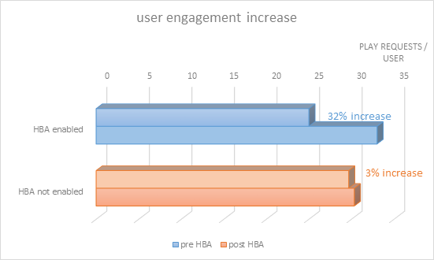

# Autenticação baseada em casa para TV em todos os lugares

>[!NOTE]
>
>O conteúdo desta página é fornecido apenas para fins informativos. O uso desta API requer uma licença atual do Adobe. Não é permitida nenhuma utilização não autorizada.

## O que é autenticação baseada em casa? {#whatis-home-based-authn}

A Autenticação baseada em casa (HBA) é um recurso da TV em todos os lugares que permite aos assinantes de TV por assinatura visualizar o conteúdo da TV on-line sem inserir credenciais MVPD quando estiverem em casa, melhorando significativamente a experiência do usuário no fluxo de autenticação.

Definição de autenticação baseada em casa pelo Open Authentication Technology Committee (OATC): &quot;A autenticação automática em casa é o processo pelo qual um MVPD/OVD usa características da rede doméstica (ou identificadores acessíveis automaticamente entre dispositivos na rede doméstica) para autenticar qual conta de assinante está associada a essa rede doméstica, de modo que os usuários não precisem inserir credenciais manualmente ao estabelecer uma sessão TVE para acessar conteúdo protegido por TVE.&quot;

Para obter mais informações sobre o HBA e os padrões do setor, leia a [Casos de uso e requisitos do OATC](https://dzf8vqv24eqhg.cloudfront.net/userfiles/258/326/ckfinder/files/Defining%20TVE%20Home-Based%20Authentication%20(HBA)%20%20Use%20Cases%20and%20Requirements%20Recommended%20Practice%20Version%201_0%20FINAL%20DRAFT%20FOR%20BOARD%20APPROVAL.pdf){target=_blank} documentação e **Diretrizes de experiência do usuário do OATC para HBA**.

>[!NOTE]
>
>Alguns fluxos de HBA fazem parte do pacote de fluxo de trabalho Premium. Entre em contato com seu representante de vendas do Primetime, se estiver interessado em usar essa funcionalidade.

## Por que o HBA é importante para você {#why-hba}

O HBA é importante porque ele praticamente remove a barreira de entrada dos visualizadores que estão em casa e já têm uma assinatura a cabo. Além disso, a autenticação baseada em casa pode aumentar significativamente o engajamento de seus visualizadores e oferecer uma melhor experiência do usuário para o conteúdo da sua TV em todos os lugares.

Atualmente, quase metade das tentativas de logon não é bem-sucedida.

Depois que o HBA foi ativado por um dos 5 principais MVPDs, sua taxa de conversão de autenticação **aumentou em 40%** (de 45 % a 63 %)

Além disso, abaixo você pode ver a taxa de conversão de entrada para um canal integrado com MVPDs diferentes: aqueles que habilitaram HBA para ele e aqueles que não têm HBA. A taxa de conversão para aqueles com HBA é significativamente maior do que aqueles sem HBA.

Seis meses após a ativação do HBA para a maioria dos canais integrados com esse MVPD, percebemos um aumento de 82% em usuários únicos (o número de usuários que acessam os canais da TV Everywhere por meio desse MVPD quase dobrou).

2w3Por outro lado, como você pode ver no gráfico abaixo, outros MVPDs que não habilitaram HBA tiveram somente um aumento de 26% nos usuários únicos nos últimos seis meses.

A partir de nossos dados, coletados 6 meses antes e 6 meses depois da ativação do HBA, vimos um grande aumento no engajamento dos visualizadores para os canais que estavam habilitados para HBA. Praticamente os usuários de MVPDs que habilitaram HBA tendem a assistir em média 30% a mais conteúdo do que os usuários de MVPDs que não habilitam HBA.

## Suporte a HBA de autenticação do Primetime {#auth-hba-support}

Esta seção descreve o suporte a HBA fornecido pela autenticação do Primetime, o comportamento das plataformas de autenticação do Primetime em fluxos de HBA e também oferece detalhes técnicos úteis para a implementação de HBA.

Recursos de autenticação do Primetime com suporte a HBA

* Capacidade de definir diferentes TTLs de autenticação para HBA versus autenticações não-HBA (também requer suporte a MVPD)
* Capacidade de selecionar automaticamente um MVPD (ignorar o seletor de MVPD) se a autenticação tiver expirado. Isso é útil especialmente quando os TTLs de HBA são pequenos.
* Capacidade de expor os programadores se a autenticação era HBA ou não (também requer suporte a MVPD)

### Experiência do usuário do HBA em plataformas de autenticação do Primetime {#hba-user-exp}

As tabelas a seguir fornecem informações sobre a experiência do usuário para as plataformas compatíveis quando o HBA está ativado e quando o HBA não está ativado:

| Fluxo de usuário - Tipo de plataforma | swf, iOS, Android |
|---|---|
| Com HBA habilitado | Quando os usuários estão em casa, eles são autenticados automaticamente. Após a expiração do token de autenticação HBA, os usuários são automaticamente reautenticados. |
| Sem HBA | Os usuários são solicitados a selecionar seu MVPD e inserir suas credenciais, mesmo que estejam em casa. Depois que o token de autenticação expirar, os usuários deverão inserir suas credenciais novamente. |

| Fluxo de usuário - Tipo de plataforma | js, Windows (nativo) |
|---|---|
| Com HBA habilitado | Quando os usuários estão em casa, eles são autenticados automaticamente. Depois que o token de autenticação HBA expirar, os usuários deverão selecionar novamente seu MVPD no seletor e serão autenticados automaticamente. |
| Sem HBA | Os usuários são solicitados a selecionar seu MVPD e inserir suas credenciais, mesmo que estejam em casa. Depois que o token de autenticação expira, os usuários devem inserir suas credenciais novamente. |

| Fluxo de usuário - Tipo de plataforma | API REST sem cliente (segunda autenticação de tela) |
|---|---|
| Com HBA habilitado | Quando os usuários estão em casa e usam um aplicativo REST API sem cliente, eles são automaticamente autenticados no segundo dispositivo de tela depois de inserir o código de registro e selecionar seu MVPD. Depois que o token de autenticação HBA expirar, os usuários serão automaticamente reautenticados (no segundo dispositivo de tela). |
| Sem HBA | Os usuários são solicitados a selecionar seu MVPD e inserir suas credenciais, mesmo que estejam em casa. Depois que o token de autenticação expira, os usuários devem inserir suas credenciais novamente. |

### Detalhes técnicos da implementação do HBA {#tech-details-hba}

#### Protocolo OAuth 2.0 {#oauth-2-protocol}

No fluxo de HBA para MVPDs integrados ao protocolo de autenticação OAuth 2.0, o MVPD emite um token de atualização e o Adobe emite um token de autenticação de HBA:

* O token de atualização tem um TTL determinado pelos requisitos de negócios do MVPD.
* O TTL do token de autenticação do HBA **deve ser menor que ou igual a** o TTL do token de atualização.

*Descrição do fluxo de autenticação do HBA para o protocolo OAuth 2.0*

| Ações do usuário | Ações do sistema |
|---|---|
| O usuário navega até o site do programador. Ao tentar reproduzir um vídeo, o seletor de MVPD é exibido. O usuário seleciona o MVPD e clica em login. | Uma verificação de antecedentes é realizada. O MVPD aplica seu conjunto de regras para detecção do usuário (por exemplo, mapeie o endereço IP do usuário com o endereço MAC de modems provisionados por distribuidor ou decodificadores de sinais conectados à banda larga). |
| Uma tela, que persiste por cerca de 3 segundos, é exibida. Uma página intersticial pode ser exibida informando que o usuário é informado de que está sendo conectado automaticamente usando sua conta MVPD. | <ol><li>O AccessEnabler, que é instalado no lado do programador, envia uma solicitação de autenticação (como uma solicitação HTTP) para o endpoint de autenticação do Adobe Primetime.</li><li>O ponto de extremidade de Autenticação do Primetime redireciona a solicitação para o ponto de extremidade de autenticação do MVPD.  **Nota:** O pedido contém a `hba_flag` parâmetro (tentativa HBA = true) que indica que o MVPD deve tentar a autenticação HBA.</li><li>O ponto de extremidade de autenticação MVPD envia um código de autorização para o ponto de extremidade de autenticação da Adobe Primetime.</li><li>A Autenticação Adobe Primetime usa o código de autorização para solicitar um token de atualização e um token de acesso do endpoint do token do MVPD.</li><li>O MVPD envia uma decisão de autenticação `hba_status` parâmetro (true/false) no `id_token`.</li><li>Uma chamada para o endpoint do perfil de usuário do MVPD é enviada para expor o [chave hba_status nos metadados do usuário](/help/authentication/user-metadata-feature.md#obtaining).</li><li>O MVPD define o TTL do token de atualização como um valor acordado pelo MVPD e o Adobe define o TTL do token AuthN como um valor menor ou igual ao valor do token de atualização.</li></ol> |
| O usuário é autenticado e agora pode navegar pelo conteúdo intitulado TV em todos os lugares. | O token de autenticação é passado para o usuário que agora pode navegar com sucesso pelo site do programador. |

#### Protocolo SAML {#saml-protocol}

Descrição do fluxo de autenticação de HBA para o protocolo de autenticação SAML

| Ações do usuário | Ações do sistema |
|---|---|
| O usuário navega até o site do programador. Ao tentar reproduzir um vídeo, o seletor de MVPD é exibido. O usuário seleciona o MVPD e clica em login. | Uma verificação de antecedentes é realizada. O MVPD aplica seu conjunto de regras para detecção do usuário (por exemplo, mapeie o endereço IP do usuário com o endereço MAC de modems provisionados por distribuidor ou decodificadores de sinais conectados à banda larga). |
| Uma tela, que persiste por cerca de 3 segundos, é exibida. Uma página intersticial pode ser exibida informando que o usuário é informado de que está sendo conectado automaticamente usando sua conta MVPD. | <ol><li>O AccessEnabler, que é instalado no lado do programador, envia uma solicitação de autenticação (como uma solicitação HTTP) para o endpoint de autenticação do Adobe Primetime.</li><li>O ponto de extremidade de Autenticação do Primetime redireciona a solicitação para o ponto de extremidade de autenticação do MVPD.</li><li>O MVPD deve enviar uma decisão de autenticação na forma de uma resposta SAML que deve conter o sinalizador HBA: hba_status (true/false).</li><li>Uma chamada para o endpoint do perfil de usuário do MVPD é enviada para expor o [chave hba_status nos metadados do usuário](/help/authentication/user-metadata-feature.md#obtaining).</li></ol> |
| O usuário é autenticado e agora pode navegar pelo conteúdo intitulado TV em todos os lugares. | O token de autenticação é passado para o usuário que agora pode navegar com sucesso pelo site do programador. |

## Como ativar o HBA {#how-to-activate-hba}

* **Protocolo OAuth:**
   * Para habilitar HBA, consulte [Guia do usuário do painel TVE do Primetime](/help/authentication/tve-dashboard-user-guide.md)
* **Protocolo SAML:** A Autenticação baseada em página inicial é ativada no lado do MVPD. Nenhuma ação é necessária por parte do programador ou Adobe.
Para obter mais informações sobre os MVPDs que oferecem suporte à Autenticação Baseada na Página Inicial, consulte [Status de HBA para MVPDs](/help/authentication/hba-status-mvpds.md).

## Perguntas frequentes {#faqs}

**Pergunta:** Por que a separação entre a Autenticação baseada em casa com os protocolos SAML e OAuth2?

**Resposta:** O fluxo do HBA é diferente para os dois protocolos. Da perspectiva de um programador, não há necessidade de ação para garantir que o HBA esteja habilitado para MVPDs SAML, enquanto para MVPDs OAuth2, o HBA pode ser ativado ou desativado no Painel TVE do Primetime.

**Pergunta:** Os usuários precisam preencher um nome de usuário e uma senha na primeira vez que são autenticados quando o HBA é ativado?

**Resposta:** Não, o nome de usuário e a senha não são obrigatórios.

**Pergunta:** Como você aplica o controle dos pais?

**Resposta 1:** O Adobe pode desativar o HBA para integrações com canais que precisam de aprovação de controle dos pais.

**Resposta 2:** O Adobe está trabalhando com o OATC em um documento UX que recomenda como configurar a experiência de HBA com controles dos pais.

**Pergunta:** Os provedores que oferecem suporte a HBA têm janelas TTL menores para HBA e, em seguida, para autenticação regular?

**Resposta:** A configuração de TTL é configurável. Recomendamos definir um TTL mais curto para tokens de autenticação de HBA para evitar manipulações incorretas.

## Informações úteis {#useful-info}

* [Recommendations de acesso instantâneo (HBA)](http://www.ctamtve.com/instantaccess){target=_blank} - pela CTAM
* [Exemplo de implementação de HBA no aplicativo Programador](https://dzf8vqv24eqhg.cloudfront.net/userfiles/258/326/ckfinder/files/HBA_Flow_Sample.pdf?dc=201604222139-1346){target=_blank} - por Adobe
  <!--* [Home Based Authentication User Experience Guidelines for TV Everywhere](http://oatc.us/Standards/DownloadRecommendedPractices.aspx){target=_blank} - by OATC-->
* [Casos de uso e requisitos da autenticação baseada em casa](https://dzf8vqv24eqhg.cloudfront.net/userfiles/258/326/ckfinder/files/Defining%20TVE%20Home-Based%20Authentication%20(HBA)%20%20Use%20Cases%20and%20Requirements%20Recommended%20Practice%20Version%201_0%20FINAL%20DRAFT%20FOR%20BOARD%20APPROVAL.pdf){target=_blank} pela OATC
* [Infográfico de autenticação baseado em casa](https://dzf8vqv24eqhg.cloudfront.net/userfiles/258/326/ckfinder/files/AdobeNewsletterHBA.pdf?dc=201604260953-2640){target=_blank} - por Adobe
* [Autenticação usando o protocolo OAuth 2.0](/help/authentication/authn-oauth2-protocol.md)
* [Autenticação com MVPDs SAML](/help/authentication/authn-usecase.md)
* [Guia do usuário do painel TVE do Primetime](/help/authentication/tve-dashboard-user-guide.md)
* [Metadados do usuário hba_status](/help/authentication/user-metadata-feature.md#obtaining)
