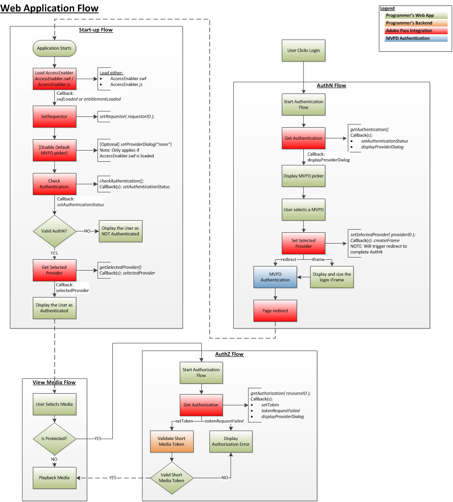

# Guia do SDK do JavaScript {#javascript-sdk-cookbook}

>[!NOTE]
>
>O conteúdo desta página é fornecido apenas para fins de informação. O uso dessa API requer uma licença atual do Adobe. Não é permitida a utilização não autorizada.

## Introdução (#intro)

Este documento descreve os workflows de direito que um aplicativo de nível superior do Programador implementa para uma integração JavaScript com o serviço de Autenticação Adobe Primetime. Links para a referência da API do JavaScript são incluídos em todo o processo.

Observe também que a variável [Informações relacionadas](#related) inclui um link para um conjunto de amostras de código JavaScript.

## Fluxos de Direito (#qualificação)

1. [Pré-requisitos](#prereq)
2. [Fluxo de inicialização](#startup)
3. [Fluxo de autenticação](#authn)
4. [Fluxo de autorização](#authz)
5. [Exibir fluxo de mídia](#logout)

</br>




## Pré-requisitos(#preereq)

**Dependências:**

- A Biblioteca de autenticação da Adobe Primetime (AccessEnabler), trabalhe com o Gerente de conta de autenticação da Adobe Primetime para fazer isso.
- SolicitanteId de autenticação válida da Adobe Primetime, trabalhe com o Gerente de conta de autenticação da Adobe Primetime para organizar isso.

Crie suas funções de retorno de chamada:

- `entitlementLoaded`

</br>

**Acionador:** O AccessEnabler foi carregado e terminou a inicialização.

- `displayProviderDialog(mvpds)`

   **Acionador:** `getAuthentication(),` somente se o usuário não tiver selecionado um provedor (um MVPD) e ainda não tiver sido autenticado O parâmetro mvpds é uma matriz de provedores disponíveis para o usuário.

- `setAuthenticationStatus(status, errorcode)`

   **Acionador:**
   - `checkAuthentication()`sempre.
   - `getAuthentication()` somente se o usuário já estiver autenticado e tiver selecionado um provedor.

   O status retornado é bem-sucedido ou falha; o errorcode descreve o tipo da falha.

- `createIFrame(width, height)`

   **Acionador:** `setSelectedProvider(providerID)`, somente se o provedor selecionado estiver configurado para exibição em um IFrame.

   >[!NOTE]
   >
   >Um provedor é configurado para renderizar a tela de autenticação como um redirecionamento ou em um iFrame, e o Programador precisa considerar ambos.

- `sendTrackingData(event, data)`

   **Acionadores:** `checkAuthentication(), getAuthentication(),checkAuthorization(), getAuthorization(), setSelectedProvider()`.  O `event` parâmetro indica qual evento de direito ocorreu; o `data` é uma lista de valores relacionados ao evento. 
- `setToken(token, resource)`

   **Acionador:** `checkAuthorization()`e `getAuthorization()` após uma autorização bem-sucedida para visualizar um recurso.   O `token` é o token de mídia de curta duração; o `resource` é o conteúdo que o usuário está autorizado a visualizar.

- `tokenRequestFailed(resource, code, description)`

   **Acionador:**`checkAuthorization()` e`getAuthorization()`  após uma autorização infrutífera.\
   O `resource` é o conteúdo que o usuário estava tentando visualizar; o `code` é o código de erro que indica o tipo de falha ocorrido; o `description` descreve o erro associado ao código de erro.

- `selectedProvider(mvpd)`

   **Acionador:** [`getSelectedProvider()`](#$getSelProv O `mvpd` fornece informações sobre o provedor selecionado pelo usuário.

- `setMetadataStatus(metadata, key, arguments)`

   **Acionador:** `getMetadata().`\
   O `metadata` fornece os dados específicos solicitados; o parâmetro key é a chave usada na variável `getMetadata()`pedido; e `arguments` é o mesmo dicionário passado para `getMetadata()`.


## 2. Fluxo de arranque

**I. Carregue o JavaScript do AccessEnabler:**

**Para Perfil de preparo**

```JSON
<script type="text/javascript"         
src="https://entitlement.auth-staging.adobe.com/entitlement/v4/AccessEnabler.js">
</script>"
```

ou...

**Para Perfil de Produção**

```JSON
<script type="text/javascript"         
src="https://entitlement.auth.adobe.com/entitlement/v4/AccessEnabler.js">
</script>"
```

**Acionadores:** Quando a inicialização estiver concluída, a autenticação do Adobe Primetime chamará sua `entitlementLoaded()` função de retorno de chamada. Este é o ponto de entrada para a comunicação do seu aplicativo com o AccessEnabler. 

 
**II.** Chame `setRequestor()`Estabelecer a identidade do programador; passe no `requestorID` e (opcionalmente) uma matriz de endpoints de autenticação da Adobe Primetime.

**Acionadores:** Nenhum, mas ativa `displayProviderDialog()` para ser chamado quando necessário.


**III.** Chame `checkAuthentication()` para verificar uma autenticação existente sem iniciar o [fluxo de autenticação].  Se esta chamada for bem-sucedida, você poderá prosseguir diretamente para o `authorization flow`.  Caso contrário, prossiga para a `authentication flow`.

**Dependência:** Uma chamada bem-sucedida para `setRequestor()`(essa dependência também se aplica a todas as chamadas subsequentes).

 **Acionadores:** `setAuthenticationStatus()` callback

</br>

## 3. Fluxo de autenticação</span>


**Dependência:** Uma chamada bem-sucedida para `setRequestor()`(essa dependência também se aplica a todas as chamadas subsequentes).


Chame `getAuthentication()` para obter o status de autenticação OU para acionar o fluxo de autenticação do provedor.

**Acionadores:**

- `displayProviderDialog()`se o usuário ainda não tiver sido autenticado
- `setAuthenticationStatus()` se a autenticação já tiver ocorrido

A conclusão do fluxo de autenticação é alcançada quando o AccessEnabler chama `setAuthenticationStatus()`com `isAuthenticated == 1`.

## 4. Fluxo de autorização (#authz)

**Dependências:**

- Uma chamada bem-sucedida para `setRequestor()` (essa dependência também se aplica a todas as chamadas subsequentes).
- ResourceID(s) válido(s) acordado(s) com o(s) MVPD(s). Observe que ResourceIDs deve ser igual àquelas usadas em qualquer outro dispositivo ou plataforma e será o mesmo em MVPDs.

Chame `getAuthorization()` e transmita o ResourceID para a mídia solicitada. Uma chamada bem-sucedida retornará um Token de mídia curto, o que confirma que o usuário está autorizado a exibir a mídia solicitada.

- Se a chamada for bem-sucedida: O usuário tem um token AuthN válido e está autorizado a assistir à mídia solicitada.
- Se a chamada falhar: Examine a Exceção acionada para determinar seu tipo (AuthN, AuthZ ou algo diferente):
- Se a chamada for um erro AuthN, reinicie o Fluxo AuthN.
- Se a chamada for um erro AuthZ, o usuário não está autorizado a assistir a mídia solicitada e algum tipo de mensagem de erro deve ser exibida para o usuário.
- Se houver algum outro erro (erro de conexão, erro de rede etc.) em seguida, exibir uma mensagem de erro apropriada para o usuário.

Use o Verificador de Token de Mídia para validar o shortMediaToken retornado de um `getAuthorization()` chame.

 
**Dependência:** O Verificador de token de mídia curta (incluído na biblioteca AccessEnabler )

- Se a validação for aprovada: Exibir/reproduzir a mídia solicitada para o usuário.
- Se falhar: O token AuthZ era inválido, a solicitação de mídia deve ser recusada e uma mensagem de erro deve ser exibida ao usuário.

## 5. Visualizar fluxo de mídia (#logout)

- O usuário seleciona a mídia a ser exibida.
   - A mídia está protegida?\
          - Seu aplicativo verifica se a mídia está protegida:
      - Se a mídia estiver protegida, o aplicativo inicia o fluxo de autorização (AuthZ) acima.
      - Se a mídia não estiver protegida, continue com o fluxo Exibir mídia .
      - Mídia de reprodução

## Configurar a ID do visitante (#visitorID)

Configurar uma [Experience Cloud visitorID](https://marketing.adobe.com/resources/help/en_US/mcvid/) é muito importante do ponto de vista analítico. Depois que um valor de ID de visitante da CE é definido, o SDK enviará essas informações juntamente com todas as chamadas de rede e o serviço de autenticação da Adobe Primetime coletará essas informações. Dessa forma, você poderá correlacionar os dados de análise do serviço de Autenticação da Adobe Primetime com quaisquer outros relatórios de análise que você possa ter de outros aplicativos ou sites. Informações sobre como configurar a ID de visitante da CE podem ser encontradas [here](https://experienceleague.adobe.com/docs/id-service/using/home.html?lang=en).

 
>[!NOTE]
>
>Observe que esse suporte a funcionalidade está disponível a partir do JS SDK versão 3.1.0. 

<!--
### Related Information (#related)

* [JavaScript SDK Overview](/help/authentication/javascript-sdk-overview.md)
* [JavaScript SDK API Reference](/help/authentication/javascript-sdk-api-reference.md)
* **JavaScript SDK Code Samples**
-->