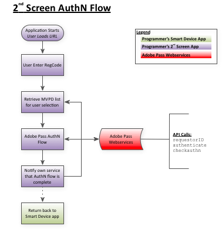
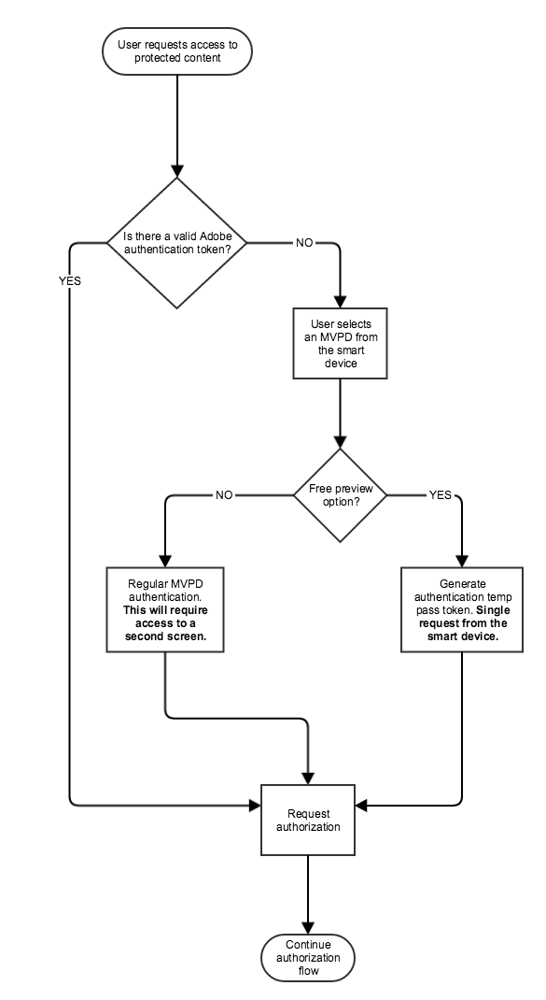

# Cookbook da API REST (cliente para servidor) {#rest-api-cookbook-client-to-server}

>[!NOTE]
>
>O conteúdo desta página é fornecido apenas para fins informativos. O uso desta API requer uma licença atual do Adobe. Não é permitida nenhuma utilização não autorizada.

## Visão geral {#overview}

Este documento fornece instruções passo a passo para a equipe de engenharia de um programador integrar um &quot;dispositivo inteligente&quot; (console de jogos, aplicativo de TV inteligente, set top box etc.) com autenticação Adobe Primetime usando os serviços REST API. Essa abordagem de cliente para servidor, que usa REST APIs em vez de um SDK cliente, permite um suporte mais amplo de diferentes plataformas para as quais o desenvolvimento de um número significativo de SDKs únicos não seria viável. Para obter uma visão geral técnica abrangente de como a solução sem clientes funciona, consulte [Visão geral técnica sem cliente](/help/authentication/rest-api-overview.md).

Essa abordagem requer dois componentes (aplicativo de streaming e aplicativo AuthN) para concluir os fluxos necessários: inicialização, registro, autorização e fluxos de mídia de visualização no aplicativo de streaming e o fluxo de autenticação no aplicativo AuthN.

## Componentes {#components}

Em uma solução cliente para servidor que funciona, os seguintes componentes estão envolvidos:

 

| Tipo | Componente | Descrição |
| --- | --- | --- |
| Dispositivo de transmissão | Aplicativo de transmissão | O aplicativo Programador que reside no dispositivo de transmissão do usuário e reproduz o vídeo autenticado. |
|  | \[Opcional\] Módulo AuthN | Se o dispositivo de transmissão tiver um agente do usuário (ou seja, navegador da Web), o módulo AuthN será responsável pela autenticação do usuário no IdP do MVPD. |
| \[Opcional\] Dispositivo AuthN | Aplicativo AuthN | se o dispositivo de transmissão não tiver um agente de usuário (ou seja, navegador da Web), o aplicativo AuthN será um aplicativo Web de programador acessado de um dispositivo separado do usuário usando um navegador da Web.  |
| Infraestrutura Adobe | Serviço Adobe Pass | Um serviço que se integra ao MVPD IdP e ao Serviço AuthZ e fornece decisões de autenticação e autorização. |
| Infraestrutura MVPD | IdP MVPD | Um ponto de extremidade MVPD que fornece um serviço de autenticação baseado em credenciais para validar a identidade do usuário. |
|  | Serviço MVPD AuthZ | Um terminal MVPD que fornece decisões de autorização com base nas assinaturas do usuário, controles dos pais etc. |

 

Os termos adicionais usados no fluxo são definidos no [Glossário](/help/authentication/glossary.md).

## Fluxos{#flows}

### Registro dinâmico de cliente (DCR)

O Adobe Pass usa DCR para proteger as comunicações do cliente entre um aplicativo ou servidor do programador e os serviços da Adobe Pass. O fluxo do DCR é separado, dependente e de pré-requisito, e pode ser encontrado em [Registro de cliente dinâmico](/help/authentication/dynamic-client-registration.md)

### Fluxos de aplicativo de transmissão (dispositivo inteligente)

#### Fluxo de inicialização

1. Seu aplicativo é iniciado e carrega sua interface inicial.

2. Obter/gerar uma ID de dispositivo.

3. Emita uma chamada de Verificação de autenticação para ver se o dispositivo já está autenticado.  Por exemplo: [`<SP_FQDN>/api/v1/checkauthn [device ID]`](/help/authentication/check-authentication-token.md)

4. Se a variável `checkauthn` chamada bem-sucedida, prossiga para o Fluxo de autorização da Etapa 2 em diante.  Se falhar, inicie o Fluxo de registro.

 

#### Fluxo de registro

1. Obtenha um código de registro e um URL que seu usuário poderá usar para acessar seu aplicativo de logon de 2ª tela e apresente-os ao usuário:

   a. Envie uma solicitação de POST para o Serviço de código de registro de Adobe, transmitindo uma ID de dispositivo com hash e um &quot;URL de registro&quot;.  Por exemplo: [`<REGGIE_FQDN>/reggie/v1/[requestorId]/regcode [device ID]`](/help/authentication/registration-code-request.md)

   b. Apresente o código de registro e o URL retornados ao usuário.

   c. Instrua o usuário a alternar para um dispositivo compatível com a Web, navegar até o URL e inserir o código de registro.

 

#### Fluxo de autorização

1. O usuário retorna do aplicativo de segunda tela e pressiona o botão &quot;Continuar&quot; em seu dispositivo. Como alternativa, você pode implementar um mecanismo de pesquisa para verificar o status de autenticação, mas a autenticação do Adobe Primetime recomenda o método do botão Continuar em vez da pesquisa. <!--(For information on employing a "Continue" button versus polling the Adobe Primetime authentication backend server, see the Clientless Technical Overview: Managing 2nd-Screen Workflow Transition.)--> Por exemplo: [\&lt;sp _fqdn=&quot;&quot;>/api/v1/tokens/authn](/help/authentication/retrieve-authentication-token.md)

2. Envie uma solicitação GET ao serviço de autorização de autenticação da Adobe Primetime para iniciar a autorização. Por exemplo: `<SP_FQDN>/api/v1/authorize [device ID, Requestor ID, Resource ID]`

<!-- end list -->

* Se a resposta indicar êxito: o usuário tem um token de AuthN válido E está autorizado a assistir à mídia solicitada (há um token de AuthZ válido para esse usuário).

* Se a resposta indicar falha: examine a exceção lançada para determinar seu tipo (AuthN, AuthZ ou algo diferente):

   * Se foi um erro de AuthN, reinicie o Fluxo de Registro.

   * Se foi um erro de AuthZ, o usuário não está autorizado a assistir à mídia solicitada e algum tipo de mensagem de erro deve ser exibido para o usuário.

   * Se houve algum outro erro (erro de conexão, erro de rede etc.) em seguida, exiba uma mensagem de erro apropriada para o usuário.

 

#### Exibir fluxo de mídia

1. Apresentar opções de mídia. O usuário seleciona a mídia para visualizar.

2. A mídia está protegida?

   a. Seu aplicativo verifica se a mídia está protegida.

   b. Se a mídia estiver protegida, o aplicativo iniciará o fluxo de autorização (AuthZ) acima.

   c. Se a mídia não estiver protegida, reproduza a mídia para o usuário.

3. Reproduza a mídia.

### Fluxo de aplicativo AuthN (2ª tela)

1. Obtenha uma lista de MVPDs para este usuário. Por exemplo: [`<SP_FQDN>/api/v1/config/[requestorID]`](/help/authentication/provide-mvpd-list.md)

1. Inicie o fluxo de autenticação.  Por exemplo: [`<SP_FQDN>/api/v1/authenticate [requestorID, MVPD ID, Redirect URL, Domain name, Registration Code, "noflash=true"]`](/help/authentication/initiate-authentication.md)

1. Verifique se a autenticação foi bem-sucedida. Por exemplo:[`<SP_FQDN>/api/v1/checkauthn/[registration code][requestor ID]`](/help/authentication/check-authentication-token.md)

1. Envie o usuário de volta ao aplicativo Dispositivo inteligente para concluir o fluxo de autorização.

## Plataforma SSO {#platform-sso}

Algumas plataformas fornecem suporte dedicado para Single Sign-On (SSO). Os detalhes da implementação podem ser encontrados para cada respectiva plataforma:

* [APPLE SSO](/help/authentication/apple-sso-cookbook-rest-api.md)
* AMAZON SSO

## TempPass e TempPass promocional para API REST {#temppass}

Para implementações TempPass e TempPass promocional em que o usuário não é solicitado a inserir credenciais, a autenticação pode ser implementada diretamente no Aplicativo de streaming.

**Para usar essa API, o aplicativo de streaming precisa garantir a exclusividade da ID do dispositivo, pois ela está sendo usada para identificar o token, juntamente com os dados adicionais opcionais.**

