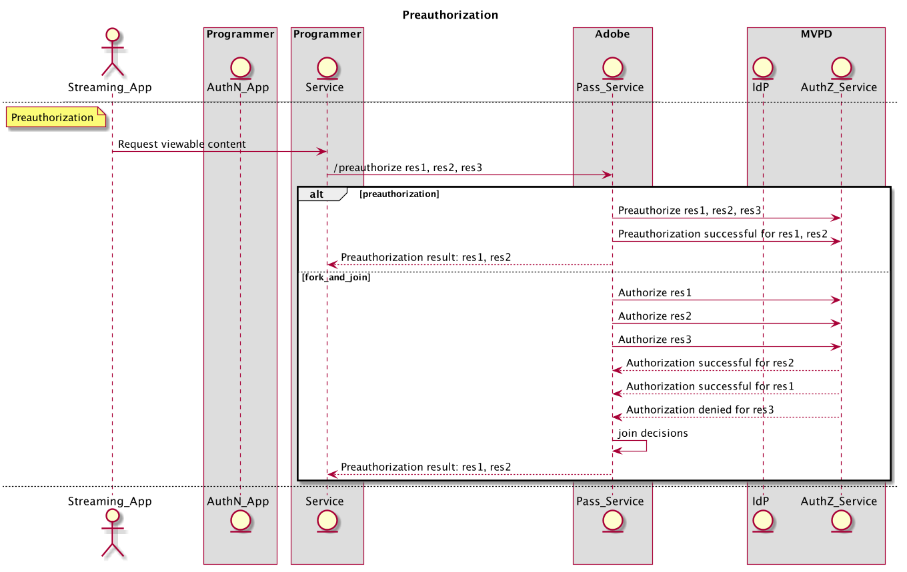

# Livro da API REST (servidor para servidor) {#rest-api-cookbook-server-to-server}

>[!NOTE]
>
>O conteúdo desta página é fornecido apenas para fins de informação. O uso dessa API requer uma licença atual do Adobe. Não é permitida a utilização não autorizada.

## Visão geral {#overview}

O objetivo deste documento de guia é detalhar as práticas recomendadas para implementar a Autenticação do Adobe Primetime usando as arquiteturas de servidor para servidor.  Ele fornece requisitos básicos, implementação passo a passo do fluxo e considerações gerais para ambientes e operações de produção.

 

## Componentes {#components}

Em uma solução de servidor para servidor em funcionamento, os seguintes componentes estão envolvidos:

 
| Tipo | Componente | Descrição | | — | — | — | | Dispositivo de transmissão | Aplicativo de transmissão | O aplicativo programador que reside no dispositivo de transmissão do usuário e reproduz vídeo autenticado. | | | \[Opcional\] Módulo AuthN | se o Dispositivo de transmissão tiver um Agente de usuário (ou seja, Navegador da Web), o Módulo AuthN será responsável pela autenticação do usuário no IdP do MVPD. | | \[Opcional\] Dispositivo AuthN | Aplicativo AuthN | se o dispositivo de transmissão não tiver um agente de usuário (ou seja, navegador da Web), o aplicativo AuthN será um aplicativo da Web programador acessado de um dispositivo de usuário separado usando um navegador da Web. | | Infraestrutura do programa | Serviço de programação | Um serviço que vincula o dispositivo de transmissão ao serviço da Adobe Pass para obter decisões de autenticação e autorização. | | Infraestrutura Adobe | Adobe Pass Service | Um serviço que se integra ao serviço MVPD IdP e AuthZ e que fornece decisões de autenticação e autorização. | | Infraestrutura MVPD | IdP MVPD | Um terminal MVPD que fornece serviço de autenticação baseado em credenciais para validar a identidade do usuário. | | | Serviço MVPD AuthZ | Um terminal MVPD que fornece decisões de autorização com base em assinaturas do usuário, controles dos pais, etc. |

Os termos adicionais usados no fluxo são definidos na variável
[Glossário](/help/authentication/glossary.md).

## Fluxos {#flows}

### Registro dinâmico de cliente (DCR)

A Adobe Pass usa o DCR para proteger as comunicações do cliente entre um aplicativo programador ou servidor e os serviços da Adobe Pass. O fluxo de DCR é separado, dependente e de pré-requisito e pode ser encontrado em [Registro dinâmico de clientes](/help/authentication/dynamic-client-registration.md).

### Autenticação (authN)

O fluxo de autenticação é usado para permitir que um usuário se identifique no MVPD para determinar se o usuário tem uma conta válida. 

1. O usuário inicia o aplicativo Dispositivo de transmissão e tenta fazer logon ou visualizar conteúdo protegido.
2. O aplicativo Dispositivo de transmissão faz uma solicitação ao Serviço de programação para determinar se o dispositivo já está autenticado.
3. O Serviço de programação registra o aplicativo usando o DCR.
4. O serviço de programação verifica o status AuthN do dispositivo de transmissão chamando o serviço Adobe Pass **checkauthn** API.
5. No caso em que a variável **checkauthn** call retorna o status em que o Dispositivo de usuário é autenticado, então o aplicativo pode prosseguir para o fluxo de Autorização.
6. No caso em que a variável **checkauthn** chamada retorna o status em que o Dispositivo de usuário NÃO está autenticado, então o aplicativo deve aguardar que uma solicitação do usuário faça logon.
7. Quando o usuário solicita o logon diretamente (por exemplo, seleciona o botão de logon) ou indiretamente (por exemplo, seleciona o conteúdo protegido quando ainda não está autenticado), o aplicativo Dispositivo de transmissão faz uma solicitação ao Serviço do programador para iniciar a autenticação do usuário. O serviço de programação solicita e recebe um código de registro exclusivo (regcode) ao chamar o serviço do Adobe Pass **regcode** API.
8. O Serviço do Programador também recupera a lista de MVPDs e atributos atuais ao chamar o Serviço da Adobe Pass **configuração** API. Observação: essa API também pode ser chamada anteriormente no fluxo e no cache.
9. O Serviço do Programador retorna o código de regravação para o aplicativo do Dispositivo de Streaming e a lista MVPD processada solicitada na etapa \#7. Observação: O formato de lista MVPD processado é especificado pelo Programador e pode ser filtrado para permitir ou bloquear explicitamente MVPDs específicos (ou seja, listas de permissões ou de bloqueios).
10. Se for diferente do dispositivo AuthN (ou seja, &quot;segunda tela&quot;), por escolha ou necessidade (ou seja, o Dispositivo de transmissão não suporta um Agente de usuário), o Dispositivo de transmissão deve exibir o regcode e um URI para o usuário acessar o Aplicativo AuthN. O usuário digita o URI no Agente do Usuário no Dispositivo AuthN para iniciar o Aplicativo AuthN e, em seguida, digita o regcode nesse aplicativo. Se o Dispositivo de transmissão for igual ao Dispositivo AuthN, o regcode poderá ser transmitido programaticamente para o Módulo AuthN.
11. O Módulo AuthN inicia a autenticação do usuário com o MVPD exibindo um Seletor MVPD. Depois que o usuário seleciona o MVPD, o módulo AuthN chama **autenticar** com o regcode, que redireciona o Agente de Usuário para o IdP do MVPD. Quando o usuário é autenticado com êxito no MVPD, o Agente do Usuário é redirecionado pelo Serviço do Adobe Pass, onde a autenticação bem-sucedida é registrada com o regcode, e então é redirecionado de volta ao Módulo AuthN.
12. Se o Dispositivo de transmissão for diferente do Dispositivo AuthN, o Dispositivo AuthN deverá exibir uma mensagem de autenticação bem-sucedida ao usuário e as etapas para continuar (por exemplo, &quot;Sucesso\! Agora você pode retornar ao console do jogo para continuar \[...\]&quot;). Se o Dispositivo de transmissão for igual ao Dispositivo AuthN, o Dispositivo de transmissão poderá detectar programaticamente a conclusão da autenticação.

 

O diagrama a seguir ilustra o fluxo de autenticação:

### Autorização (authZ)

O fluxo de autorização é usado para determinar se um usuário tem direito de acessar o conteúdo solicitado.

1. Toda vez que o usuário tenta visualizar conteúdo protegido no aplicativo do dispositivo de transmissão, o aplicativo do dispositivo de transmissão chama o serviço de programação, identificando o conteúdo, solicitando a permissão e as informações necessárias para iniciar o fluxo.
1. O serviço de programação chama a Adobe Pass **autorizar** A API que transmite o ID do recurso junto com outros parâmetros necessários. O serviço da Adobe chama o serviço MVPD AuthZ com a ID do recurso e recebe uma decisão de autorização que é retornada ao serviço do programador. Essa decisão de autorização será armazenada em cache pelo Adobe Pass Service por um período configurável. Em seguida **autorizar** Chamadas do Serviço do Programador para o Adobe Pass Service, o valor em cache será retornado, desde que seja válido.
1. Se a autorização for concedida, o Serviço do Programador deve chamar a Adobe Pass **/tokens/media** API, que retornará um token de mídia assinado. O serviço Programador deve validar o token de mídia usando a biblioteca do Verificador de Token de Mídia (JAR). Se for válido, o Serviço do Programador deve retornar a permissão e o necessário para iniciar o fluxo (por exemplo, URL de fluxo) solicitado na etapa \#1.
1. Se a autorização for negada, a **autorizar** chamada retornará um código de erro e uma descrição para o Serviço do programador. O serviço Programador deve retornar o código de erro e a descrição (ou uma mensagem modificada pelo Programador) para a solicitação na etapa \#1.

O diagrama a seguir ilustra o fluxo de autorização:

### Logout

O fluxo de logout permite que um usuário remova a identidade associada ao aplicativo no momento.

1. Quando o usuário solicita o logout (ou seja, remove do dispositivo a conta MVPD atual associada ao aplicativo), o aplicativo Dispositivo de transmissão chama o Serviço do programador para que ele desconecte o dispositivo.
1. O serviço de programação deve chamar a Adobe Pass **logout** API.

O diagrama a seguir ilustra o fluxo de logout:

### \[Opcional\] Pré-autorização (também conhecido por Pré-voo)

A pré-autorização pode ser usada para determinar rapidamente, a partir de um conjunto de recursos, aqueles que um usuário pode ter acesso.  O resultado dessa chamada é normalmente usado para personalizar a interface do usuário para um usuário individual.

1. Depois que o usuário é autenticado, o Dispositivo de Steaming pode chamar o Serviço do Programador para solicitar o conteúdo para o qual o usuário tem direito de stream.

1. O serviço de programação deve chamar a Adobe Pass **pré-autorizar** API com uma lista de IDs de recurso, que são uma sequência de caracteres simples que normalmente representam um canal ao qual um usuário pode ter direito para transmitir. *Observação: Atualmente, o* ***pré-autorizar*** *é configurada para limitar a lista a cinco (5) IDs de recurso. Quando mais de cinco recursos forem necessários, vários* ***pré-autorizar*** *as chamadas podem ser feitas ou a chamada pode ser configurada para aceitar mais de cinco recursos com um acordo dos MVPDs. Os implementadores devem ter em mente o custo de um* ***pré-autorizar*** *chame os recursos do MVPD, bem como o tempo de resposta ao Programador e estruture seu uso da chamada criteriosamente.*

1. O **pré-autorizar** A chamada responderá ao Serviço do programador com um objeto JSON contendo um valor TRUE ou FALSE para cada ID de recurso na solicitação que indica se o usuário tem direito ao canal associado ou não. *Observação: Se um MVPD não fornecer uma resposta para um determinado ID de Recurso (por exemplo, devido a erros de rede ou tempo limite), o valor assumirá FALSE como padrão.*

1. O serviço de programação deve usar a variável **pré-autorizar** chamada de resposta para criar uma resposta personalizada definida pelo Programador para o Dispositivo de transmissão, normalmente para personalizar a apresentação para o usuário com base em seus direitos.

O diagrama a seguir ilustra o fluxo de pré-autorização:

### \[Opcional\] Metadados

Os metadados podem ser usados para recuperar informações do usuário compartilhadas pelo MVPD.
 Exemplos disso podem incluir ID de usuário, código postal etc.

1. Depois que o usuário é autenticado, o Serviço do Programador pode chamar a Adobe Pass **usermetadata** API para solicitar informações sobre o usuário autenticado.

1. A resposta incluirá todos os metadados disponíveis para o usuário em questão. Os campos específicos são configurados separadamente para cada integração do Programador/MVPD.

O diagrama a seguir ilustra o fluxo de pré-autorização:

 

 

## Ambientes e requisitos funcionais{#environments}

 

Um Programador deve criar pelo menos dois ambientes: um para produção e um ou mais para preparo.

### Produção

O ambiente de produção deve ser altamente disponível e dimensionado adequadamente para picos grandes ou inesperados (por exemplo, esportes ao vivo, notícias de última hora).

 

O serviço Adobe Pass é executado em vários data centers geograficamente dispersos pelos EUA.  Para obter o melhor tempo de resposta (ou seja, a latência mais baixa) do serviço Adobe Pass, o programador também deve criar uma infraestrutura de serviço geograficamente dispersa semelhante. 

O serviço Programador deve limitar o cache DNS a um máximo de 30 s caso o Adobe precise redirecionar o tráfego. Isso pode ocorrer se um data center se tornar indisponível.\
 

O Programador deve fornecer a gama de IP público do ambiente de produção. Eles serão inseridos em uma lista de IPs permitidos na infraestrutura Adobe Pass para acesso e gerenciados pelas políticas de uso da API Fair Adobe.

### Estágios

O ambiente de preparo pode ser mínimo, mas deve incluir todos os componentes do sistema e a lógica comercial. Deve funcionar de forma semelhante à produção e permitir o ensaio de emissões fora da produção. Idealmente, o ambiente de preparo pode ser conectado aos ambientes de teste do Adobe Pass para uso pelo Programador e pelo Adobe, quando necessário, para que possamos ajudar nos testes e na solução de problemas.

### Requisitos funcionais

O serviço Programador deve transmitir informações precisas de identificação do dispositivo para o dispositivo para o qual está executando os fluxos. Além disso, o serviço Programador deve passar o IP do dispositivo para o qual está executando os fluxos (em um cabeçalho x-sent-for) juntamente com a porta de origem da conexão (no campo de informações do dispositivo):

    **X-Forwarded-For : \&lt;client _ip=&quot;&quot;>** 
    
    onde \&lt;client _ip=&quot;&quot;> é o endereço IP público do cliente
    
     
    
    O cabeçalho precisa ser adicionado em chamadas **regcode** e **allow***
    
    Exemplos :
    
    POST /reggie/v1/{req\_id}/regcode HTTP/1.1
    
    X-Forwarded-For:203.45.101.20
    
     
    
    GET /api/v1/autorizar HTTP/1.1
    
    X-Forwarded-For:203.45.101.20

 

O serviço Programador deve enviar os dados e a formatação exigidos por MVPDs individuais ou aplicativos integrados (por exemplo, IP do dispositivo, porta de origem, informações do dispositivo, MRSS, dados opcionais como ECID). <!--Please see the documentation for [Passing Device and Connection Information Cookbook](http://tve.helpdocsonline.com/passing-device-information-cookbook)-->.

O serviço Programador deve respeitar os TTLs authN e authZ ao armazenar em cache e invalidar as sessões authN ou authZ quando notificado.

O Programador deve manter certificados compartilhados com o Adobe.

<!--
## Related Information {#related}

* [REST API Reference](/help/authentication/rest-api-reference.md)
* [Glossary of Terms](/help/authentication/adobe-pass-glossary.md)
-->