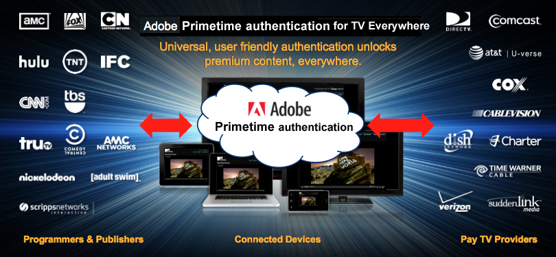

# Sobre a autenticação da Adobe Primetime e da TV em todos os lugares {#about-auth-tve}

>[!NOTE]
>
>O conteúdo desta página é fornecido apenas para fins informativos. O uso desta API requer uma licença atual do Adobe. Não é permitida nenhuma utilização não autorizada.

## Sobre a TV em todos os lugares {#about-tve}

Os telespectadores de hoje podem ficar online a qualquer hora ou lugar, e esperam que sua capacidade de acessar conteúdo de TV por assinatura esteja lá mesmo com eles. Além disso, os públicos-alvo estão visualizando conteúdo usando uma variedade cada vez maior de dispositivos compatíveis com a Internet, incluindo:

* Notebooks
* Comprimidos
* Smartphones
* Sites da Web
* Aplicativos Federados
* Consoles de jogos
* Decodificadores
* TVs inteligentes

TV Everywhere é o movimento industrial que apoia a capacidade dos assinantes de TV por assinatura de acessar o mesmo conteúdo pelo qual já estão pagando, em vários dispositivos, dentro e fora de suas casas. Embora a maior parte da visualização de televisão ainda esteja ocorrendo na TV convencional e linear, o crescimento no consumo está no conteúdo deslocado no tempo, vídeo on-line e telas alternativas. Como resultado, o mercado de distribuição de vídeo hoje está em um estado de ruptura, e a TV Everywhere emergiu como a solução que alinha os interesses dos programadores, provedores de TV por assinatura e assinantes de TV por assinatura.

O objetivo técnico da TV Everywhere é permitir que os clientes de TV por assinatura acessem o conteúdo ao qual já estão inscritos em todos os seus dispositivos e plataformas.

Os objetivos de negócios da TV Everywhere são:

* **Preservar os relacionamentos existentes com os clientes e habilitar novos relacionamentos**
* Permitir que programadores e proprietários de conteúdo atinjam o público mais amplo e capturem mais valor do conteúdo premium
* Estender marcas por meio da interação online direta com visualizadores

## Desafios da TV em todos os lugares {#tve-challenges}

Junto com as oportunidades da TV Everywhere vêm desafios. No cerne destes direitos está o direito. Antes de um visualizador acessar o conteúdo de assinatura, alguém precisa determinar se tem direito a esse acesso.

O usuário tem uma assinatura com um provedor de TV por assinatura? Em caso afirmativo, essa assinatura inclui o conteúdo que está sendo solicitado? O direito é especialmente difícil para programadores e proprietários de conteúdo determinarem diretamente, porque são os operadores de TV por assinatura que têm os dados de identificação de seus clientes, bem como os privilégios de acesso de seus clientes.

Além dos direitos, há vários desafios técnicos e de integração relacionados, incluindo:

* Desenvolver e adotar uma estratégia abrangente para vários dispositivos
* Coordenando as inúmeras relações entre programadores e provedores de TV por assinatura
* Impedir o acesso fraudulento ou o abuso de termos de serviço
* Fornecendo uma experiência de autenticação consistente e sem frustrações para usuários em sites e aplicativos
* Manutenção de um rápido tempo de entrada no mercado para acompanhar as negociações de afiliados
* Gerenciamento de custos associados a várias integrações

Esses desafios tornam o desempenho e a manutenção de integrações complexas e diretas entre os programadores e os sistemas de autenticação de vários provedores de TV por assinatura altamente exigentes em recursos, exigindo tempo e sofisticação técnica.

A solução? **Autenticação do Adobe® Primetime**.

## Introdução à autenticação do Adobe Primetime {#authentication-intro}

Com a autenticação do Adobe Primetime, os programadores e provedores de TV por assinatura precisam apenas fazer uma integração simples, usando APIs de autenticação da Adobe Primetime, para obter acesso a todo o ecossistema, incluindo:

* Programadores como Turner Broadcasting (TBS, TNT, CNN), Fox Broadcast Networks e Hulu

* Todos os principais fornecedores de TV paga nos EUA, compreendendo mais de 90% de todos os lares de TV paga dos EUA

Além disso, a autenticação da Adobe Primetime fornece a estrutura que torna a autenticação e a autorização do usuário simples e seguras.

*Figura 1: Apenas alguns dos programadores e provedores de TV por assinatura que se conectam por meio da autenticação do Adobe Primetime...*

O Adobe Pass realiza com segurança as transações de direitos entre programadores e provedores de TV por assinatura, facilitando o acesso do visualizador ao conteúdo de assinatura. Ou, em outras palavras...

**A autenticação do Adobe Primetime facilita e agiliza o acesso dos clientes certos ao conteúdo certo.**

**Para quem é a autenticação da Adobe Primetime?**

* **Programadores** que desejam integrar facilmente com provedores de TV por assinatura (também conhecidos como &quot;MVPDs&quot; ou &quot;Distribuidores de programação de vídeo multicanal&quot;), atingindo o público mais amplo, para obter receita ideal. Usando a autenticação do Adobe Primetime, os programadores podem autenticar visualizadores em todos os principais provedores, independentemente da plataforma do cliente.

* **Provedores de TV por assinatura/MVPDs** que buscam conectividade indolor com vários programadores e maior satisfação do cliente, facilitando o acesso ao conteúdo de assinatura on-line.

* **Clientes de TV por assinatura** que desejam acesso fácil ao conteúdo que já assinam, onde quer que estejam, sem custo adicional. O logon único fornece autenticação segura do visualizador na Web ou em aplicativos móveis, sem exigir downloads do cliente ou logons repetidos, bem como uma boa experiência do usuário.

Para **Programadores**, a autenticação do Adobe Primetime fornece:

* Fácil integração e conectividade instantânea com os principais provedores de TV paga, sem o problema de várias integrações diretas
* Otimização das receitas de assinatura (licenciamento) e de publicidade ao oferecer suporte aos mais amplos públicos-alvo possíveis para o conteúdo
* Autenticação segura, com acesso a conteúdo premium concedido somente a usuários/dispositivos autorizados
* Uma estrutura aberta e flexível que é independente de plataforma de player e DRM; a reprodução pode ocorrer em uma grande variedade de plataformas, incluindo iOS, Android, Windows 8, consoles de jogos, decodificadores de sinais e muito mais.
* Compatibilidade com qualquer tecnologia DRM, como Adobe Flash Access® ou Play Ready®.
* Suporte para autenticação e autorização de Logon Único (SSO), para que os assinantes não precisem fazer logon novamente após a primeira autenticação em seus próprios sistemas.

Para **Provedores de TV por assinatura/MVPDs**, a autenticação do Adobe Primetime fornece:

* Fácil integração com proprietários de conteúdo, fornecendo conectividade instantânea com vários programadores usando uma única integração
* Maior engajamento do cliente ao oferecer suporte a uma experiência perfeita e com marca, pois visualizam o conteúdo em várias plataformas e dispositivos
* Autenticação segura que garante que somente usuários/dispositivos autorizados tenham acesso ao conteúdo premium e (opcionalmente) limita o número de dispositivos e fluxos simultâneos que podem se conectar por conta da família.

Para **Clientes de TV por assinatura**, a autenticação do Adobe Primetime fornece:

* **TV em todos os lugares!**

O restante deste documento fornece uma introdução técnica à autenticação da Adobe Primetime.  Embora grande parte dos itens a seguir se concentre na integração de programadores, há informações gerais e específicas que se aplicam a provedores de TV por assinatura também. Este documento também destaca a segurança e a integridade de como a autenticação do Adobe Primetime funciona como uma solução para o TV Everywhere. Para obter mais detalhes além deste documento, entre em contato com o representante da Adobe ou preencha o Formulário de solicitação de informações [aqui](https://www.adobe.com/).

## Blocos de construção de arquitetura {#arch-building-blocks}

 Veja a seguir as transações de direitos centrais de autenticação e autorização. A autenticação é o processo de confirmar com um provedor de TV por assinatura que um determinado usuário é um cliente conhecido. A autorização é o processo no qual um provedor de TV por assinatura confirma que um usuário autenticado tem uma assinatura válida para um determinado recurso.
A autenticação do Adobe Primetime consiste nos seguintes componentes básicos:

* Componente do cliente (um dos seguintes):

   * O Access Enabler - Uma biblioteca específica da plataforma; fornece APIs fáceis de usar e amostras de código para implementar os fluxos de direitos
   * A API sem cliente - serviços Web RESTful; fornece endpoints de fluxo de direitos para plataformas sem recursos de renderização de página da Web (como consoles de jogos, decodificadores de sinais, etc.)

* Servidores de back-end hospedados pelo Adobe
* O verificador de token de mídia
* Um meio de troca seguro e central (tokens)

Em um nível básico, a autenticação do Adobe Primetime consiste em três componentes (o Ativador de acesso, os servidores back-end hospedados em Adobe e o Verificador de token de mídia) e um item central de troca (tokens).

### Componentes do cliente {#client-components}

* Ativador de acesso
* API sem cliente

#### Ativador de acesso {#access-enabler}

Em plataformas totalmente compatíveis (incluindo a Web, iOS, Android, Windows 8), os programadores interagem com a autenticação do Adobe Primetime por meio do componente de cliente Access Enabler. Esse componente facilita todas as interações de autenticação e autorização com o cliente.  O Access Enabler é executado localmente no sistema. Quando um usuário acessa um site ou aplicativo do Programador e solicita conteúdo, o componente Access Enabler hospedado/mantido no Adobe é carregado silenciosamente em segundo plano.

O Ativador de acesso lida com os workflows de direitos reais, enquanto o Programador mantém a responsabilidade pela página da Web de nível superior ou pelo aplicativo do reprodutor que implementa a interface do usuário e interage com o Ativador de acesso. Essas interações são realizadas por meio de um sistema assíncrono de funções e retornos de chamada, definidos pela API do Access Enabler.

Esses são os fluxos de direitos básicos, facilmente implementados usando a API do Access Enabler:

* Definir a identidade do solicitante (Programador)
* Verificação/obtenção da autenticação do usuário em relação a um determinado operador de TV por assinatura (o &quot;Provedor de Identidade&quot;)
* Verificação/obtenção de autorização do usuário para um recurso específico
* Fazendo logout do usuário

O Access Enabler também fornece os seguintes serviços:

* Valida as consultas do Programador, incluindo o status de registro de clientes específicos, seus domínios e seus recursos/canais.
* Ele fornece os dados que criam a lista de operadores de TV por assinatura a partir dos quais o usuário seleciona seu provedor. Essa lista também é validada e definida conforme apropriado para o Programador do qual a solicitação se origina.
* Ele inicia workflows de autenticação e autorização específicos do operador de TV por assinatura.
* Ele armazena em cache as respostas de autorização bem-sucedidas por recurso/canal do programador para minimizar o tráfego de solicitação desnecessário.
* Ele pode ser configurado para fluxos de trabalho predefinidos específicos para cada operador de TV por assinatura, como o registro explícito do dispositivo.

Dependendo do site ou aplicativo de reprodução, o Ativador de acesso pode assumir as seguintes formas:

* Um arquivo SWF que o tempo de execução do Flash Player pode executar
* Um arquivo JS executado diretamente pelo navegador
* Um Ativador de acesso nativo para plataformas compatíveis (incluindo iOS, Android e Windows 8)

#### API sem cliente {#clientless-api}

A abordagem da API sem cliente é para &quot;dispositivos inteligentes&quot; (consoles de jogos, decodificadores de sinais e TVs inteligentes) que não são compatíveis com navegadores da Web (necessário para autenticação com MVPDs).  Na abordagem sem cliente, os aplicativos de dispositivo inteligente se comunicam diretamente com a autenticação do Adobe Primetime por meio de APIs de serviços Web RESTful para tudo, exceto autenticação, que é executada em um segundo aplicativo de tela (navegador). Em outras palavras, a biblioteca do lado do cliente do Access Enabler não é usada. Em vez disso, os desenvolvedores de aplicativos de dispositivos inteligentes consomem diretamente as APIs de serviços da Web de autenticação da Adobe Primetime para implementar os fluxos de direito.

### Servidores de back-end hospedados pelo Adobe {#adobe-backend-servers}

Os servidores back-end de autenticação da Adobe Primetime, hospedados pela Adobe:

* Provisione os fluxos de trabalho de autenticação e autorização com os provedores de TV por assinatura que exigem comunicação servidor a servidor entre a autenticação do Adobe Primetime e o operador.
* Mantenha a configuração dos sites e aplicativos do Programador.
* Hospede os arquivos componentes baixáveis do Access Enabler.
* Forneça os pontos de extremidade do serviço Web RESTful para a integração da API sem cliente.
* Gere (e em alguns casos, armazene) tokens de autenticação e autorização.

### Tokens e o Verificador de token de mídia {#tokens-media-token-verifier}

A solução de direitos de autenticação da Adobe Primetime se concentra na geração de dados específicos que são obtidos após a conclusão bem-sucedida dos workflows de autenticação/autorização. Esses dados são chamados de tokens. Eles têm uma vida útil limitada e são armazenados com segurança, em locais dependentes de plataforma no cliente ou em servidores Adobe, no caso da solução de API sem cliente. Após a expiração, os tokens devem ser emitidos novamente por meio da reinicialização dos workflows de autenticação e/ou autorização.

Há três tipos de tokens que o Adobe Primetime emite durante os workflows de autenticação/autorização. Duas são de &quot;longa duração&quot;, proporcionando continuidade na experiência de visualização do usuário. O terceiro, um token de vida curta, fornece suporte às práticas recomendadas do setor para mitigar fraudes (onde a fraude inclui explorações, como a extração de fluxo, por exemplo). Os valores de vida útil (&quot;TTL&quot;) são definidos com base em acordos entre programadores e provedores de TV por assinatura, que concordam em um valor que melhor atenda a todos os envolvidos.

#### Token de autenticação (de longa duração) {#long-lived-auth-token}

O sucesso da autenticação ocorre quando o cliente usa a autenticação do Adobe Primetime para fazer logon com êxito em sua conta de TV paga. A autenticação do Adobe Primetime produz um token de autenticação de longa duração (AuthN) vinculado ao dispositivo solicitante e (dependendo do provedor de TV por assinatura) um identificador exclusivo global (&quot;GUID&quot;) que identifica o usuário de forma anônima.

* A autenticação do Adobe Primetime armazena o token de autenticação com segurança em um local onde ele está disponível para todos os aplicativos que usam a autenticação do Adobe Primetime. Para integrações do Access Enabler, os tokens são armazenados com segurança no lado do cliente.  A autenticação do Adobe Primetime usa o token de autenticação para fazer consultas de autorização subsequentes em nome do usuário.
* Em um dado momento, somente um token de AuthN é armazenado. Sempre que um novo token de autenticação for emitido e um antigo já existir, o novo token substituirá o valor armazenado existente.

#### (Vida longa) Token de autorização {#long-lived-authriz-token}

Após a autorização bem-sucedida, a autenticação do Adobe Primetime cria um token de autorização de longa duração (&quot;AuthZ&quot;). Esse token não é portátil, pois está vinculado ao dispositivo solicitante e a um recurso protegido específico (por exemplo, um canal, série ou episódio).

* A autenticação do Adobe Primetime armazena o token AuthZ com segurança, juntamente com outros tokens de autorização para outros recursos.  Novamente, assim como com os tokens AuthN, em plataformas que usam o Access Enabler o token é armazenado localmente no cliente; em plataformas que usam a API sem clientes, os tokens são armazenados nos servidores de autenticação da Adobe Primetime.
* O TTL (time-to-live) do token AuthZ de longa vida é normalmente definido na faixa de dias a semanas, dependendo do acordo específico entre o provedor de TV por assinatura e o programador.
* Em um dado momento, somente um token de AuthZ por recurso é armazenado. Pode haver vários tokens de autorização armazenados, desde que eles estejam associados a recursos diferentes. Sempre que um novo token de autorização for emitido e um antigo já existir para o mesmo recurso, o novo token substituirá o valor em cache existente.
* A autenticação do Adobe Primetime usa o token AuthZ de longa duração para criar os tokens de mídia de curta duração usados para acesso de visualização real.

#### Token de mídia de vida curta {#short-lived-media-token}

Depois que a autenticação do Adobe Primetime gera o token AuthZ, ela o usa para gerar um token de mídia de uso único e de vida curta que é assinado pelo Adobe e criptografado para evitar adulterações durante a troca:

* O TTL do token de vida curta (padrão: 5 minutos) é definido para permitir problemas de sincronização de relógio entre o servidor que está gerando o token e o servidor que está validando o token.
* O token de curta duração é exposto ao site de incorporação antes de fornecer acesso ao recurso protegido, portanto, o Programador deve validar o token, usando o Verificador de token de mídia para integrações do Access Enabler ou o Serviço de Verificador de token no caso de integrações de API sem cliente.

#### Verificador de token de mídia {#media-token-verifier}

Os programadores são responsáveis pela integração da Biblioteca de verificador de token de mídia em seus servidores de aplicativos existentes, para que o Verificador possa executar as validações finais do usuário antes que um fluxo de vídeo seja realmente iniciado. A biblioteca Verificador de token de mídia define:

* Uma API de verificação de token que recupera informações do token, como se ele é válido, a hora em que o token foi emitido e outros dados relevantes
* A chave pública de Adobe usada para verificar se o token realmente vem do Adobe
* Uma implementação de referência que mostra como usar a API do Verificador e como usar a chave pública Adobe contida na biblioteca para verificar sua origem

*Figura 2: Arquitetura de alto nível do ecossistema de autenticação da Adobe Primetime em uma integração do Access Enabler*

## Integração com a autenticação do Adobe Primetime {#integrate-auth}

Quer você seja um provedor de TV por assinatura ou um programador, o processo de integração com a autenticação da Adobe Primetime requer uma certa quantidade de sua participação ativa. Cada um desses processos é descrito abaixo.

### O Processo do Provedor de TV por Assinatura

A principal responsabilidade do provedor de TV por assinatura com a autenticação do Adobe Primetime é validar se um usuário solicitante é realmente um assinante conhecido que está autorizado a acessar o conteúdo do Programador. Em um nível superior, o processo de autenticação do Adobe Primetime para integração com um novo provedor de TV por assinatura requer as seguintes etapas:

1. O provedor assina o NDA (Non-Disclosure Agreement, contrato de não divulgação) de autenticação da Adobe Primetime.
1. O provedor fornece ao Adobe especificações para seu sistema de autenticação e autorização. Para simplificar a integração, recomenda-se que os operadores de TV por assinatura tenham um provedor de identidade (IdP) baseado em SAML para autenticação e a capacidade de se comunicar por meio do protocolo de acesso SOAP para autorização.
1. O provedor estabelece conectividade entre seus servidores e os servidores de autenticação da Adobe Primetime. Isso inclui o fornecimento de pontos de extremidade e a listagem de IPs.
1. Pré-qualificação e QE.
1. Versão de produção e QE.

Embora a autenticação do Adobe Primetime possa substituir as integrações existentes para Programadores, isso normalmente não é necessário para provedores de TV por assinatura. O Adobe trabalha com a equipe técnica do provedor para configurar a autenticação do Adobe Primetime de forma a atender às necessidades de quaisquer integrações existentes. A integração é gratuita para provedores de TV por assinatura, presumindo uma integração &quot;padrão&quot; e requisitos mínimos de suporte (documentação e suporte básico por email). Se um provedor exigir suporte significativo ou um cronograma escalonado, uma taxa de suporte poderá ser cobrada ou o provedor poderá querer trabalhar com terceiros familiarizados com nossa solução, como a Synacor.

A autenticação do Adobe Primetime também oferece suporte à manipulação eficiente da lógica de negócios do provedor de TV por assinatura, como demonstrado a seguir:

* Para uma lógica de negócios que é independente e pode ser aplicada pelo operador quando um pedido de autorização é recebido, o Adobe fornece os dados necessários necessários para apoiar a aplicação da lógica de negócios quando o operador recebe um pedido de autorização. Esses dados podem incluir, mas não podem se limitar a, a ID de dispositivo exclusiva do usuário que faz a solicitação e o endereço IP do dispositivo.
* Para uma lógica de negócios que requer a intervenção do usuário e/ou tratamento específico pela solução Adobe, o Adobe pode manter algumas propriedades personalizadas para cada provedor de TV por assinatura. Essas configurações/políticas específicas do operador incluem a ativação de fluxos de trabalho predefinidos que podem ser iniciados em pontos específicos do fluxo de trabalho de nível superior. Para obter detalhes sobre o suporte a propriedades personalizadas, entre em contato com o representante da Adobe.

O Adobe também oferece serviços de limitação de fraudes. Entre em contato com o representante da Adobe para obter detalhes.

### O processo do programador {#programmer-process}

Para integrar com êxito a autenticação do Adobe Primetime, os programadores devem configurar o aplicativo de reprodutor de mídia ou página da Web para trabalhar com a autenticação do Adobe Primetime no tratamento dos processos principais de qualificação: autenticação, autorização e logout.

Antes de iniciar uma integração com a autenticação do Adobe Primetime, os programadores devem ter:

* Uma plataforma de vídeo online existente, incluindo um reprodutor de mídia, como parte de um site ou como um aplicativo independente
* Um sistema de gerenciamento de conteúdo
* Um mecanismo de entrega, que pode ou não incluir uma rede de entrega de conteúdo de terceiros (CDN)

Os programadores devem esperar executar algumas tarefas de integração como parte do fornecimento de serviços da TV Everywhere com a autenticação do Adobe Primetime. Essas tarefas incluem:

* Integração da biblioteca Access Enabler da autenticação do Adobe Primetime à sua página da Web ou reprodutor de mídia, ou implementação da integração usando a abordagem sem cliente para &quot;dispositivos inteligentes&quot; que não são compatíveis com a Web
* Trabalho do lado do servidor para integrar o componente de verificador de token de autenticação do Adobe Primetime ao fluxo de trabalho de transmissão de vídeo
* Criação de uma interface para o fluxo de trabalho de acesso em seu site ou aplicativo (alguns elementos disso, como o processo de logon real, são fornecidos pelo operador de TV por assinatura e alguns elementos estão opcionalmente disponíveis como parte da autenticação do Adobe Primetime)

Adobe Este documento fornece uma visão geral do processo do programador e fornece orientação adicional sobre o início formal da integração.

#### Configuração do solicitante (programador) {#requester-prog-setup}

##### Registro com o Adobe {#registering}

Como primeira etapa, os programadores devem se registrar com o Adobe ou um parceiro autorizado de Adobe e especificar os domínios que desejam usar com a autenticação da Adobe Primetime. Os programadores recebem uma ID de solicitante exclusiva, fornecida para a autenticação do Adobe Primetime, para cada sessão em que o programador interage com o Access Enabler.

##### Configuração Da Integração Inicial Do Access Enabler {#access-enabler-int-setup}

Antes de qualquer cliente solicitar acesso ao conteúdo, os programadores devem integrar o componente de cliente de autenticação do Adobe Primetime, o Ativador de acesso, ao aplicativo de reprodutor de mídia ou página da Web existente. Há várias opções para fazer isso:

* Você pode incorporar a versão do Flash, AccessEnabler.swf, em um player de vídeo baseado em Flashes em uma página da Web ou diretamente no HTML. Você pode se comunicar com o SWF no ActionScript ou JavaScript. A API base é ActionScript, mas uma biblioteca JavaScript wrapper completa está disponível.
* Para dispositivos que não sejam de Flash, é possível:
   * Use a versão do HTML5/JavaScript e o AccessEnabler.js e comunique-se com ele por meio da API do JavaScript ou
   * Use uma biblioteca nativa do Access Enabler, como para iOS, Android ou Windows 8

##### Configuração da integração inicial da API sem cliente {#clientless-api-int-setup}

Antes de qualquer cliente solicitar acesso ao conteúdo, os programadores devem implementar as chamadas de serviços da Web RESTful usando a API sem cliente no aplicativo do reprodutor de mídia, bem como configurar um aplicativo de &quot;segunda tela&quot; para lidar com o logon do usuário em seu provedor de TV paga pela Web.

#### Manipulando Autenticação e Autorização {#auth-authr-handling}

Quando um cliente solicita um recurso protegido de um Programador pela primeira vez, o Programador apresenta ao cliente uma lista de provedores de TV por assinatura com os quais escolher. Quando o provedor é selecionado, o usuário é redirecionado para esse operador para autenticação inicial do usuário. Depois que a autenticação é bem-sucedida, a autenticação do Adobe Primetime se comunica com o provedor de TV por assinatura selecionado para autorizar o acesso ao recurso especificado. Veja a seguir detalhes sobre esses processos.

*Figura 3: Exemplo de interface do usuário de seleção de provedor*

>[!NOTE]
>
>* A autenticação ocorre como uma troca SAML entre a autenticação do Adobe Primetime como Provedor de serviços (ou &quot;SP&quot;) e um provedor de TV paga como Provedor de identidade (ou &quot;IdP&quot;).
>* A autorização usa uma troca de serviço Web de canal de retorno (servidor para servidor) entre a autenticação do Adobe Primetime (o SP) e um provedor de TV por assinatura (o IdP).

##### Comunicação do programador usando o ativador de acesso

O canal de comunicação bidirecional entre o Ativador de acesso e a página da Web ou o aplicativo de reprodução do Programador segue um padrão totalmente assíncrono. O Programador envia mensagens para o Ativador de acesso por meio dos métodos expostos pela API do Ativador de acesso. O Ativador de acesso responde por meio de retornos de chamada registrados na biblioteca do Ativador de acesso.

* Qualquer solicitação de autorização solicita automaticamente a autenticação primeiro, se um token de autenticação não for encontrado no sistema local. Quando a autenticação é bem-sucedida, o token do cliente é armazenado localmente, para que ele não precise fazer logon novamente por um determinado período. Se a autenticação for bem-sucedida por meio da solução de direito de autenticação da Adobe Primetime em qualquer outro contexto (por exemplo, por meio do site do provedor de TV por assinatura ou de um programador diferente), o Ativador de acesso terá acesso ao token local e não exigirá uma autenticação adicional.
* Quando um cliente solicita um recurso específico, o Programador solicita autorização do provedor de TV paga por meio do Ativador de acesso. Após verificar (ou iniciar) a autenticação, o Ativador de acesso entra em contato com o provedor de TV paga (por meio da autenticação do Adobe Primetime) para determinar se o cliente tem direito a visualizar o recurso. A autenticação do Adobe Primetime lida com a comunicação com o provedor de TV por assinatura para obter autorização. O Programador precisa apenas enviar a solicitação ao Ativador de acesso e manipular a resposta (sucesso ou falha de autorização). Se a autorização for bem-sucedida, um token de autorização será armazenado no sistema cliente e o retorno de chamada receberá um token de mídia de vida curta.

##### Comunicação do programador usando a API sem cliente {#progr-comm-clientless-api}

A comunicação entre o aplicativo do Programador e a autenticação do Adobe Primetime é feita por meio dos serviços Web RESTful.  Há protocolos de segurança em vigor para todas as chamadas de API para os endpoints de autenticação da Adobe Primetime.  Os requisitos de segurança são descritos na Documentação da API sem cliente.

##### Exemplo de fluxo de trabalho com autenticação baseada em SSO do navegador da Web SAML {#sample-wf}

1. O Visualizador Navega até um site (dummy1.com) e tenta acessar o conteúdo autorizado.
1. A página/reprodutor de vídeo carrega o Ativador de acesso do adobe.com e, quando solicitado pela ação do usuário, solicita autorização para o conteúdo solicitado.
1. O Access Enabler executa e valida o solicitante e a solicitação.
1. O Ativador de Acesso verifica se há um token de autorização válido no armazenamento local. Se uma autorização válida for encontrada, o Access Enabler produzirá um token de mídia de vida curta (consulte a etapa 14).
1. Se nenhuma autorização válida for encontrada para o recurso solicitado, mas houver um token de autenticação válido, o Ativador de Acesso iniciará uma solicitação de autorização com o provedor de TV por Assinatura em que o usuário está autenticado. O servidor Adobe fornece a troca de solicitação/resposta de autorização com o provedor de TV por assinatura.
1. Se nenhum token de autenticação válido for encontrado, o Ativador de acesso solicitará ao usuário seu provedor de TV paga. (A seleção de um provedor que oferece suporte à autenticação baseada em SSO do navegador da Web SAML aciona um fluxo de trabalho de autenticação baseado em SAML. Para provedores não SAML, o Adobe lida com um fluxo de trabalho personalizado semelhante.)
1. O Ativador de acesso navega pelo navegador para o serviço Adobe SAML SP (Provedor de serviço), transmitindo-o a todos os parâmetros apropriados.
1. O SAML SP invoca o SAML IdP (Provedor de Identidade) apropriado no provedor de TV por assinatura do usuário, usando o perfil de navegador da Web SAML conforme indicado nos metadados do IdP. O usuário é direcionado para o site do IdP (provedor de TV por assinatura), no qual o usuário se autentica.
1. Após a autenticação bem-sucedida, o usuário é redirecionado de volta para a controladora de armazenamento SAML do Adobe, transmitindo a ela um GUID de autenticação na resposta do SAML.
1. O Adobe SAML SP cria uma sessão no lado do servidor, onde o GUID de autenticação é armazenado e redireciona o usuário de volta para a página original do Programador. (A sessão do servidor é excluída após a recuperação do token de autenticação do Access Enabler.)
1. O Ativador de acesso recupera o GUID de autenticação do servidor Adobe para incluir no token com uma ID de dispositivo mantida pela autenticação Adobe Primetime. Quando o DRM do Flash está no dispositivo, isso é feito por meio das APIs do Flash Access (componente DRM do Flash Player), que permitem a vinculação da GUID à ID do dispositivo e retornam um token de autenticação. Caso contrário, isso será feito por meio de APIs JS em HTTPS, usando armazenamento baseado em HTML5 ou por meio de componentes nativos específicos.
1. O token de autenticação é usado pelo Access Enabler para fazer solicitações de autorização ao provedor de TV por assinatura. Em dispositivos habilitados para o Flash Access, as solicitações são sempre feitas por meio de APIs do Flash Access para que o token de autorização resultante seja vinculado ao dispositivo. Em dispositivos que não sejam de Flash Access, o HTTPS é usado para comunicação segura de cliente para servidor.
1. Após a autorização bem-sucedida, a autenticação do Adobe Primetime cria um token de autorização de longa vida (&quot;authZ&quot;) e o transmite para o Access Enabler, que o armazena no sistema local.
1. O Ativador de acesso usa o token de autorização para criar tokens de mídia de vida curta usados para acesso de visualização real. Para fins de segurança, esses tokens de vida curta devem ser validados por outro componente de autenticação da Adobe Primetime, o Verificador de token de mídia.

*Figura 4: Fluxo de trabalho do Authentication and authorization Access Enabler*

##### Fornecendo uma Interface do Usuário de Direito {#entitlement-ui}

Os programadores devem criar sua própria interface do usuário para acessar o fluxo de trabalho em seus sites ou aplicativos. Alguns elementos, como o processo de logon real, são fornecidos pelo provedor de TV por assinatura, e alguns elementos estão opcionalmente disponíveis como parte da autenticação do Adobe Primetime. No mínimo, o Programador faz o seguinte:

* **Implementa uma interface de seleção de provedor** isso permite que um novo usuário identifique o provedor de TV por assinatura e faça logon pela primeira vez. Para desenvolvimento, o Ativador de acesso fornece uma interface básica de usuário que oferece ao cliente uma opção de provedores de TV por assinatura e inicia o processo de logon. Para um ambiente de produção, os programadores devem implementar sua própria caixa de diálogo do seletor de provedor. Alguns provedores de TV por assinatura redirecionam para seu próprio site para o logon e alguns exigem que suas páginas de logon sejam exibidas em um iframe. Os programadores devem implementar o retorno de chamada que cria esse iframe, caso o cliente escolha um desses provedores.
* **Identifica recursos protegidos.** Os recursos protegidos são aqueles que exigem autorização para acessar o. Ao oferecer esses recursos, a interface do Programador deve indicar a necessidade de autorização antes da visualização. Com a autorização bem-sucedida, a interface deve mostrar que o recurso agora está autorizado.
* **Cria e mantém uma lista de provedores de TV por Assinatura** para controlar o acesso do usuário somente aos provedores especificados.
* **Mostra que um usuário está autenticado.** O Programador deve indicar o status de autenticação do cliente como parte de qualquer meio usado para identificar recursos protegidos. Os programadores podem consultar o Ativador de acesso para determinar se um cliente já foi autenticado.

#### Suporte para logout único {#single-logout-support}

Na maioria dos casos, o Programador é responsável por lidar com logouts de usuário por meio de uma chamada de API simples. A chamada logout() direciona a autenticação do Primetime para fazer logout do usuário atual por:

* Exclusão de todos os tokens AuthN e AuthZ
* Limpando todas as informações de autenticação e autorização desse usuário
* Iniciando um workflow específico do provedor de TV paga para limpar a sessão de autenticação do usuário com o provedor (por exemplo, se a autenticação foi feita usando o protocolo de Solicitação de Autenticação SAML, o logout pode ser feito usando o protocolo de Logout Único SAML.)

Se o usuário deixar a máquina ociosa por tempo suficiente para que os tokens expirem, ainda poderá retornar à sessão e iniciar o logout com êxito. A autenticação do Adobe Primetime garante que todos os tokens sejam excluídos e notifica o provedor de TV por assinatura para excluir sua sessão.

Quando o logout é iniciado a partir de um site que não está integrado com a autenticação Adobe Primetime, o provedor de TV por assinatura pode chamar o serviço de Logout único da autenticação Adobe Primetime por meio de um redirecionamento do navegador.

## Além dos fluxos de direitos básicos - recursos adicionais {#beyond-basics}

Os fluxos básicos de direito são Inicialização, Autenticação, Autorização e Logout.  À medida que a autenticação do Adobe Primetime amadurece e se desenvolve, vários recursos adicionais foram e estão sendo adicionados aos fluxos básicos.  Isso inclui:

* **Metadados do usuário** - Dependendo dos acordos entre MVPDs e Programadores, os MVPDs podem trocar metadados com segurança, como código postal, classificação máxima, ID de canal e muito mais. Os metadados permitem vários casos de uso, incluindo controles dos pais, períodos de congelamento regionais para eventos esportivos etc.
* **Acesso gratuito temporário** - Permite que os programadores ofereçam acesso gratuito temporário ao seu conteúdo protegido (por exemplo, amostras curtas de programação diária ou apresentação gratuita de um grande evento).
* **Proxy MVPD** - Um MVPD pode gerenciar sua própria integração com a autenticação do Adobe Primetime e também gerenciar o processo de direitos em nome de um grupo de &quot;ProxyMVPDs&quot; associados.

## Segurança {#security}

Esta seção destaca a segurança e a integridade da infraestrutura de autenticação do Adobe Primetime.

### Segurança de token {#token-security}

Uma das principais metas da autenticação do Adobe Primetime é garantir que o sistema possa resistir aos ataques aos dados de direitos de conteúdo por um usuário ou agregador de conteúdo não autorizado. Portanto, o acesso aos dados é protegido em diferentes níveis no fluxo de trabalho, com a proteção da geração e do uso dos dados do token de autorização tendo a maior importância. A arquitetura de autenticação do Adobe Primetime foi projetada para garantir que o conteúdo do token seja mantido com segurança e permaneça no dispositivo para o qual foi emitido.

* **Segurança de token de AuthN e AuthZ de vida longa** - Todos os tokens de vida longa são assinados digitalmente pelo servidor de autenticação do Adobe Primetime. No entanto, a assinatura digital difere de plataforma para plataforma, na medida em que usa uma ID de dispositivo que difere em como é gerada, protegida e validada. Em todos os casos, uma validação no lado do cliente garante que a assinatura digital esteja intacta e que a integridade do token seja preservada. O Access Enabler armazena com segurança os tokens validados em locais específicos do ambiente em que está sendo executado. Se a validação da ID de dispositivo falhar, a sessão de autenticação será invalidada, os tokens serão redefinidos e o usuário será solicitado a fazer logon novamente.
* **Segurança de token de mídia de vida curta** - Os tokens de mídia de vida curta, que são produzidos na etapa final antes do acesso ao conteúdo, são assinados pelo Adobe e criptografados para evitar adulteração durante o intercâmbio. Os tokens de mídia de vida curta também exigem uma etapa de validação extra por um componente adicional de autenticação da Adobe Primetime, o Verificador de token de mídia. O TTL do token de vida curta é definido como um padrão de 5 minutos e pode ser reduzido, se desejado. O token de mídia de vida curta nunca é armazenado em cache; um novo token é recuperado do servidor sempre que uma API de autorização é chamada.

### Segurança de dispositivos específica da plataforma {#platform-sp-security}

As medidas de segurança usadas pela autenticação do Adobe Primetime variam de acordo com a plataforma, mas todas são robustas e de última geração.

* **Dispositivos habilitados para Flash** - Quando o Flash Player 10.1+ ou AIR 2.5+ está no dispositivo, a autenticação do Adobe Primetime usa a funcionalidade DRM do Flash Player para proteção, também conhecida como Flash Access. O Flash fornece um nível extra de proteção; a forte garantia da vinculação de dispositivos para tokens baseados em Flashes significa que, na maioria dos casos, o tempo de vida pode ser maior, o usuário não precisa fazer logon com tanta frequência e a experiência do usuário geralmente é mais tranquila.
* **Experiências no navegador em dispositivos compatíveis com HTML5**- Em dispositivos que não sejam de Flash e que incluam a capacidade de navegador HTML5, a autenticação Adobe Primetime tem um meio alternativo de proteção limitada para integrações baseadas em navegador. No entanto, como a vinculação de dispositivo para o HTML5 não é tão forte, o TTL (time-to-live) para tokens em plataformas HTML5 normalmente é menor.
* **Suporte a aplicativos nativos para dispositivos internos e externos** - O Adobe oferece SDKs nativos por SO (iOS, Android, Windows 8 etc.) que fornecem segurança aprimorada sobre a solução HTML5. Esses SDKs usam APIs nativas para recuperar uma ID de dispositivo e transmiti-la com segurança para o servidor de autenticação da Adobe Primetime.
* **Sem cliente** - A autenticação do Adobe Primetime usa o protocolo HTTPS para comunicação segura. Além disso, todas as chamadas de um dispositivo inteligente devem ser assinadas digitalmente.

## Perguntas frequentes {#faqs}

**O que é a TV em todo lugar?**
O movimento do setor conhecido como TV Everywhere permite que os clientes de TV por assinatura acessem o conteúdo premium ao qual já estão inscritos em uma variedade de dispositivos conectados à Internet, incluindo computadores pessoais, tablets, smartphones, consoles de jogos, decodificadores de sinais e TVs &quot;inteligentes&quot;. O desafio dessa iniciativa é tornar o processo de autenticação o mais simples e simples possível, permitindo que os clientes acessem sem problemas o conteúdo de suas assinaturas sem barreiras proibitivas e logons múltiplos.

**O que é a autenticação do Adobe Primetime e como ela se relaciona com a TV Everywhere?**
A autenticação do Adobe Primetime leva a TV em todos os lugares do conceito à realidade, verificando sem problemas o direito do usuário ao conteúdo, de uma maneira simples e segura. A autenticação do Adobe Primetime é um serviço hospedado que permite uma integração rápida de back-end com base nas regras de negócios exigidas pelos programadores e provedores de TV por assinatura. Isso significa um rápido tempo de comercialização para todas as partes, um ambiente mais seguro para evitar fraudes e uma experiência superior para o cliente, com mais conteúdo de TV disponível para mais pessoas em mais plataformas.

**Como a autenticação do Adobe Primetime é oferecida/entregue?**
A autenticação do Adobe Primetime é oferecida pelo modelo Software as a Service (SaaS). Isso permite uma comunicação mais segura entre usuários finais, programadores e provedores de TV por assinatura para validar o direito ao conteúdo. Os componentes principais do serviço incluem o Access Enabler do lado do cliente (ou a API sem cliente para alguns dispositivos) e o servidor de autenticação Adobe Primetime hospedado. O Ativador de acesso é um pequeno arquivo carregado na página da Web de um programador ou aplicativo de reprodução. Ele se comunica com os servidores de autenticação da Adobe Primetime, que, por sua vez, têm conexões integradas nos sistemas de autenticação de vários provedores de TV por assinatura. A autenticação do Adobe Primetime também oferece uma abordagem de API sem cliente para integração de alguns &quot;dispositivos inteligentes&quot; que não são compatíveis com a Web (TVs inteligentes, decodificadores de sinais, consoles de jogos etc.). A abordagem sem cliente fornece serviços Web RESTful com os quais os desenvolvedores podem implementar os fluxos de direito de autenticação do Adobe Primetime nesses dispositivos.

**Em que a autenticação do Adobe Primetime é diferente das outras soluções da TV Everywhere?**
A autenticação do Adobe Primetime tem benefícios distintos em relação às soluções alternativas da TV Everywhere. As integrações diretas com provedores individuais não fornecem a flexibilidade de um logon único e persistente (SSO), pois os usuários viajam de um site para outro pela Internet. A autenticação Adobe Primetime também tem uma notável penetração no mercado; uma vez que um programador se integra à autenticação Adobe Primetime, ele é imediatamente conectado com operadores de TV por assinatura que atendem mais de 90% das residências nos Estados Unidos. Além disso, a autenticação do Adobe Primetime aproveita recursos de segurança exclusivos incorporados ao tempo de execução do Flash (quando disponível) para ajudar a reduzir fraudes e, ao mesmo tempo, fornece SDKs para que os programadores possam ter a mesma funcionalidade de TV em todos os lugares incorporada em aplicativos nativos para dispositivos móveis ou em casa, onde o Flash não está disponível. Por fim, enquanto a autenticação do Adobe Primetime está disponível como um serviço independente, também oferecemos a opção de ter uma integração total com outros produtos e serviços de Adobe (incluindo o Primetime e o Adobe Analytics) relacionados à entrega, proteção e monetização de conteúdo do TV Everywhere.

**Qual é a segurança da autenticação do Adobe Primetime?**
A prioridade número um da arquitetura de autenticação do Adobe Primetime é garantir que somente visualizadores autorizados sejam autenticados e tenham acesso ao conteúdo premium. A autenticação do Adobe Primetime vincula rigorosamente o acesso ao dispositivo de visualização e pode ajudar a limitar fluxos, sessões e/ou dispositivos para uma determinada residência.

**O Flash Player é necessário?**
O Flash Player Adobe 11.x ou mais recente é necessário para a mais estrita segurança de vinculação de dispositivo. No entanto, a autenticação do Adobe Primetime para TV Everywhere é independente de plataforma e reprodutor, integrando-se a qualquer aplicativo de reprodução, incluindo o Silverlight e o HTML5. Além disso, a autenticação do Adobe Primetime fornece suporte nativo a dispositivos como iOS, Android e Xbox, nos quais o Flash Player não está disponível.  Finalmente, a autenticação do Adobe Primetime fornece uma abordagem sem cliente para dispositivos que não são capazes de renderizar páginas da Web (consoles de jogos, TVs inteligentes, decodificadores de sinais).

**Quais dispositivos são compatíveis com a autenticação do Adobe Primetime?**
A autenticação Adobe Primetime é suportada por praticamente qualquer dispositivo com o kit da Web HTML5 para experiências de visualização no navegador. Além disso, a autenticação da Adobe Primetime continua distribuindo SDKs (Software Development Kits, kits de desenvolvimento de software) nativos para várias plataformas específicas de dispositivos, incluindo iOS, Android™ e Windows 8. A autenticação do Adobe Primetime suporta parcialmente alguns dispositivos não compatíveis com a Web (Smart TVs, decodificadores de sinais, consoles de jogos etc.) por meio de suas APIs de serviços Web RESTful.

**A autenticação do Adobe Primetime é compatível com os novos padrões da TV Everywhere?**
A autenticação do Adobe Primetime é compatível com o **CableLabs OLCA (Acesso Online ao Conteúdo)** [especificação](https://www.cablelabs.com/specifications), que fornece requisitos técnicos e arquitetura para a entrega de vídeo a um cliente de TV por assinatura a partir de fontes online. A Adobe participou do projeto conjunto de testes de interopt de CableLabs em junho de 2011 e passou no processo de teste para uma implementação do Provedor de serviços. A autenticação do Adobe Primetime é verificada (completa e testada) em relação às especificações OLCA para autenticação. O componente de autorização foi concluído, mas a verificação de teste aguarda o lançamento do ambiente de teste CableLabs (ETA, novembro de 2011).

Adobe também é um membro ativo da **OATC (Open Authentication Technical Consortium, consórcio técnico de autenticação aberta)** e participa em vários projetos de redação de cadernos de especificações dos subcomités no âmbito desse órgão.

**Como a autenticação do Adobe Primetime lida com o gerenciamento de identidade federada/logon único (SSO)?**
A autenticação do Adobe Primetime permite que você forneça aos clientes autenticação e autorização de logon único (SSO), usando a comunicação de canal traseiro (servidor para servidor) entre a autenticação do Adobe Primetime e os operadores de TV por assinatura participantes. Assim, com a autenticação do Adobe Primetime, não há necessidade de os assinantes fazerem logon novamente após sua primeira autenticação, desde que essa autenticação seja permitida pela operadora de TV por assinatura para persistir. Normalmente, esse limite é definido em 30 dias. Para isso, a autenticação da Adobe Primetime fornece um domínio comum para tokens de autenticação para nossos clientes. Essas informações de estado de autenticação estão disponíveis para todos os sites participantes integrados a uma determinada operadora de TV por assinatura.

Atualmente, a maioria das integrações de autenticação do Adobe Primetime com operadores de TV por assinatura usa o protocolo SAML, um dos padrões de autenticação principais. A autenticação do Adobe Primetime atua como um Provedor de Serviço de proxy na arquitetura SAML e mantém a resposta de autenticação SAML como um token seguro no domínio comum Adobe. A autenticação do Adobe Primetime é compatível com SAML 2.0.

Embora a autenticação do Adobe Primetime seja normalmente usada com soluções SAML SSO neste ponto, a arquitetura de autenticação do Adobe Primetime abstrai todas as especificidades de protocolo da integração do programador. Portanto, o suporte para novos protocolos, como um baseado em OAuth 2.0 ou protocolos personalizados, pode ser adicionado ao longo do tempo.

**Quanto custa aos usuários finais a autenticação Adobe Primetime para TV Everywhere?**
Não há custo adicional para os usuários finais pelo uso da autenticação Adobe Primetime.

>[!NOTE]
>
>**Próximas etapas:** Para obter mais informações, entre em contato com o representante da Adobe ou preencha o Formulário de solicitação de informações [aqui](https://www.adobe.com/cfusion/mmform/index.cfm?name=adobepass_rfi).
>
