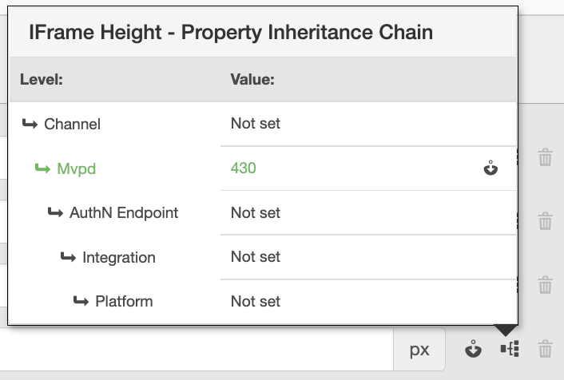

# Guia do usuário do Painel Primetime TVE {#tve-db-user-guide}

>[!NOTE]
>
>O conteúdo desta página é fornecido apenas para fins de informação. O uso dessa API requer uma licença atual do Adobe. Não é permitida a utilização não autorizada.

## Introdução {#tve-db-intro}

[[!DNL Adobe] Painel TVE (Painel TVE)](https://console.auth.adobe.com/) é um painel de autoatendimento destinado a usuários que trabalham para empresas de mídia (Programadores) que têm um relacionamento comercial com a equipe de produtos Autenticação da Adobe Primetime.

Entre em contato com o Gerente técnico de contas (TAM) para obter acesso. Para obter acesso, você precisará de dois novos grupos de usuários configurados em sua organização da Adobe Marketing Cloud:

* Leitura-gravação do painel TVE - os membros deste grupo têm direitos totais em todas as seções editáveis do painel
* Painel TVE Somente Leitura - os membros deste grupo têm somente direitos de exibição em todo o painel

Antes de aprofundar esse guia do usuário, recomendamos que você verifique os seguintes recursos para ter uma boa compreensão dos fluxos e recursos fornecidos pela equipe de produtos de Autenticação Adobe Primetime e se familiarize com os termos usados no presente documento:

* [Documento técnico TVE](/help/authentication/technical-paper.md)
* [Guia de início rápido do programador](/help/authentication/programmer-kickstart-guide.md)
* [Fluxo de direitos](/help/authentication/entitlement-flow.md)
* [Glossário](/help/authentication/glossary.md)

Continuando para as próximas seções deste guia do usuário, você descobrirá maneiras de administrar diferentes configurações para os Canais, Programadores ou as Integrações entre Canais e MVPDs (Distribuidores do Programa de Vídeo Multicanal) da sua empresa.

>[!IMPORTANT]
>O Painel TVE oferece a opção de alternar entre um Espaço de trabalho básico e um Espaço de trabalho avançado. Você pode fazer isso alternando o ícone no canto superior direito. O Espaço de trabalho avançado é destinado aos usuários com conhecimento técnico substancial, bem como conhecimento avançado dos recursos oferecidos pela equipe de produtos de Autenticação da Adobe Primetime.

*Figura 1: O menu suspenso &quot;Básico / Espaço de trabalho avançado&quot; do Adobe Primetime TVE Dashboard*

## Ambientes {#authn-environments}

Dependendo das tarefas que um usuário pode ser necessário realizar, ele pode precisar alternar entre os ambientes de Autenticação do Adobe Primetime. Para obter informações detalhadas sobre os ambientes de Autenticação Adobe Primetime, consulte o seguinte documento: [Compreensão dos ambientes de autenticação do Adobe Primetime](/help/authentication/understanding-the-adobe-environments.md).

O Painel TVE fornece dois ambientes chamados Pré-requisitos (Pré-qualificação) e Versão, cada um com dois perfis nomeados como Armazenamento temporário e Produção, conforme mostrado abaixo:

* [Preparação de Prequal](https://console-prequal.auth-staging.adobe.com/)
* [Produção Prequal](https://console-prequal.auth.adobe.com/)
* [Estágio da versão](https://console.auth-staging.adobe.com/)
* [Versão de produção](https://console.auth.adobe.com/)

Para alternar entre ambientes, o usuário pode clicar no ambiente desejado representado pela entrada do elemento suspenso mostrado abaixo:

*Figura 2: O menu suspenso de ambientes do Adobe Primetime TVE Dashboard*

>[!IMPORTANT]
>É muito importante observar que, ao fazer alterações administrativas na configuração de Autenticação da Adobe Primetime por meio do Painel TVE, recomendamos que você siga a sequência abaixo para garantir a funcionalidade adequada.

Para fazer alterações administrativas na sua configuração de Autenticação do Adobe Primetime por meio do Painel TVE:

* Execute as alterações em [Preparo da versão e validá-las](http://sp.auth-staging.adobe.com/apitest/api.html).
* Execute as alterações em [Pré-produção e validá-las](http://sp.auth-staging.adobe.com/apitest/api.html).
* Execute as alterações em [Liberar produção e validá-las](http://sp.auth-staging.adobe.com/apitest/api.html).

>[!IMPORTANT]
>Para que as alterações administrativas sejam ativadas, os usuários devem navegar até a seção &quot;Revisar e enviar alterações&quot; selecionando o botão, que será exibido na parte inferior esquerda da barra lateral, para revisar as alterações, adicionar uma descrição para as alterações recém-criadas e confirmar a atualização da configuração selecionando &quot;Enviar configuração&quot;.

*Figura 3: A notificação de Revisar e enviar alterações do painel do Adobe Primetime TVE*

## Seções {#sections}

Os usuários que trabalham para empresas de mídia (Programadores) podem acessar as seguintes seções do Painel TVE na barra lateral:

* **Canais** - Contém configurações relacionadas a provedores de conteúdo
* **Programadores** - Contém configurações relacionadas à organização principal agregando um ou vários **Canais**
* **Integrações** - Contém configurações relacionadas à integração entre **Canais** e **MVPDs**
* **MVPDs** - Contém configurações relacionadas ao **MVPDs**
* **Relatórios** - Contém dados agregados para três tipos de relatórios: AuthN TTL, AuthZ TTL, SSO
* **Log de alterações** - Contém as modificações mais recentes aplicadas à configuração do painel TVE

*Figura 4: As seções do painel Adobe Primetime TVE*

### Canais {#tve-db-channels-section}

Esta seção permite visualizar e editar configurações para Canais disponíveis ou criar um novo. Clicar em um dos Canais disponíveis retornará uma tela com as seguintes guias:

* **Dados do canal**
   * **Id Do Canal** - A ID exclusiva do Canal usada em nosso sistema, também chamada de &quot;ID do solicitante&quot;.
   * **Nome de exibição** - O nome comercial do Canal.
* **Configurações gerais**
   * **Configuração do Analytics** - Configurar eventos de autenticação do Adobe Primetime para serem encaminhados ao Adobe Analytics. Entre em contato com o Adobe para obter mais detalhes sobre como a ID do conjunto de relatórios (RSID) precisa ser configurada antes de habilitar esse recurso.
* **Certificados**

   Contém a lista dos certificados utilizados no fluxo de autenticação juntamente com a organização emissora, a data de emissão e a data de expiração. Esses certificados servem como chaves privadas/públicas e são usados para fins de validação.
* **Domínios**

   Contém a lista de domínios a partir dos quais o Canal respectivo se comunicará com a Autenticação Adobe Primetime.
* **Integrações**

   Contém a lista de integrações com MVPDs disponíveis, junto com o status de cada integração que pode ser habilitada ou não. A navegação para a página Integração está disponível ao clicar em uma entrada específica.
* **Aplicativos registrados**

   Contém a lista de registros de aplicativos. Para obter mais detalhes, consulte o documento [Gerenciamento dinâmico de registros de clientes](/help/authentication/dynamic-client-registration-management.md).

* **Esquemas personalizados**

   Contém a lista de esquemas personalizados. Para obter mais detalhes, consulte [Registro do aplicativo iOS/tvOS](/help/authentication/iostvos-application-registration.md) e [Gerenciamento dinâmico de registros de clientes](/help/authentication/dynamic-client-registration-management.md)

#### Adicionar / excluir domínios {#add-delete-domains}

Para iniciar o processo de adição de um novo domínio para o canal selecionado, é necessário clicar no botão &quot;Adicionar novo domínio&quot; abaixo da lista Domínios. Isso criará uma nova entrada de domínio onde você pode especificar o nome do domínio. Se um domínio mais genérico já existir na lista de domínios, você não deve adicionar um novo subdomínio.

*Figura: Guia Domínios em canais*

### Programadores {#tve-db-programmers-section}

Esta seção permite visualizar e editar configurações para Programadores disponíveis ou criar um novo. Clicar em um dos programadores disponíveis retornará uma tela com as seguintes guias:

* **Dados do programador**
   * **Id Do Programador** - A ID exclusiva do Programador usada em nosso sistema.
   * **Nome de exibição** - O nome comercial do programador.
   * **Url do logotipo** - O endereço de recursos uniforme (URL) do logotipo comercial do Programador.
   * **Visualização do logotipo** - A visualização do logotipo comercial do Programador, baixando-a do URL (Uniform Resource Locator) acima.

* **Certificados**

   Contém a lista dos certificados utilizados no fluxo de autenticação juntamente com a organização emissora, a data de emissão e a data de expiração. Esses certificados servem como chaves privadas/públicas e são usados para fins de validação.

* **Canais**

   Contém a lista de Canais pertencentes a este programador específico. A seção Navegar até Canais está disponível ao clicar em uma entrada específica.

* **Aplicativos registrados**

   Contém a lista de registros de aplicativos. Para obter mais detalhes, consulte [Gerenciamento dinâmico de registros de clientes](/help/authentication/dynamic-client-registration-management.md).

* **Esquemas personalizados**

   Contém a lista de esquemas personalizados. Para obter mais detalhes, consulte [Registro do aplicativo iOS/tvOS](/help/authentication/iostvos-application-registration.md) e [Gerenciamento dinâmico de registros de clientes](/help/authentication/dynamic-client-registration-management.md).

### Integrações {#tve-db-integrations-sec}

Esta seção permite visualizar e editar configurações para integrações entre Canais e MVPDs disponíveis ou criar um novo. Clicar em uma das integrações disponíveis retornará uma única página ao usar o Espaço de trabalho básico ou uma tela com as seguintes guias ao usar o Espaço de trabalho avançado:

* **Dados de integração**
   * **ID de integração**- O resultado de anexar a id exclusiva dos MVPDs à id exclusiva do Canal separada pelo caractere &quot;_&quot;.
   * **Nome de exibição do canal** - O nome comercial do Canal.
   * **Id Do Canal** - A ID exclusiva do Canal usada em nosso sistema, também chamada de &quot;ID do solicitante&quot;.
   * **Nome de exibição do MVPD** - O nome comercial do MVPD.
   * **Id do MVPD** - A id exclusiva do MVPD usada em nosso sistema.
* **Configurações gerais**
   * **Chaves de metadados do usuário** - Configure as chaves de metadados disponíveis para a integração específica.
   * **Configurações específicas da plataforma** - Configure configurações diferentes para uma plataforma específica (por exemplo, TTLs, SSO e IFrames).

* **Configurações de autenticação**
   * Contém configurações relacionadas ao recurso de autenticação Adobe Primetime Authentication.
* **Configurações de autorização**
   * Contém configurações relacionadas ao recurso de autorização de Autenticação do Adobe Primetime.
* **Configurações de Logout**
   * Contém configurações relacionadas ao recurso de logout da Autenticação Adobe Primetime.

#### Criar integração {#create-integration}

Para criar uma nova integração, siga as etapas abaixo:

* clique no botão &quot;Adicionar nova integração&quot;
* pesquisar e selecionar um Canal
* pesquisar e selecionar um MVPD
* aguarde o painel TVE para calcular &quot;ID de integração&quot; e exibir os pontos de extremidade MVPD disponíveis
* selecione endpoints de autenticação, autorização e logout ou use os valores padrão
* clique no botão &quot;Criar integração&quot;
* dependendo das configurações do MVPD, um pop-up pode aparecer e solicitar propriedades adicionais, que devem ter sido fornecidas pelo MVPD antecipadamente, caso contrário, ocorrerá um redirecionamento para a página de integração recém-criada

*Figura 5. A janela Nova integração do painel Adobe Primetime TVE*

#### Atualizar integração {#update-integration}

Para atualizar uma integração existente, clique na entrada da tabela para essa integração específica na seção Integrações ou na seção Canais , que contém uma guia Integrações .

Ao usar o modo Básico do Workspace, esta seção permitirá ver e editar as configurações atualizadas com mais frequência, como TTLs (time-to-live) de token de autenticação e autorização, bem como as configurações do iFrame. Lembre-se de que as configurações TTL podem estar ausentes nas integrações com MVPDs que oferecem suporte ao TTL de persistência de token definido dinamicamente (consulte a entrada 1.19 de [Requisitos de integração do MVPD](/help/authentication/mvpd-integr-features.md)).

Ao usar o modo Espaço de trabalho avançado, esta seção permitirá ver e editar configurações menos comuns.

No caso dos modos Básico e Espaço de trabalho avançado, essas configurações podem ser alteradas em um nível de plataforma (por exemplo, selecione um valor personalizado para o token TTL de autorização no Android, padrão em todas as outras plataformas).

>[!IMPORTANT]
>É importante entender a cadeia de herança de configurações: MVPD -> Endpoint MVPD -> Integração -> Plataforma, onde Plataforma tem o valor mais específico e MVPD é o padrão mais genérico.

*Figura 6. O componente da cadeia de herança da propriedade do Painel TVE do Adobe Primetime*

#### Configurações específicas da plataforma {#platform-sp-settings}

Essa subseção pode ser usada para substituir as configurações de plataformas específicas. As plataformas disponíveis são:

* **Todas as plataformas** - Defina os valores que serão aplicados a todas as plataformas, independentemente das implementações do Programador, caso não haja outros valores definidos para uma plataforma específica.
* **Android** - Defina os valores que serão aplicados às implementações do Programador sobre o SDK do Android de Autenticação da Adobe Primetime.
* **REST API sem cliente** - Defina os valores que serão aplicados às implementações do Programador sobre a API REST de autenticação do Adobe Primetime.
* **Fire TV** - Defina os valores que serão aplicados às implementações do Programador sobre o SDK do Adobe Primetime Authentication FireTV.
* **SDK do Flash** - Essa plataforma está obsoleta. **obsoleto**
* **SDK do JavaScript** - Defina os valores que serão aplicados às implementações do Programador por meio do SDK JavaScript da Autenticação do Adobe Primetime.
* **Roku** - Defina os valores que serão aplicados às implementações do Programador por meio da API REST de Autenticação do Adobe Primetime e que estão enviando &quot;Roku&quot; como o tipo de dispositivo. Isso tem precedência sobre os valores definidos para a plataforma REST API sem cliente no caso de dispositivos Roku.
* **SDK nativo da Xbox** - Essa plataforma está obsoleta. **obsoleto**
* **API REST do Xbox 360** - Defina os valores que serão aplicados às implementações do Programador por meio da API REST de Autenticação do Adobe Primetime e que estão enviando &quot;xbox&quot; como o tipo de dispositivo. Isso tem precedência sobre os valores definidos para a plataforma REST API sem cliente no caso de dispositivos Xbox 360.
* **API REST da Xbox One** - Defina os valores que serão aplicados às implementações do Programador por meio da API REST de Autenticação do Adobe Primetime e que estão enviando &quot;xboxOne&quot; como o tipo de dispositivo. Isso tem precedência sobre os valores definidos para a plataforma REST Api sem cliente no caso de dispositivos XboxOne.
* **iOS** - Defina os valores que serão aplicados às implementações do Programador sobre o SDK do iOS de Autenticação do Adobe Primetime.
* **tvOS** - Defina os valores que serão aplicados às implementações do Programador por meio do SDK tvOS da Autenticação do Adobe Primetime.

*Figura 7. As configurações específicas da plataforma de painel do Adobe Primetime TVE*

#### Ativar logon único da plataforma {#enable-platform-sso}

Siga as etapas abaixo para ativar/desativar o Logon único para uma integração e plataforma específicas:

* certifique-se de usar o modo Avançado do Workspace
* navegue até a integração desejada
* navegue até o **Configurações gerais** guia
* selecione a plataforma desejada na qual deseja ativar ou desativar o Logon único
* alterne a **Ativar logon único** sinalizador para o valor desejado (Sim / Não)

   >[!IMPORTANT]
   >É importante notar que a variável **Ativar logon único** O sinalizador está disponível somente para plataformas iOS, tvOS, Roku e FireTV e somente para integrações com MVPDs que oferecem suporte ao Single Sign On para essas plataformas.

* alterne a **Impor permissão da plataforma** sinalizador para o valor desejado (Sim / Não)

   >[!IMPORTANT]
   >É importante notar que a variável **Impor permissão da plataforma** O sinalizador controla se a decisão do usuário de Permitir ou Negar acesso à plataforma para sua assinatura do Provedor de TV será imposta ou não. Considere o cenário ao **Ativar logon único** sinalizador é definido como &quot;Sim&quot;, **Impor permissão da plataforma** O sinalizador também é definido como &quot;Sim&quot; e o usuário opta por negar acesso à plataforma à sua assinatura do Provedor de TV, então o respectivo aplicativo (canal) não poderá usar o token de autenticação do Adobe Primetime obtido por outro aplicativo (canal).

#### Habilitar Autenticação Baseada em Casa {#enable-hba}

Siga as etapas abaixo para ativar/desativar a Autenticação de Base para **OAuth2** MVPDs baseados:

* certifique-se de usar o modo Avançado do Workspace
* navegue até a integração desejada
* navegue até **Configurações de autenticação** guia
* navegue até **Regras dinâmicas de AuthN** subguia
* alterne a **Tentar HBA** sinalizador para o valor desejado (Sim / Não)

>[!IMPORTANT]
>Lembre-se de que o valor &quot;HBA AuthN TTL&quot; nunca deve ser substituído, caso contrário o fluxo de autorização poderá falhar inesperadamente.

Entre em contato com o **tve-support@adobe.com** para obter informações sobre como habilitar a autenticação de base para MVPDs baseados em SAML.

### MVPDs {#tve-db-mvpds-sec}

Esta seção permite visualizar configurações para MVPDs disponíveis. Clicar em um dos MVPDs disponíveis retornará uma tela com as seguintes guias:

* **Dados MVPD**
   * **Id do MVPD** - A id exclusiva do MVPD usada em nosso sistema.
   * **Nome de exibição** - O nome comercial do MVPD que pode ser usado no seletor do usuário.
   * **Url do logotipo** - O localizador uniforme de recursos (URL) do logotipo comercial do MVPD.
   * **Visualização do logotipo** - A visualização do logotipo comercial do MVPD, baixando-a do localizador uniforme de recursos (URL) acima.
* **Configurações gerais**
   * **Chaves de metadados do usuário**
      * Chaves de metadados disponíveis para o MVPD específico.
   * **Propriedades de dados do cliente**
      * **Autenticação/Agregador** - Se definido como &quot;Sim&quot;, então um novo token de autenticação será necessário para cada novo Canal que o usuário estiver tentando acessar.
      * **AuthN Passivo Ativado** - Se o sinalizador Auth/Aggregator estiver definido como &quot;Sim&quot; e se AuthN passivo estiver definido como &quot;Sim&quot;, o processo de autenticação com outro Canal ocorrerá em segundo plano sem a necessidade de um redirecionamento completo do navegador e o seletor sendo mostrado.
      * **Sessão de autenticação/navegador** - Se definido como &quot;Sim&quot;, o usuário será desconectado após fechar o navegador. Se definido como &quot;Não&quot;, o usuário poderá reiniciar o navegador e permanecer conectado.
      * **IFrame obrigatório** - Se estiver definido como &quot;Sim&quot;, isso indica que a janela de logon do MVPD requer um iFrame. Os campos &quot;Largura do iFrame&quot; e &quot;Altura do iFrame&quot; representam o tamanho necessário para o iFrame carregar a página de logon do MVPD.
* **Configurações de autenticação**
   * **Selecionar Ponto Final**
      * Este campo indica os pontos de extremidade de autenticação expostos pelo MVPD. O ponto de extremidade pode ser diferente de acordo com o protocolo de autenticação usado.
   * **Configurações gerais do AuthN**
      * Esta subguia exibe o protocolo de autenticação usado pelo MVPD e as informações relacionadas ao protocolo.
   * **Certificados AuthN**
      * Esta subguia exibe os certificados que o MVPD usa no fluxo de autenticação junto à organização do emissor, data de emissão e data de expiração. Esses certificados servem como chaves privadas / públicas e são usados para fins de validação.
   * **Regras dinâmicas de AuthN**
      * Essa subguia exibe as regras que se aplicam ao processo de autenticação. Ao pressionar na Solicitação / Resposta / Token do diagrama, você pode ver como destacados os parâmetros aplicados a essa parte do fluxo de autenticação.
* **Configurações de autorização**
   * **Selecionar Ponto Final**
      * Este campo indica o terminal de autorização exposto pelo MVPD. O endpoint pode diferir dependendo do protocolo de autorização usado. Os protocolos de autorização disponíveis são SOAP, REST (para dispositivos sem cliente), SAML, XACML e OAUTH.
   * **Configurações gerais de AuthZ**
      * Esta subguia exibe o protocolo de autorização usado pelo MVPD e as informações relacionadas ao protocolo.
      * **Configuração de comprovação**
         * Descreve o número de recursos que podem ser pré-autorizados por um MVPD em uma única chamada, o modelo PreFlight usado, bem como o limite de tempo limite. Ocasionalmente, o número de recursos pode ser diferente para uma determinada integração. Isso pode ser gerenciado editando o &quot;**Número máximo de recursos de comprovação**&quot;, disponível na guia Configurações gerais . Essa propriedade está disponível somente para uma determinada integração e, se configurada, será usada em vez do valor definido em Configurações de Autorização -> Configuração Pré-Voo -> Recursos Máximos Pré-Voo.
      * **Proteção DOS**
         * Descreve a proteção de recusa de serviço no ponto final de autorização do MVPD. Para obter uma descrição exata de cada campo, consulte as dicas de ferramentas ao passar o mouse sobre os campos de Proteção DOS.
      * Se o MVPD for um **TempPass**, em seguida, o **Configurações gerais de AuthZ** também contém informações sobre a duração do TempPass.
      * Se o MVPD for um **FlexibleTempPass**, em seguida, o **Configurações gerais de AuthZ** também contém informações sobre a duração do TempPass, o número máximo de recursos e o campo de identificação (consulte a imagem abaixo).
   * **Certificados AuthZ**
      * Esta subguia exibe os certificados que o MVPD usa no fluxo de autorização ao lado de sua organização emitente, data de emissão e data de expiração. Esses certificados servem como chaves privadas / públicas e são usados para fins de validação.
   * **Regras dinâmicas de AuthZ**
      * Essa subguia exibe as regras que se aplicam ao processo de autorização. Ao pressionar no **Solicitação / Resposta / Token**, você pode ver como destacados os parâmetros aplicados a essa parte do fluxo de autorização.
* **Configurações de Logout**
   * **Selecionar Ponto Final**
      * Este campo indica o ponto de extremidade de logout exposto pelo MVPD. Os protocolos fornecidos podem ser SAML ou OAuth2.
      * **Configurações gerais de logout**
         * Esta subguia exibe o protocolo de logout usado pelo MVPD e as informações relacionadas ao protocolo.
         * **Exigir resposta de logout assinado** - Se definido como &quot;Sim&quot;, a resposta deve ser assinada por um certificado confiável.
      * **Certificados de logout**
         * Esta subguia exibe os certificados que o MVPD usa no fluxo de logout ao lado da organização do emissor, data de emissão e data de expiração. Esses certificados servem como chaves privadas / públicas e são usados para fins de validação.
      * **Fazer logoff de regras dinâmicas**
         * Essa subguia exibe as regras que se aplicam ao processo de logout. Ao pressionar no **Solicitação / Resposta / Token**, você pode ver como destacados os parâmetros aplicados a essa parte do fluxo de logout.

### Relatórios {#tve-db-reports-sec}

Para navegar até esta seção, clique em &quot;Relatórios&quot; no &quot;[Seções do painel](#sections)&quot;. Essa ação navegará para uma tela com 3 guias, que serão apresentadas em detalhes nas seguintes subseções: [Relatórios TTL AuthN](#authn-ttl-reports), [Relatórios de TTL AuthZ](#authz-ttl-reports), [Relatórios de SSO](#sso-reports).

Esta seção permite visualizar e exportar dados agregados para vários tipos de relatórios para sua integração/integração de Canal/s com vários MVPDs em todas as plataformas.

#### Plataformas {#report-platforms}

Todos os relatórios agregam valores nas seguintes plataformas:

**NAVEGADORES**
Exibe valores que serão aplicados às implementações do Programador sobre o SDK JavaScript da Autenticação do Adobe Primetime.

**CELULAR: iOS**
Exibe valores que serão aplicados às implementações do Programador sobre o SDK do iOS de Autenticação do Adobe Primetime.

**CELULAR: ANDROID**
Exibe valores que serão aplicados às implementações do Programador sobre o SDK do Android de Autenticação da Adobe Primetime.

**CELULAR: OUTROS**
Exibe valores que serão aplicados às implementações do Programador sobre a API REST de Autenticação Adobe Primetime desenvolvida para dispositivos móveis.

**TVCD: ROKU**
Exibe valores que serão aplicados às implementações do Programador por meio da API REST de Autenticação do Adobe Primetime e que estão enviando &quot;Roku&quot; como o tipo de dispositivo.

**TVCD: FIRETV**
Exibe os valores que serão aplicados às implementações do Programador sobre o SDK do Adobe Primetime Authentication FireTV.

**TVCD: APPLETV**
Exibe valores que serão aplicados às implementações do Programador sobre o SDK tvOS da Autenticação do Adobe Primetime.

**TVCD: OUTROS**
Exibe os valores que serão aplicados às implementações do Programador sobre a API REST de Autenticação Adobe Primetime desenvolvida para dispositivos conectados à TV.

**PLATAFORMA: DESCONHECIDO**
Exibe valores que serão aplicados às implementações do Programador para as quais os serviços de Autenticação da Adobe Primetime detectam um tipo de dispositivo desconhecido.

Analisar o mecanismo de [transmitindo informações do cliente](/help/authentication/passing-client-information-device-connection-and-application.md) para APIs REST ou SDKs de autenticação da Adobe Primetime para obter mais detalhes sobre como enviar o tipo de dispositivo desejado (por exemplo, &quot;Roku&quot;).

Todos os relatórios agregam valores calculados com base na configuração específica de cada ambiente de Autenticação do Adobe Primetime. Portanto, você pode esperar diferentes dados de relatório ao alternar entre diferentes ambientes de painel TVE.

Revise o [Ambientes](#authn-environments) para obter mais detalhes relacionados aos ambientes disponíveis de Autenticação do Adobe Primetime .

##### Selecionar Canais/MVPDs específicos {#selecting-specific-channels-mvpds}

Todos os relatórios permitem usar filtros selecionando Canais específicos ou selecionando MVPDs específicos a serem incluídos nos relatórios resultantes.

Para selecionar um ou vários canais, use o **lista suspensa** colocado depois do rótulo &quot;Canais selecionados para relatório&quot;. Veja a Figura 8./9./10. imagens abaixo.

Para selecionar um ou vários MVPDs, use a variável **lista suspensa** colocado depois do rótulo &quot;MVPDs seleted for report&quot;. Veja a Figura 8./9./10. imagens abaixo.

Por padrão, os dados são agregados em todos os Canais da sua empresa (&quot;Todos os Canais&quot;) e MVPDs com os quais são integrados (&quot;Todos MVPDs&quot;).

Caso você opte por desmarcar &quot;Todos os canais&quot; ou &quot;Todos os MVPDs&quot; sem escolher opções específicas, a interface do usuário exibirá um espaço reservado &quot;Nenhum dado disponível&quot;.

##### Exportar relatório {#export-report}

Todos os relatórios permitem exportar dados em um arquivo de formato CSV (Valores separados por vírgula).

Para exportar dados, use o botão &quot;Exportar relatório&quot; posicionado no canto superior direito da janela. Veja a Figura 8./9./10. imagens abaixo.

Um arquivo chamado **Report.csv** será baixado automaticamente no computador. Portanto, verifique se as configurações do seu navegador permitem o download de arquivos.

O ícone de carregamento &quot;Exportar dados&quot; estará presente na tela, enquanto o arquivo Report.csv é calculado, o que pode assumir **até alguns minutos** dependendo do tamanho dos dados que você deseja exportar.

#### Relatórios TTL AuthN (#authn-ttl-reports)

Este relatório exibe o Time-To-Live (TTL) do token de autenticação configurado para sua integração de Canal/s com vários MVPDs em todas as plataformas.

O token de autenticação Time-To-Live, também conhecido como **AuthN TTL**, é exibido em valores legíveis como: **dias, horas, minutos, segundos**.

Em termos de experiência do usuário, os relatórios de TTL do AuthN permitem inspecionar visualmente o tempo em que um usuário será autenticado, considerando um MVPD específico e uma plataforma específica.

Para navegar até esse tipo de relatório, clique na guia &quot;Relatórios de TTL do AuthN&quot; na seção &quot;Relatórios&quot;.

*Figura 8: A guia Relatório de AuthN TTL do painel do Adobe Primetime TVE*

A tabela Relatórios TTL do AuthN contém páginas e é rolável horizontal e verticalmente, dependendo do tamanho da tela.

Caso considere fazer uma alteração em um valor de TTL AuthN, revise a [Integrações](#tve-db-integrations-sec) seção.

>[!IMPORTANT]
>O &quot;**Definido por MVPD**&quot; espaço reservado é usado nos casos em que o MVPD será o que aplica o valor de TTL do AuthN e não a configuração de Autenticação do Adobe Primetime.

#### Relatórios TTL de AuthZ {#authz-ttl-reports}

Este relatório exibe o Time-To-Live (TTL) do token de autorização configurado para sua integração de Canal/s com vários MVPDs em todas as plataformas.

O token de autorização Time-To-Live, também conhecido como **AuthZ TTL**, é exibido em valores legíveis como: **dias, horas, minutos, segundos**.

Em termos de experiência do usuário, os relatórios TTL de AuthZ permitem inspecionar visualmente o tempo em que um usuário será autorizado, considerando um MVPD específico e uma plataforma específica.

Para navegar até esse tipo de relatório, clique na guia &quot;Relatórios TTL de AuthZ&quot; na seção &quot;Relatórios&quot;.

*Figura 9. A guia Adobe Primetime TVE Dashboard AuthZ TTL Report*

A tabela Relatórios TTL do AuthZ contém páginas e é rolável horizontal e verticalmente, dependendo do tamanho da tela.

Se você considerar fazer uma alteração em um valor TTL de AuthZ, consulte a [Integrações](#tve-db-integrations-sec) seção.

>[!IMPORTANT]
>O &quot;**Definido por MVPD**&quot; espaço reservado é usado nos casos em que o MVPD será o que aplica o valor de TTL do AuthZ e não a configuração de Autenticação do Adobe Primetime.

#### Relatórios de SSO {#sso-reports}

Este relatório exibe o status de Logon Único (SSO) configurado para sua integração de Canal/s com vários MVPDs em todas as plataformas.

O status de Logon único, também conhecido como **Status do SSO**, é exibido como um tristate com os seguintes valores possíveis: **SSO Desativado, SSO Ativado, SSO Incerto**.

Em termos de experiência do usuário, os relatórios de SSO permitem inspecionar visualmente a experiência de autenticação de usuário esperada, considerando um MVPD específico e uma plataforma específica.

Para navegar para esse tipo de relatório, clique no botão &quot;**Relatórios de SSO**&quot; na guia &quot;**Relatórios** seção &quot;.

*Figura 10: A guia Relatórios SSO do painel Adobe Primetime TVE*

A tabela Relatórios SSO contém páginas e é rolável horizontal e verticalmente dependendo do tamanho da tela.

Caso considere fazer uma alteração em um status de SSO, revise a [Integrações](#tve-db-integrations-sec) seção.

>[!IMPORTANT]
>&quot;**SSO Incerto**&quot; espaço reservado é usado nos casos em que o SSO é ativado e possível, mas as configurações da plataforma do usuário / decisões do usuário (por exemplo, a opção do navegador do usuário para bloquear cookies de terceiros, o usuário que opta por negar o acesso da plataforma à sua assinatura do Provedor de TV) ou as configurações do MVPD (por exemplo, o MVPD que solicita a autenticação em cada Canal) podem impedir que o SSO ocorra.

### Log de alterações {#tve-db-changelog-sec}

Esta seção exibe uma lista de todas as modificações enviadas pelo Painel TVE para o ambiente e a configuração de Autenticação do Adobe Primetime.

Há colunas que indicam a data de push, o usuário que operou a modificação e o status do push.

Esta seção também permite a comparação de duas entradas da tabela para restringir as modificações específicas que você deseja inspecionar e até mesmo compartilhar a comparação como um item de email.

### Feedback {#tve-db-feedback-sec}

Esta seção permite que os usuários enviem comentários. Siga as etapas para fornecer feedback à equipe de produtos de Autenticação da Adobe Primetime:

* clique no botão &quot;Feedback&quot; no lado direito da tela
* inserir o Assunto
* digite a mensagem
* se necessário, carregue uma captura de tela na mensagem clicando no botão &quot;Upload Screenshot&quot;
* clique no botão &quot;Enviar&quot;

*Figura 11: A seção Feedback do painel TVE do Adobe Primetime*

Para obter instruções sobre como capturar capturas de tela, visualize os links abaixo:

* [Como capturar capturas de tela no Windows](https://support.microsoft.com/en-us/windows/use-snipping-tool-to-capture-screenshots-00246869-1843-655f-f220-97299b865f6b#1TC=windows-7)

* [Como capturar capturas de tela no Mac](https://support.apple.com/en-us/HT201361)

## Solução de problemas {#tve-db-troubleshoot}

### Modo de manutenção {#maintenance-mode}

*Figura: Aplicativo TVE no modo de manutenção*

Caso o Painel TVE esteja no &quot;modo de manutenção&quot;, os usuários não poderão visualizar ou fazer novas alterações.

Se isso ocorrer, será necessário aguardar a equipe de engenharia de Autenticação da Adobe Primetime para concluir o trabalho de manutenção no Painel TVE.

### Estado degradado {#degraded-state}

*Figura: Aplicativo TVE em estado degradado*

Caso o Painel TVE esteja em &quot;estado degradado&quot;, os usuários não terão recursos de pesquisa e classificação, mas os usuários poderão visualizar ou fazer novas alterações.

Se isso ocorrer, será necessário aguardar a equipe de engenharia de Autenticação da Adobe Primetime para concluir o trabalho de manutenção no Painel TVE.
