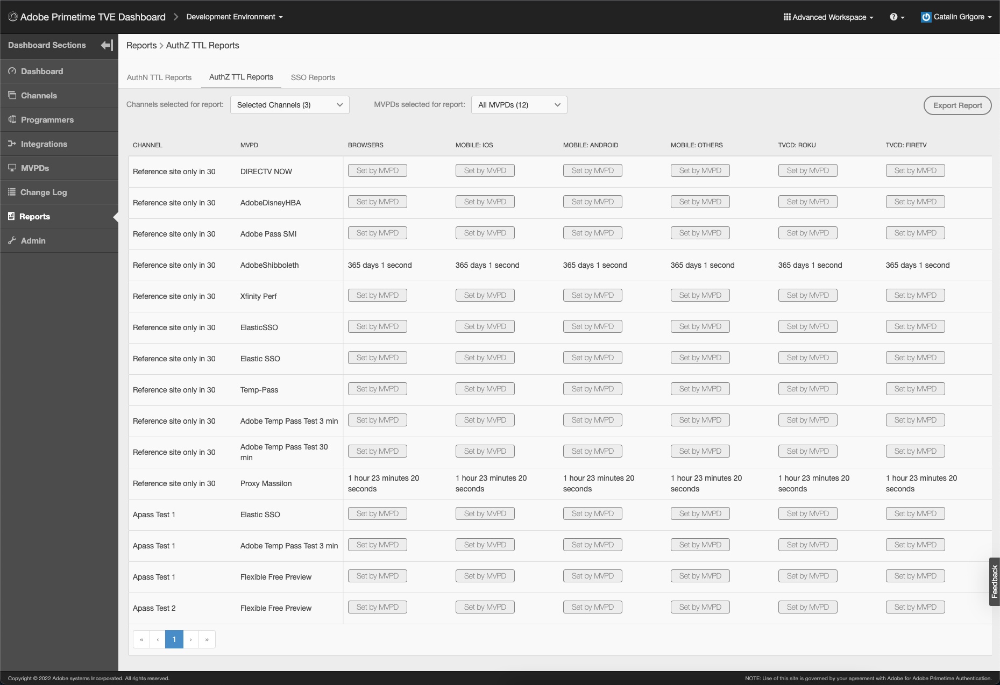
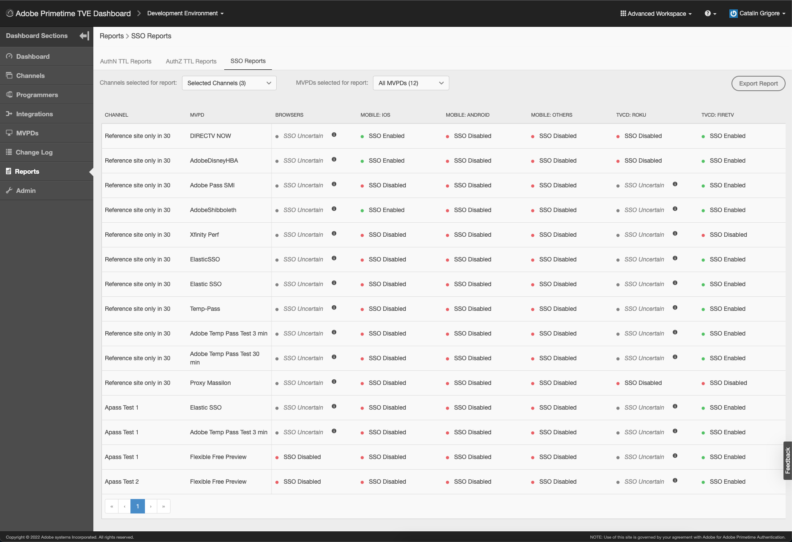
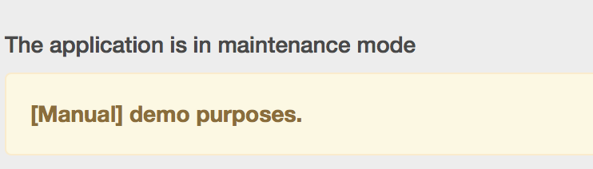

# Guia do usuário do Painel Primetime TVE {#tve-db-user-guide}

>[!NOTE]
>
>O conteúdo desta página é fornecido apenas para fins informativos. O uso desta API requer uma licença atual do Adobe. Não é permitida nenhuma utilização não autorizada.

## Introdução {#tve-db-intro}

[[!DNL Adobe] Painel TVE (Painel TVE)](https://console.auth.adobe.com/) é um painel de autoatendimento destinado a usuários que trabalham para empresas de mídia (Programadores) que têm um relacionamento comercial com a equipe de produtos de autenticação da Adobe Primetime.

Entre em contato com o gerente técnico de conta (TAM) para obter acesso. Para obter acesso, você precisará de dois novos grupos de usuários a serem configurados em sua organização da Adobe Marketing Cloud:

* Leitura-gravação do painel TVE - os membros deste grupo têm direitos totais em todas as seções editáveis do painel
* Painel TVE Somente Leitura - os membros deste grupo só têm direitos de visualização em todo o painel

Antes de aprofundar esse guia do usuário, recomendamos que você passe pelos seguintes recursos para ter uma boa compreensão dos fluxos e recursos fornecidos pela equipe de produtos de Autenticação do Adobe Primetime e se familiarizar com os termos usados no presente documento:

* [Documento técnico da TVE](/help/authentication/technical-paper.md)
* [Guia de início rápido do programador](/help/authentication/programmer-kickstart-guide.md)
* [Fluxo de direitos](/help/authentication/entitlement-flow.md)
* [Glossário](/help/authentication/glossary.md)

Prosseguindo para as próximas seções deste guia do usuário, você descobrirá maneiras de administrar diferentes configurações para os Canais, Programadores ou as Integrações entre Canais e MVPDs (Distribuidores de Programas de Vídeo Multicanais) da sua empresa.

>[!IMPORTANT]
>O TVE Dashboard oferece a opção de alternar entre um Espaço de Trabalho Básico e Avançado. Você pode fazer isso alternando o ícone no canto superior direito. O Espaço de trabalho avançado destina-se a usuários com conhecimento técnico substancial, bem como conhecimento avançado dos recursos oferecidos pela equipe de produtos de Autenticação do Adobe Primetime.

*Figura 1: A lista suspensa do painel do Adobe Primetime TVE &quot;Basic / Advanced Workspace&quot;*

## Ambientes {#authn-environments}

Dependendo das tarefas que um usuário pode ter de realizar, ele pode precisar alternar entre os ambientes de Autenticação do Adobe Primetime. Para obter informações detalhadas sobre os ambientes de autenticação do Adobe Primetime, consulte o seguinte documento: [Noções básicas sobre os ambientes de autenticação do Adobe Primetime](/help/authentication/understanding-the-adobe-environments.md).

O Painel do TVE fornece dois ambientes chamados Pré-qualificação e Versão, cada um com dois perfis chamados Preparo e Produção, conforme mostrado abaixo:

* [Estágios desiguais](https://console-prequal.auth-staging.adobe.com/)
* [Produção Pré-Igual](https://console-prequal.auth.adobe.com/)
* [Estágios de lançamento](https://console.auth-staging.adobe.com/)
* [Liberar produção](https://console.auth.adobe.com/)

Para alternar entre ambientes, o usuário pode clicar no ambiente desejado representado pela entrada do elemento suspenso representado abaixo:

*Figura 2: Lista suspensa de ambientes do painel do Adobe Primetime TVE*

>[!IMPORTANT]
>É muito importante observar que, ao fazer alterações administrativas na configuração da Autenticação do Adobe Primetime por meio do Painel do TVE, recomendamos que você siga a sequência abaixo para garantir a funcionalidade adequada.

Para fazer alterações administrativas na configuração da Autenticação Adobe Primetime por meio do Painel TVE:

* Faça as alterações no [Liberar armazenamento temporário e validá-los](http://sp.auth-staging.adobe.com/apitest/api.html).
* Faça as alterações no [Produção pré-igualada e validação](http://sp.auth-staging.adobe.com/apitest/api.html).
* Faça as alterações no [Liberar produção e validá-las](http://sp.auth-staging.adobe.com/apitest/api.html).

>[!IMPORTANT]
>Para que as alterações administrativas sejam ativadas, os usuários devem navegar até a seção &quot;Revisar e enviar alterações&quot; selecionando o botão, que aparecerá na parte inferior esquerda da barra lateral. Para revisar as alterações, adicione uma descrição das alterações recém-criadas e confirme a atualização de configuração selecionando a &quot;Configuração de envio&quot;.

*Figura 3: Notificação de revisão e alterações por push do painel do Adobe Primetime TVE*

## Seções {#sections}

Os usuários que trabalham para empresas de mídia (programadores) podem acessar as seguintes seções do Painel TVE na barra lateral:

* **Canais** - Contém configurações relacionadas a provedores de conteúdo
* **Programadores** - Contém configurações relacionadas à organização principal agregando um ou vários **Canais**
* **Integrações** - Contém configurações relacionadas à integração entre **Canais** e **MVPDs**
* **MVPDs** - Contém configurações relacionadas ao disponível **MVPDs**
* **Relatórios** - Contém dados agregados para três tipos de relatórios: AuthN TTL, AuthZ TTL, SSO
* **Registro de alterações** - Contém as modificações mais recentes aplicadas à configuração do painel TVE

*Figura 4: Seções do painel do Adobe Primetime TVE*

### Canais {#tve-db-channels-section}

Esta seção permite visualizar e editar as configurações dos Canais disponíveis ou criar um novo. Clicar em um dos canais disponíveis retornará uma tela com as seguintes guias:

* **Dados do canal**
   * **ID do canal** - A ID exclusiva do canal usada em nosso sistema, também chamada de &quot;ID do solicitante&quot;.
   * **Nome de exibição** - O nome comercial do Canal.
* **Configurações gerais**
   * **Configuração do Analytics** - Configurar os eventos de Autenticação do Adobe Primetime para serem encaminhados ao Adobe Analytics. Entre em contato com o Adobe para obter mais detalhes sobre como a ID do conjunto de relatórios (RSID) precisa ser configurada antes de habilitar esse recurso.
* **Certificados**

   Contém a lista de certificados utilizados no fluxo de autenticação juntamente com a organização emissora, a data de emissão e a data de expiração. Esses certificados servem como chaves privadas/públicas e são usados para fins de validação.
* **Domínios**

   Contém a lista de domínios a partir dos quais o respectivo Canal se comunicará com a Autenticação Adobe Primetime.
* **Integrações**

   Contém a lista de integrações com os MVPDs disponíveis, juntamente com o status de cada integração que pode ser ativada ou não. Navegar para a página Integração está disponível ao clicar em uma entrada específica.
* **Aplicativos registrados**

   Contém a lista de registros de solicitações de emprego. Para obter mais detalhes, revise o documento [Gerenciamento dinâmico de registros de clientes](/help/authentication/dynamic-client-registration-management.md).

* **Esquemas personalizados**

   Contém a lista de esquemas personalizados. Para obter mais detalhes, consulte [Registro de aplicativo iOS/tvOS](/help/authentication/iostvos-application-registration.md) e [Gerenciamento dinâmico de registros de clientes](/help/authentication/dynamic-client-registration-management.md)

#### Adicionar/Excluir domínios {#add-delete-domains}

Para iniciar o processo de adição de um novo domínio para o canal selecionado, você precisa clicar no botão &quot;Adicionar novo domínio&quot; abaixo da lista Domínios. Isso criará uma nova entrada de domínio onde você pode especificar o nome do domínio. Se um domínio mais genérico já existir na lista de domínios, você não deve adicionar um novo subdomínio.

*Figura: Guia Domínios nos canais*

### Programadores {#tve-db-programmers-section}

Esta seção permite visualizar e editar configurações para Programadores disponíveis ou criar um novo. Clicar em um dos programadores disponíveis retornará uma tela com as seguintes guias:

* **Dados do programador**
   * **ID do programador** - O identificador exclusivo do programador usado em nosso sistema.
   * **Nome de exibição** - O nome comercial do Programador.
   * **URL do logotipo** - O logotipo comercial do programador localizador uniforme de recursos (URL).
   * **Visualização do logotipo** - A pré-visualização do logotipo comercial do programador, baixando-o do Uniform Resource Locator (URL) acima.

* **Certificados**

   Contém a lista de certificados utilizados no fluxo de autenticação juntamente com a organização emissora, a data de emissão e a data de expiração. Esses certificados servem como chaves privadas/públicas e são usados para fins de validação.

* **Canais**

   Contém a lista de canais que pertencem a este programador específico. Navegar até a seção Canais está disponível ao clicar em uma entrada específica.

* **Aplicativos registrados**

   Contém a lista de registros de solicitações de emprego. Para obter mais detalhes, consulte [Gerenciamento dinâmico de registros de clientes](/help/authentication/dynamic-client-registration-management.md).

* **Esquemas personalizados**

   Contém a lista de esquemas personalizados. Para obter mais detalhes, consulte [Registro de aplicativo iOS/tvOS](/help/authentication/iostvos-application-registration.md) e [Gerenciamento dinâmico de registros de clientes](/help/authentication/dynamic-client-registration-management.md).

### Integrações {#tve-db-integrations-sec}

Esta seção permite visualizar e editar configurações para integrações entre Canais e MVPDs disponíveis ou criar uma nova. Clicar em uma das integrações disponíveis retornará uma única página ao usar o Espaço de trabalho básico ou uma tela com as seguintes guias ao usar o Espaço de trabalho avançado:

* **Dados de integração**
   * **ID da integração**- O resultado do acréscimo da ID exclusiva do MVPDs à ID exclusiva do Canal separada pelo caractere &quot;_&quot;.
   * **Nome para Exibição do Canal** - O nome comercial do Canal.
   * **ID do canal** - A ID exclusiva do canal usada em nosso sistema, também chamada de &quot;ID do solicitante&quot;.
   * **Nome para Exibição do MVPD** - O nome comercial do MVPD.
   * **ID do MVPD** - O identificador exclusivo do MVPD usado em nosso sistema.
* **Configurações gerais**
   * **Chaves de metadados do usuário** - Configurar chaves de metadados disponíveis para a integração específica.
   * **Configurações específicas da plataforma** - Definir configurações diferentes para uma plataforma específica (por exemplo, TTLs, SSO e IFrames).

* **Configurações de autenticação**
   * Contém configurações relacionadas ao recurso de autenticação Autenticação do Adobe Primetime.
* **Configurações de autorização**
   * Contém configurações relacionadas ao recurso de autorização Autenticação do Adobe Primetime.
* **Configurações de saída**
   * Contém configurações relacionadas ao recurso de logout de Autenticação do Adobe Primetime.

#### Criar integração {#create-integration}

Para criar uma nova integração, siga as etapas abaixo:

* clique no botão &quot;Adicionar nova integração&quot;
* pesquisar e selecionar um canal
* pesquisar e selecionar um MVPD
* aguarde o TVE Dashboard calcular a &quot;ID de Integração&quot; e exibir os pontos de extremidade MVPD disponíveis
* selecione os endpoints de autenticação, autorização e logout ou use os valores padrão
* clique no botão &quot;Criar integração&quot;
* dependendo das configurações do MVPD, um pop-up pode ser exibido e solicitar propriedades adicionais, que devem ter sido fornecidas pelo MVPD anteriormente. Caso contrário, ocorrerá um redirecionamento para a página de integração recém-criada

*Figura 5. A janela Nova integração do painel do Adobe Primetime TVE*

#### Atualizar integração {#update-integration}

Para atualizar uma integração existente, clique na entrada da tabela dessa integração específica na seção Integrações ou na seção Canais, que contém uma guia Integrações.

Ao usar o modo Espaço de trabalho básico, esta seção permitirá visualizar e editar as configurações mais atualizadas, como TTLs de token de autenticação e autorização (tempo de vida útil), bem como configurações de iFrame. Lembre-se de que as configurações de TTL podem estar ausentes nas integrações com MVPDs que oferecem suporte a TTL de persistência de token definido dinamicamente (consulte a entrada 1.19 de [Requisitos de integração do MVPD](/help/authentication/mvpd-integr-features.md)).

Ao usar o modo Espaço de trabalho avançado, esta seção permitirá visualizar e editar configurações menos comuns.

No caso dos modos Básico e Avançado do Workspace, essas configurações podem ser alteradas no nível da plataforma (por exemplo, selecione um valor personalizado para o token de autorização TTL no Android, padrão em todas as outras plataformas).

>[!IMPORTANT]
>É importante entender as configurações da cadeia de herança: MVPD -> Ponto de extremidade MVPD -> Integração -> Plataforma, onde Plataforma tem o valor mais específico e MVPD o padrão mais genérico.

*Figura 6. O componente da cadeia de herança do painel do Adobe Primetime TVE*

#### Configurações específicas da plataforma {#platform-sp-settings}

Esta subseção pode ser usada para substituir as configurações de plataformas específicas. As plataformas disponíveis são:

* **Todas as plataformas** - Defina valores que serão aplicados a todas as plataformas, independentemente das implementações do programador, caso não haja outros valores definidos para uma plataforma específica.
* **Android** - Defina valores que serão aplicados às implementações do programador no SDK Android de autenticação da Adobe Primetime.
* **API REST sem cliente** - Defina valores que serão aplicados às implementações do Programador por meio da API REST de autenticação da Adobe Primetime.
* **Fire TV** - Defina valores que serão aplicados às implementações do Programador por meio do SDK FireTV de autenticação da Adobe Primetime.
* **FLASH SDK** - Esta plataforma está obsoleta. **obsoleto**
* **SDK do JavaScript** - Defina valores que serão aplicados às implementações do programador no SDK JavaScript de autenticação da Adobe Primetime.
* **Roku** - Defina valores que serão aplicados às implementações do programador por meio da API REST de autenticação da Adobe Primetime e que enviam &quot;Roku&quot; como o tipo de dispositivo. No caso de dispositivos Roku, isso tem prioridade sobre os valores definidos para a plataforma da API REST sem cliente.
* **SDK nativo do Xbox** - Esta plataforma está obsoleta. **obsoleto**
* **API REST do Xbox 360** - Defina valores que serão aplicados às implementações do programador por meio da API REST de autenticação da Adobe Primetime e que enviam &quot;xbox&quot; como o tipo de dispositivo. No caso de dispositivos Xbox 360, isso tem prioridade sobre os valores definidos para a plataforma REST API sem cliente.
* **API REST do Xbox One** - Defina valores que serão aplicados às implementações do programador por meio da API REST de autenticação da Adobe Primetime e que enviam &quot;xboxOne&quot; como o tipo de dispositivo. No caso de dispositivos XboxOne, esses valores têm prioridade sobre os valores definidos para a plataforma REST Api sem Cliente.
* **iOS** - Defina valores que serão aplicados às implementações do programador no SDK iOS de autenticação da Adobe Primetime.
* **tvOS** - Defina valores que serão aplicados às implementações do programador por meio do SDK tvOS de autenticação da Adobe Primetime.

*Figura 7. As configurações específicas da plataforma do painel do Adobe Primetime TVE*

#### Habilitar logon único da plataforma {#enable-platform-sso}

Siga as etapas abaixo para habilitar/desabilitar o Logon único para uma integração e plataforma específicas:

* verifique se você está usando o modo Advanced Workspace
* navegue até a integração desejada
* navegue até o **Configurações gerais** guia
* selecione a plataforma desejada na qual você deseja ativar ou desativar o Single Sign-On
* alterne o **Habilitar Logon Único** sinalizar para o valor desejado (Sim / Não)

   >[!IMPORTANT]
   >É importante notar que a **Habilitar Logon Único** O sinalizador está disponível somente para plataformas iOS, tvOS, Roku e FireTV e somente para integrações com MVPDs compatíveis com Logon único para essas plataformas.

* alterne o **Forçar a permissão da plataforma** sinalizar para o valor desejado (Sim / Não)

   >[!IMPORTANT]
   >É importante notar que a **Forçar a permissão da plataforma** O sinalizador controla se a decisão do usuário de Permitir ou Negar acesso à plataforma para sua assinatura do Provedor de TV será ou não imposta. Considerar o cenário quando **Habilitar Logon Único** o sinalizador está definido como &quot;Sim&quot;, **Forçar a permissão da plataforma** O sinalizador também é definido como &quot;Sim&quot; e o usuário opta por Negar acesso à plataforma para sua assinatura do Provedor de TV. Em seguida, o respectivo aplicativo (canal) não poderá usar o token de autenticação do Adobe Primetime obtido por outro aplicativo (canal).

#### Ativar autenticação baseada em casa {#enable-hba}

Siga as etapas abaixo para ativar/desativar a Autenticação Home-Base para **OAuth2** MVPDs baseados em:

* verifique se você está usando o modo Advanced Workspace
* navegue até a integração desejada
* navegue até **Configurações de autenticação** guia
* navegue até **Regras Dinâmicas de Autenticação** subguia
* alterne o **Tentativa de HBA** sinalizar para o valor desejado (Sim / Não)

>[!IMPORTANT]
>Lembre-se de que o valor &quot;HBA AuthN TTL&quot; nunca deve ser substituído, caso contrário, o fluxo de autorização pode falhar inesperadamente.

Entre em contato com **tve-support@adobe.com** para obter informações sobre como ativar a Autenticação Home-Base para MVPDs baseados em SAML.

### MVPDs {#tve-db-mvpds-sec}

Esta seção permite exibir configurações para MVPDs disponíveis. Clicar em um dos MVPDs disponíveis retornará uma tela com as seguintes guias:

* **Dados MVPD**
   * **ID do MVPD** - O identificador exclusivo do MVPD usado em nosso sistema.
   * **Nome de exibição** - O nome comercial do MVPD que pode ser usado no seletor do usuário.
   * **URL do logotipo** - O logotipo comercial do MVPD, o localizador uniforme de recursos (URL).
   * **Visualização do logotipo** - A pré-visualização do logotipo comercial do MVPD, baixando-o do Uniform Resource Locator (URL) acima.
* **Configurações gerais**
   * **Chaves de metadados do usuário**
      * Chaves de metadados disponíveis para o MVPD específico.
   * **Propriedades dos dados do cliente**
      * **Autenticação / Agregador** - Se definido como &quot;Sim&quot;, um novo token de autenticação será necessário para cada novo Canal que o usuário está tentando acessar.
      * **Autenticação passiva ativada** - Se o sinalizador Autenticação / Agregador estiver definido como &quot;Sim&quot; e se Autenticação Passiva Ativada estiver definido como &quot;Sim&quot;, o processo de autenticação com outro Canal ocorrerá em segundo plano, sem a necessidade de um redirecionamento completo do navegador e a exibição do seletor.
      * **Sessão de autenticação/navegador** - Se definido como &quot;Sim&quot;, o usuário será desconectado após fechar o navegador. Se definido como &quot;Não&quot;, o usuário poderá reiniciar o navegador e permanecer conectado.
      * **IFrame obrigatório** - Se definido como &quot;Sim&quot;, isso indica que a janela de logon do MVPD requer um iFrame. Os campos &quot;Largura do iFrame&quot; e &quot;Altura do iFrame&quot; representam o tamanho necessário para o iFrame carregar a página de logon do MVPD.
* **Configurações de autenticação**
   * **Selecionar Ponto de Extremidade**
      * Esse campo indica os endpoints de autenticação expostos pelo MVPD. O endpoint pode diferir de acordo com o protocolo de autenticação usado.
   * **Configurações gerais de AuthN**
      * Esta subguia exibe o protocolo de autenticação usado pelo MVPD e informações relacionadas ao protocolo.
   * **Certificados AuthN**
      * Esta subguia exibe os certificados que o MVPD usa no fluxo de autenticação junto com sua organização emissora, data de emissão e data de expiração. Esses certificados servem como chaves privadas/públicas e são usados para fins de validação.
   * **Regras Dinâmicas de Autenticação**
      * Esta subguia exibe as regras que se aplicam ao processo de autenticação. Ao pressionar a opção Request / Response / Token do diagrama, você pode ver como destacados os parâmetros aplicados a essa parte do fluxo de autenticação.
* **Configurações de autorização**
   * **Selecionar Ponto de Extremidade**
      * Esse campo indica o endpoint de autorização exposto pelo MVPD. O endpoint pode diferir dependendo do protocolo de autorização usado. Os protocolos de autorização disponíveis são SOAP, REST (para dispositivos sem cliente), SAML, XACML e OAUTH.
   * **Configurações gerais de AuthZ**
      * Esta subguia exibe o protocolo de autorização usado pelo MVPD e informações relacionadas ao protocolo.
      * **Configuração de simulação**
         * Ele descreve o número de recursos que podem ser pré-autorizados por um MVPD em uma única chamada, o modelo PreFlight usado, bem como o limite de tempo limite. Ocasionalmente, o número de recursos pode ser diferente para uma determinada integração. Isso pode ser gerenciado ao editar o &quot;**Número máximo de recursos de comprovação**&quot;, disponível na guia Configurações gerais. Essa propriedade está disponível somente para uma determinada integração e, se definida, será usada em vez do valor definido em Configurações de autorização -> Configuração pré-voo -> Recursos máximos pré-voo.
      * **Proteção DOS**
         * Ele descreve a proteção de Negação de serviço no endpoint de autorização do MVPD. Para obter uma descrição exata de cada campo, consulte as dicas de ferramentas, passando o mouse sobre os campos de Proteção DOS.
      * Se o MVPD for um **TempPass**, depois o **Configurações gerais de AuthZ** também contém informações sobre a duração do TempPass.
      * Se o MVPD for um **TempPass Flexível**, depois o **Configurações gerais de AuthZ** também contém informações sobre a duração do TempPass, o número máximo de recursos e o campo de identificação (consulte a imagem abaixo).
   * **Certificados AuthZ**
      * Esta subguia exibe os certificados que o MVPD usa no fluxo de autorização juntamente com sua organização emissora, data de emissão e data de expiração. Esses certificados servem como chaves privadas/públicas e são usados para fins de validação.
   * **Regras dinâmicas de AuthZ**
      * Esta subguia exibe as regras que se aplicam ao processo de autorização. Ao pressionar no menu do diagrama **Solicitação / Resposta / Token**, você poderá ver como destacados os parâmetros aplicados a essa parte do fluxo de autorização.
* **Configurações de saída**
   * **Selecionar Ponto de Extremidade**
      * Esse campo indica o ponto de extremidade de logout exposto pelo MVPD. Os protocolos fornecidos podem ser SAML ou OAuth2.
      * **Configurações gerais de logout**
         * Esta subguia exibe o protocolo de logout usado pelo MVPD e informações relacionadas ao protocolo.
         * **Exigir resposta de logout assinada** - Se definido como &quot;Sim&quot;, a resposta deverá ser assinada por um certificado confiável.
      * **Fazer logoff de certificados**
         * Esta subguia exibe os certificados que o MVPD usa no fluxo de logout ao lado de sua organização emissora, data de emissão e data de expiração. Esses certificados servem como chaves privadas/públicas e são usados para fins de validação.
      * **Fazer logoff das regras dinâmicas**
         * Esta subguia exibe as regras que se aplicam ao processo de logout. Ao pressionar no menu do diagrama **Solicitação / Resposta / Token**, você poderá ver como realçados os parâmetros aplicados a essa parte do fluxo de logout.

### Relatórios {#tve-db-reports-sec}

Para acessar esta seção, clique em &quot;Relatórios&quot; na &quot;[Seções do painel](#sections)&quot;. Isso navegará para uma tela com 3 guias, que serão apresentadas em detalhes nas seguintes subseções: [Relatórios AuthN TTL](#authn-ttl-reports), [Relatórios TTL AuthZ](#authz-ttl-reports), [Relatórios de SSO](#sso-reports).

Esta seção permite visualizar e exportar dados agregados para vários tipos de relatórios para suas integrações de Canal/s com vários MVPDs em todas as plataformas.

#### Plataformas {#report-platforms}

Todos os relatórios agregam valores nas seguintes plataformas:

**NAVEGADORES**
Exibe valores que serão aplicados às implementações do Programador no SDK JavaScript de autenticação da Adobe Primetime.

**DISPOSITIVO MÓVEL: IOS**
Exibe valores que serão aplicados às implementações do Programador por meio do SDK iOS de autenticação da Adobe Primetime.

**DISPOSITIVO MÓVEL: ANDROID**
Exibe valores que serão aplicados às implementações do Programador por meio do SDK Android de autenticação da Adobe Primetime.

**CELULAR: OUTROS**
Exibe valores que serão aplicados às implementações do Programador por meio da API REST de autenticação da Adobe Primetime desenvolvida para dispositivos móveis.

**TVCD: ROKU**
Exibe valores que serão aplicados às implementações do Programador por meio da API REST de autenticação da Adobe Primetime e que estão enviando &quot;Roku&quot; como o tipo de dispositivo.

**TVCD: FIRETV**
Exibe valores que serão aplicados às implementações do Programador por meio do SDK FireTV de autenticação da Adobe Primetime.

**TVCD: APPLETV**
Exibe valores que serão aplicados às implementações do programador por meio do SDK tvOS de autenticação da Adobe Primetime.

**TVCD: OUTROS**
Exibe valores que serão aplicados às implementações do Programador por meio da API REST de Autenticação do Adobe Primetime desenvolvida para dispositivos conectados à TV.

**PLATAFORMA: DESCONHECIDA**
Exibe valores que serão aplicados às implementações do Programador para as quais os serviços de Autenticação do Adobe Primetime detectam um tipo de dispositivo desconhecido.

Rever o mecanismo de [transmitindo informações do cliente](/help/authentication/passing-client-information-device-connection-and-application.md) para Adobe Primetime Authentication REST APIs ou SDKs para obter mais detalhes sobre como enviar o tipo de dispositivo desejado (por exemplo, &quot;Roku&quot;).

Todos os relatórios agregam valores calculados com base na configuração específica de cada ambiente de autenticação do Adobe Primetime. Portanto, você pode esperar dados de relatório diferentes ao alternar entre diferentes ambientes do Painel de TVE.

Revise o [Ambientes](#authn-environments) para obter mais detalhes relacionados aos ambientes disponíveis de Autenticação do Adobe Primetime.

##### Seleção de Canais/MVPDs específicos {#selecting-specific-channels-mvpds}

Todos os relatórios permitem usar filtros selecionando Canais específicos ou MVPDs específicos a serem incluídos nos relatórios resultantes.

Para selecionar um ou vários canais, use o **lista suspensa** colocado depois do rótulo &quot;Canais selecionados para relatório&quot;. Consulte a Figura 8./9./10. imagens abaixo.

Para selecionar um ou vários MVPD/s, use o **lista suspensa** colocado depois do rótulo &quot;MVPDs seleted for report&quot;. Consulte a Figura 8./9./10. imagens abaixo.

Por padrão, os dados são agregados em todos os Canais da empresa (&quot;Todos os canais&quot;) e os MVPDs com os quais estão integrados (&quot;Todos os MVPDs&quot;).

Caso opte por desmarcar &quot;Todos os canais&quot; ou &quot;Todos os MVPDs&quot; sem escolher opções específicas, a interface mostrará um espaço reservado &quot;Nenhum dado disponível&quot;.

##### Exportar relatório {#export-report}

Todos os relatórios permitem exportar dados em um arquivo de formato CSV (Valores separados por vírgula).

Para exportar dados, use o botão &quot;Exportar relatório&quot;, posicionado no canto superior direito da janela. Consulte a Figura 8./9./10. imagens abaixo.

Um arquivo chamado **Relatório.csv** serão baixados automaticamente no computador. Portanto, verifique se as configurações do seu navegador permitem o download de arquivos.

O ícone de carregamento &quot;Exportar dados&quot; estará presente na tela enquanto o arquivo Report.csv é calculado, o que pode ocorrer **para alguns minutos** dependendo do tamanho dos dados que você deseja exportar.

#### Relatórios AuthN TTL (#authn-ttl-reports)

Este relatório exibe o TTL (Time-To-Live) do token de autenticação configurado para sua integração com vários MVPDs em todas as plataformas.

O tempo de vida do token de autenticação, que também é conhecido como **TTL AuthN**, é exibido em valores legíveis por humanos, como: **dias, horas, minutos, segundos**.

Em termos de experiência do usuário, os relatórios AuthN TTL permitem que você inspecione visualmente a quantidade de tempo que um usuário será autenticado considerando um MVPD específico e uma plataforma específica.

Para navegar até este tipo de relatório, clique na guia &quot;AuthN TTL Reports&quot; na seção &quot;Reports&quot;.

*Figura 8: Guia AuthN TTL Report do painel do Adobe Primetime TVE*

A tabela Relatórios AuthN TTL contém páginas e pode ser rolada horizontal e verticalmente, dependendo do tamanho da tela.

Caso considere fazer uma alteração em um valor AuthN TTL, revise o [Integrações](#tve-db-integrations-sec) seção.

>[!IMPORTANT]
>O &quot;**Definido por MVPD** O espaço reservado &quot; é usado nos casos em que o MVPD será o que impõe o valor AuthN TTL e não a configuração do Adobe Primetime Authentication.

#### Relatórios TTL AuthZ {#authz-ttl-reports}

Esse relatório exibe o TTL (Time-To-Live) do token de autorização configurado para sua integração com vários MVPDs em todas as plataformas.

O token de autorização Time-To-Live, também conhecido como **TTL AuthZ**, é exibido em valores legíveis por humanos, como: **dias, horas, minutos, segundos**.

Em termos de experiência do usuário, os relatórios AuthZ TTL permitem que você inspecione visualmente a quantidade de tempo que um usuário será autorizado considerando um MVPD específico e uma plataforma específica.

Para navegar para este tipo de relatório, clique na guia &quot;AuthZ TTL Reports&quot; na seção &quot;Reports&quot;.

*Figura 9. A guia Relatório TTL AuthZ do painel do Adobe Primetime TVE*

A tabela Relatórios TTL AuthZ contém páginas e pode ser rolada horizontal e verticalmente, dependendo do tamanho da tela.

Se você considerar fazer uma alteração em um valor TTL AuthZ, consulte a [Integrações](#tve-db-integrations-sec) seção.

>[!IMPORTANT]
>O &quot;**Definido por MVPD** O espaço reservado &quot; é usado nos casos em que o MVPD será o que impõe o valor TTL de AuthZ e não a configuração de Autenticação do Adobe Primetime.

#### Relatórios de SSO {#sso-reports}

Este relatório exibe o status do Single Sign-On (SSO) configurado para suas integrações de canal/s com vários MVPDs em todas as plataformas.

O status de Logon único, também conhecido como **Status do SSO**, é exibido como um tri-state com os seguintes valores possíveis: **SSO Desabilitado, SSO Habilitado, SSO Incerto**.

Em termos de experiência do usuário, os relatórios de SSO permitem inspecionar visualmente a experiência de SSO de autenticação do usuário esperada, considerando um MVPD específico e uma plataforma específica.

Para acessar esse tipo de relatório, clique no link &quot;**Relatórios de SSO** Guia &quot; na guia &quot;**Relatórios**&quot;.

*Figura 10: Guia Relatórios SSO do painel do Adobe Primetime TVE*

A tabela Relatórios de SSO contém páginas e pode ser rolada horizontal e verticalmente, dependendo do tamanho da tela.

Caso considere fazer uma alteração em um status de SSO, revise o [Integrações](#tve-db-integrations-sec) seção.

>[!IMPORTANT]
>&quot;**SSO Incerto** O espaço reservado &quot; é usado nos casos em que o SSO está ativado e é possível, mas as configurações da plataforma do usuário/decisões do usuário (por exemplo, a opção do navegador do usuário de bloquear cookies de terceiros, a opção do usuário de negar acesso à plataforma para sua assinatura do Provedor de TV) ou as configurações de MVPD (por exemplo, o MVPD solicitando autenticação para cada Canal) podem impedir que o SSO ocorra.

### Log de alterações {#tve-db-changelog-sec}

Esta seção exibe uma lista de todas as modificações enviadas por meio do Painel TVE para o ambiente e a configuração de Autenticação do Adobe Primetime.

Há colunas que indicam a data do push, o usuário que operou a modificação e o status do push.

Esta seção também permite a comparação de duas entradas da tabela para restringir as modificações específicas que você deseja inspecionar e até mesmo compartilhar a comparação como um item de e-mail.

### Feedback {#tve-db-feedback-sec}

Esta seção permite que os usuários enviem comentários. Siga as etapas para fornecer feedback à equipe de produtos de autenticação da Adobe Primetime:

* clique no botão &quot;Feedback&quot; no lado direito da tela
* insira o assunto
* insira a mensagem
* se necessário, faça upload de uma captura de tela para a mensagem clicando no botão &quot;Fazer upload da captura de tela&quot;
* clique no botão &quot;Enviar&quot;

*Figura 11: Seção Feedback do painel do Adobe Primetime TVE*

Para obter instruções sobre como capturar capturas de tela, exiba os links abaixo:

* [Como capturar capturas de tela no Windows](https://support.microsoft.com/en-us/windows/use-snipping-tool-to-capture-screenshots-00246869-1843-655f-f220-97299b865f6b#1TC=windows-7)

* [Como capturar capturas de tela no Mac](https://support.apple.com/en-us/HT201361)

## Solução de problemas {#tve-db-troubleshoot}

### Modo de manutenção {#maintenance-mode}

*Figura: Aplicativo TVE no modo de manutenção*

Caso o painel TVE esteja no &quot;modo de manutenção&quot;, os usuários não poderão visualizar ou fazer novas alterações.

Se isso ocorrer, será necessário aguardar a equipe de engenharia de Autenticação do Adobe Primetime concluir o trabalho de manutenção no Painel da TVE.

### Estado degradado {#degraded-state}

*Figura: aplicativo TVE em estado degradado*

Caso o painel TVE esteja em &quot;estado degradado&quot;, os usuários não terão recursos de pesquisa e classificação, mas eles poderão visualizar ou fazer novas alterações.

Se isso ocorrer, será necessário aguardar a equipe de engenharia de Autenticação do Adobe Primetime concluir o trabalho de manutenção no Painel da TVE.
