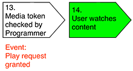

# Noções básicas sobre métricas do lado do servidor {#understanding-server-side-metrics}

>[!NOTE]
>
>O conteúdo desta página é fornecido apenas para fins informativos. O uso desta API requer uma licença atual do Adobe. Não é permitida nenhuma utilização não autorizada.

## Introdução {#intro}

Este documento descreve as métricas do lado do servidor de autenticação da Adobe Primetime geradas pelo serviço Entitlement Service Monitoring (ESM). Ele não descreve os mesmos eventos que são vistos da perspectiva do lado do cliente (o que os programadores veriam se implementassem um serviço de medição como o Adobe Analytics em sua página/aplicativo).

## Resumo dos eventos {#events_summary}

Do ponto de vista do servidor de autenticação da Adobe Primetime, os seguintes eventos são gerados:

* **Eventos gerados no fluxo de autenticação**(Um logon real com o MVPD)

   * Notificação de Tentativa de Autenticação - Isso é gerado quando o usuário é enviado ao site de logon do MVPD.
   * Notificação de Autenticação pendente - Se o usuário conseguir fazer logon com seu MVPD, isso será gerado quando o usuário for redirecionado de volta à autenticação do Primetime.
   * Notificação de Autenticação Concedida - Gerada quando o usuário volta ao site do Programador e recupera com êxito o token de autenticação da autenticação do Primetime.
* **Fluxo de autorização** (Apenas uma verificação para autorização com um MVPD)\
  *Pré-requisito:* Um token de autenticação válido
   * Notificação de tentativa de AuthZ
   * Notificação de AuthZ concedida
* **Solicitação de reprodução bem-sucedida**\
  *Pré-requisito:* Tokens de AuthN e AuthZ válidos
   * Notificação de uma verificação com autenticação da Adobe Primetime
   * Uma solicitação de reprodução requer uma autenticação concedida e uma autorização concedida

O número de usuários únicos é abordado em detalhes na seção [Usuários únicos](#unique-users) abaixo. Como uma visão geral, já que as respostas de autenticação e autorização concedidas geralmente são armazenadas em cache, as seguintes fórmulas geralmente se aplicam:

* Número de tentativas de AuthN \> Número de AuthN concedido
* Número de tentativas de AuthZ \> Número de AuthZ concedidas
* Número de tentativas de AuthZ \> Número de AuthN concedidas (geralmente)
* Número de solicitações de reprodução bem-sucedidas \> Número de AuthZ concedidas

### Exemplo {#example}

O exemplo a seguir mostra as métricas do lado do servidor para um mês para uma marca:

| Métrica | MVPD 1 | MVPD 2 | … | MVPD n | Total |
| -------------------------- | ------ | ------ | - | ------ | ---------------------------------------------- |
| Autenticações com êxito | 1125 | 2892 |   | 2203 | SUM(MVP1+...MVPD n) |
| Autorizações bem-sucedidas | 2527 | 5603 |   | 5904 | SUM(MVP1+...MVPD n) |
| Solicitações de reprodução bem-sucedidas | 4201 | 10518 |   | 10737 | SUM(MVP1+...MVPD n) |
| Usuários únicos | 1375 | 2400 |   | 2890 | SOMA de todos os usuários para todos os MVPDs desduplicados\* |
| Tentativas de Autenticações | 2147 | 3887 |   | 3108 | SUM(MVP1+...MVPD n) |
| Tentativas de Autorização | 2889 | 6139 |   | 6039 | SUM(MVP1+...MVPD n) |

 

Nesse caso, a desduplicação não deve ter efeito, pois usuários MVPD diferentes não devem receber a mesma ID de usuário. Ao fazer uma soma para duas marcas diferentes, mas a mesma MVPD, o efeito da desduplicação deve ser muito maior.

## Acionadores de eventos {#event_triggers}

### Novo usuário - Fluxo completo {#new-user-full-flow}

O gráfico a seguir descreve os eventos e as etapas para um usuário sem token de autenticação (um novo usuário ou um usuário cujo token de autenticação expirou):

O fluxo envolve viagens de ida e volta para MVPDs para Autenticação (#5 para \#7) e Autorização (\#11).

Após a conclusão do fluxo, os tokens de Autenticação e Autorização são armazenados em cache no dispositivo do usuário. Os valores de Tempo de vida (TTL) para tokens de autenticação estão entre 6 horas e 90 dias. A expiração do token de AuthN força automaticamente uma expiração do token de AuthZ. O valor de TTL do token de autorização geralmente é de 24 horas.

| Eventos do lado do servidor acionados | <ul><li>Tentativa de autenticação, autenticação pendente, autenticação concedida</li><li>Tentativa de autorização, autorização concedida</li><li>Solicitação de reprodução bem-sucedida</li></ul> |
|---|---|

### Usuário recorrente - Tokens de AuthZ e AuthN armazenados em cache

Para usuários que têm tokens AuthZ e AuthN válidos em cache, as seguintes etapas ocorrem:

Isso é acionado automaticamente ao chamar `getAuthorization()`, e envolve apenas verificações com autenticação Adobe Primetime. O MVPD não está envolvido nesse fluxo.

| Eventos do lado do servidor acionados | * Solicitação de reprodução bem-sucedida |
|---|---|

### Usuário recorrente - Tokens de AuthN armazenados em cache, token de AuthZ expirado

Para usuários que ainda têm tokens AuthN válidos, as seguintes etapas ocorrem:

Esse fluxo envolve uma viagem de ida e volta para o MVPD.

| Eventos do lado do servidor acionados | <ul><li>Tentativa de autorização, Autorização OK</li><li>Solicitação de reprodução bem-sucedida</li> |
|---|---|

## Eventos de autenticação {#authn_events}

### Tentativa de autenticação {#authentication-attempt}

Como ilustrado no diagrama acima, os eventos de autenticação só são acionados quando o usuário faz uma viagem de ida e volta para o MVPD; os eventos de autenticação não incluem autenticações de token em cache.

O evento de tentativa de autenticação é acionado depois que o usuário clica em um MVPD específico no seletor.

* O primeiro evento no lado do MVPD próximo a esse é o carregamento de página
* A autenticação do Adobe Primetime não conta tentativas repetidas do usuário para fazer logon na página MVPD (senha incorreta, tente novamente)
* tentativas múltiplas são contadas como uma tentativa
* Alguns MVPDs também executam Autorização na etapa Autenticação, e o usuário não é redirecionado se a autorização falhar.

### Autenticação pendente {#authentication-pending}

Esse evento ocorre quando o processo de redirecionamento para a autenticação da Adobe Primetime foi iniciado.

### Autenticação concedida {#authentication-granted}

O usuário é um assinante conhecido do MVPD, normalmente com uma assinatura de TV paga, mas às vezes com acesso apenas à Internet. Uma autenticação bem-sucedida pode ocorrer porque o usuário inseriu credenciais válidas explicitamente com seu MVPD ou porque ele inseriu credenciais válidas anteriormente e teve a opção &quot;Lembre-se de mim&quot; marcada (e a sessão anterior não expirou).

O MVPD envia, portanto, uma resposta positiva da autenticação do Adobe Primetime à solicitação de autenticação, e a autenticação do Adobe Primetime cria uma *Token de autenticação*.

* A autenticação geralmente é armazenada em cache por um longo período de tempo (um mês ou mais). Devido a isso, os eventos de autenticação não estarão mais presentes até que o token expire e o fluxo seja iniciado novamente.
* Entrar de outro site/aplicativo por meio do Logon único não acionará eventos de autenticação.

### Autenticação Comcast {#comcast-authentication}

A Comcast tem um fluxo de AuthN diferente em comparação ao restante dos MVPDs.

Os seguintes recursos descrevem as diferenças:

* **Comportamento do cookie da sessão**: causa uma remoção completa de todos os tokens de autenticação depois que o usuário fecha o navegador. Esse recurso está presente somente na Web. O objetivo principal é garantir que sua sessão Comcast não seja mantida em computadores não seguros/compartilhados. O impacto é que haverá mais tentativas de autenticação/fluxos concedidos do que para o restante dos MVPDs.

* **AuthN por requestorID**: Comcast não permite que o estado AuthN seja armazenado em cache de uma ID do solicitante para outra. Devido a isso, cada site/aplicativo tem que ir para a Comcast para obter um token de autenticação. Além das considerações sobre a experiência do usuário, o impacto, conforme acima, é que mais tentativas de autenticação/eventos concedidos serão gerados.

* **Autenticação passiva**: para melhorar a experiência do usuário, mas ainda manter a funcionalidade AuthN per requestorID, um fluxo de autenticação passivo ocorre em um iFrame oculto. O usuário não verá nada, mas os eventos ainda serão acionados como antes.

Se o usuário clicar em &quot;Lembre-se de mim&quot; na página de logon Comcast, as visitas subsequentes a essa página (em um período de 2 semanas) serão apenas um redirecionamento rápido de volta. Caso contrário, os usuários terão que se autenticar na página.

### Autenticação sem sucesso {#unsuccessful-authentication}

Uma autenticação sem sucesso não é um evento per se na autenticação do Adobe Primetime, mas pode ser computada como a diferença entre tentativas e sucessos.

Na versão de maio de 2013, a autenticação do Adobe Primetime adicionará códigos de erro para autenticações malsucedidas que são causadas por erros de sistema ou de rede, incluindo erros de DRM (falha na vinculação de token) e erros de LSO (sem espaço para gravar o token etc).

### Índice de conversão de autenticação {#authenitication-conversion-rate}

Uma métrica interessante que os programadores podem rastrear é a taxa de conversão de autenticação, calculada como (solicitações de AuthN/AuthN concedidas)%.

Algumas observações sobre as métricas:

* Como é uma métrica baseada em eventos, ela realmente não reflete a taxa de conversão de usuário única. Se um usuário tentar oito vezes e for bem-sucedido na nona vez, isso refletirá muito mal na taxa de conversão acima.
* Não há como (ainda) calcular uma conversão de autenticação baseada em exclusividade na autenticação do Adobe Primetime (no lado do servidor).
* Se houver tentativas automáticas de autenticação no site/aplicativo, a métrica acima também será distorcida.

## Eventos de autorização {#authorization_events}

### Tentativa de autorização {#authorization_attempt}

Além de obter um token de autenticação, os usuários também devem obter um token de autorização antes de reproduzir o conteúdo. Isso geralmente acontece após a autenticação ou se o token de autorização expirar. Como essa verificação é feita no lado do servidor (dos servidores de autenticação da Adobe Primetime para os servidores MVPD), o usuário não precisa fazer nada.

### Autorização concedida {#authorization-granted}

Uma &quot;autorização concedida&quot; indica que a assinatura do usuário autenticado inclui a programação solicitada.

Observe que nem todos os MVPDs suportam uma etapa de autorização separada; para algumas autenticações, é equiparado a autorização. O MVPD envia à autenticação do Adobe Primetime uma resposta bem-sucedida à solicitação de AuthZ do backchannel, e a autenticação do Adobe Primetime cria um token de AuthZ.

* O token de AuthZ é armazenado em cache por um período, normalmente 24 horas. Durante esse período, nenhum evento de AuthZ será acionado.
* Alguns MVPDs funcionam com Autorizações no nível do ativo, outros funcionam com Autorizações no nível do canal; - dependendo de qual é usado, mais ou menos eventos AuthZ são acionados. Mesmo para autorização no nível do canal, o armazenamento em cache está em vigor. Portanto, se o mesmo ativo for solicitado em menos de 24 horas, nenhum evento será acionado.

### Autorização negada {#authorization-denied}

Se uma autorização for negada, o usuário autenticado não terá uma assinatura confirmada para a programação solicitada. A causa mais provável é que o canal não faça parte do pacote de assinatura do usuário, mas isso também pode refletir um usuário que tenha somente acesso à Internet do MVPD.

Para alguns MVPDs, os usuários são autenticados com êxito, mesmo que tenham apenas uma assinatura da Internet do MVPD (sem assinatura de TV paga). Nesse caso, mesmo que o canal para o qual o usuário solicita autorização esteja no pacote básico, a autorização será negada.

Alguns MVPDs oferecem mensagens de erro personalizadas para recusas AuthZ que podem incluir ofertas para atualizar seu pacote.

### Índice de conversão de autorização {#authorization-conversion-rate}

A taxa de conversão da Autenticação pode ser calculada como (solicitações AuthZ / AuthZ concedida)%.

### Solicitação de reprodução bem-sucedida {#successful-play-request}

Um usuário autenticado e autorizado tem permissão para exibir conteúdo protegido.

Após uma solicitação de reprodução bem-sucedida, a autenticação do Adobe Primetime gera um token de mídia de curta duração afirmando que o usuário tem direito a visualizar o vídeo solicitado. O programador usa esse token de mídia para validação adicional do visualizador potencial. Os tokens de mídia são rastreados como solicitações de reprodução bem-sucedidas.

* A autenticação do Adobe Primetime faz *não* rastreie se a reprodução de vídeo realmente começou após gerar o Token de mídia. Por exemplo, se houver uma restrição geográfica no conteúdo, a transação ainda será contada como uma solicitação de reprodução bem-sucedida, mesmo que o fluxo nunca seja iniciado.
* Como os tokens AuthN e AuthZ armazenam a resposta do MVPD em cache por um período de tempo, o evento de solicitação de reprodução bem-sucedida é o evento mais frequente nas métricas.

## Usuários únicos {#unique-users}

### Definição {#definition}

Após uma autenticação bem-sucedida, a autenticação do Adobe Primetime rastreia a existência de um usuário único, com base no valor da ID de usuário MVPD retornada.  Esse valor se baseia nas informações de logon do usuário, mas não contém informações que possam ser identificadas.

Esse valor também é passado para o site/aplicativo no retorno de chamada sendTrackingData.

Esse valor pode ser persistente entre dispositivos (o MVPD produz o mesmo valor para um determinado usuário, independentemente de onde o logon ocorra) ou temporário (para cada logon, um novo valor é gerado, que o MVPD mapeia em seu back-end. Normalmente, os valores fornecidos pelos MVPDs para a autenticação da Adobe Primetime são persistentes em todas as sessões e dispositivos, mas, como observado, a persistência não é garantida nem validada.

Esse valor é usado como uma maneira de calcular os usuários únicos. O valor relatado (por ID/intervalo/MVPD do solicitante) é desduplicado para o intervalo específico. Portanto, a soma dos usuários únicos por dia geralmente é diferente do valor mensal, com o valor mensal tendo o valor mais baixo.

Esse número inclui todos os eventos de autenticação da Adobe Primetime, menos Tentativas de autenticação (que não têm ID de usuário), mas inclui tentativas de autorização (e possivelmente falhas).

### Exemplos {#examples}

#### Dia 1 {#day1}

O usuário XYZ acessa o site para assistir a um vídeo.

Eventos acionados:

* Tentativa de autenticação (ainda sem usuário único)
* AuthN concedido
   * neste ponto, identificamos exclusivamente o usuário com base no que o MVPD retorna; portanto, a contagem diária de usuários únicos é aumentada em 1
   * o token de autenticação é armazenado em cache por 30 dias
* Tentativa de AuthZ/evento concedido
   * Token de autenticação armazenado em cache por 1 dia
* Evento de solicitação de reprodução bem-sucedido

#### Dia 1 (Mais Tarde) {#day1-later-on}

O usuário XYZ assiste a outro vídeo.

Eventos acionados:

* Evento de solicitação de reprodução bem-sucedido (o restante é armazenado em cache)
* Nenhum aumento nos únicos diários ou mensais

#### Dia 3 {#day3}

O usuário XYZ assiste a outro vídeo.

Eventos acionados:

* Tentativa de AuthZ/evento concedido
   * Desde que o cache de 1 dia do dia 1 expirou
* Evento de solicitação de reprodução bem-sucedido (o restante é armazenado em cache)
* Usuários únicos diários aumentados em 1 - únicos mensais ainda são 1

#### Dia 31 {#day31}

O usuário XYZ assiste a outro vídeo.

Igual ao dia 1 desde que o cache AuthN expirou.

Se o mesmo usuário não conseguir obter a autorização, a contagem mensal de usuários únicos ainda será aumentada em 1, pois há dois eventos que contêm a ID do usuário: autenticação concedida e tentativa de autorização.

### Logon único (SSO) {#single-sign-on-sso}

Em alguns casos, o número de usuários únicos pode ser maior que o número de autenticações bem-sucedidas. Normalmente, isso ocorre quando muitos usuários entram por meio do SSO de outros sites/aplicativos e só precisam obter autorização no site/aplicativo atual.

### Comparação de usuários únicos do lado do cliente e do lado do servidor {#comparing-client-side-and-server-side-unique-users}

Se o valor da ID do usuário de `sendTrackingData()` é usado no lado do cliente para contar usuários únicos, portanto, os números do lado do cliente e do lado do servidor devem corresponder.

Se as diferenças forem importantes, os seguintes motivos geralmente levam em conta a diferença:

* Únicos de reprodução de vídeo versus todos os únicos de eventos. Como mencionado, a autenticação do Adobe Primetime conta usuários únicos para todos os eventos, exceto tentativas de Autenticação. Isso significa que se o usuário se autenticar apenas (na página), mas não visualizar um vídeo, um aumento exclusivo na contagem de usuários ainda será acionado.

* Contagem de usuários que falharam na autorização - A autenticação do Adobe Primetime conta esses usuários também no número relatado.

<!--
## Related Information {#related-information}

- [Entitlement Service Monitoring API](/help/authentication/entitlement-service-monitoring-api.md)

-->
