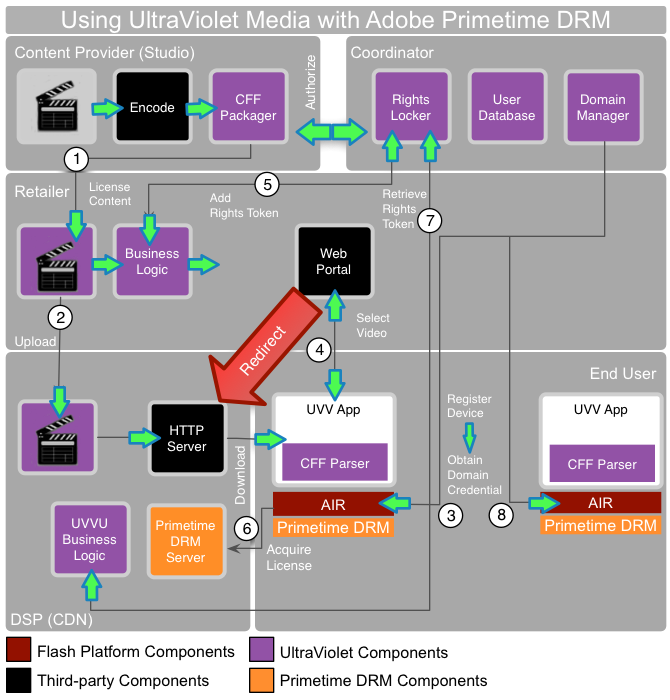

# Mídia UltraViolet e DRM Adobe Primetime {#ultraviolet-media-and-adobe-primetime-drm}

O Adobe Primetime DRM pode ser usado com outras soluções de transmissão de conteúdo de terceiros para configurar um ecossistema de distribuição de mídia completo e seguro baseado em DRM.

UltraViolet é um sistema de autenticação de direitos digitais e distribuição baseada em nuvem que permite aos consumidores de conteúdo de entretenimento da casa digital transmitir e fazer download de conteúdo adquirido através de várias plataformas e dispositivos. O conteúdo UltraViolet é baixado (ou transmitido) em um CFF (Common File Format) usando o CENC (Common Encryption, Criptografia comum).

É fácil configurar um sistema UltraViolet junto com o Adobe Primetime DRM. O caso de uso a seguir descreve o comportamento do fluxo de conteúdo:

<!---->

1. O proprietário do conteúdo codifica e compacta o conteúdo em CFF. O conteúdo empacotado é licenciado para distribuição a um varejista.
1. O varejista faz upload do conteúdo para um provedor de serviços digitais, como o CDN. O conteúdo agora está disponível para download. Algumas dessas funções podem ser desempenhadas por uma ou mais empresas.

   O usuário final tem um dispositivo compatível com o Adobe AIR. Além disso, o usuário deve instalar uma aplicação compatível com UltraViolet. O aplicativo inclui o código necessário para analisar o CFF e apresentá-lo para consumo pelo tempo de execução. Todas as operações criptográficas confidenciais são tratadas no tempo de execução seguro.
1. O aplicativo pode acionar uma associação de domínio para o dispositivo, que interage com o coordenador. O coordenador mantém um Rights Locker, um banco de dados de usuários e domínios. O gerenciador de domínio do coordenador é criado usando o SDK do DRM do Primetime para implementar operações de ingresso/saída de domínio específicas do DRM do Primetime.
1. O usuário pode usar o aplicativo para selecionar um vídeo que deseja adquirir do varejista. O varejista normalmente fornece um portal da Web e lida com toda a lógica de negócios.
1. O varejista interage com o coordenador para adicionar um token de direitos. O varejista então redireciona a solicitação para o provedor de serviços para o download do conteúdo real.
1. Se o dispositivo ainda não tiver uma licença para o conteúdo, ele acionará uma solicitação de licença usando o CFF. A solicitação normalmente inclui um certificado de domínio, credenciais de usuário e informações sobre o aplicativo. O provedor de serviços opera um Servidor de Licenças DRM do Primetime (desenvolvido usando o SDK DRM do Primetime) que segue as especificações UltraViolet.
1. A lógica de negócios UltraViolet do provedor de serviços interage com o coordenador conforme necessário para recuperar o token de direitos apropriado para determinar se uma licença de conteúdo deve ser emitida.

   A licença de conteúdo está vinculada ao domínio. O aplicativo cliente pode inserir a licença no arquivo CFF. O conteúdo agora pode ser reproduzido de volta no aplicativo, com toda a proteção e aplicação de regras de uso tratadas pelo componente DRM do Primetime no tempo de execução.
1. Outros dispositivos e aplicativos de propriedade do mesmo usuário final podem ser registrados no coordenador. O conteúdo agora pode ser carregado em outros dispositivos DRM do Primetime sem exigir nenhuma transação externa.
