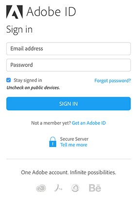
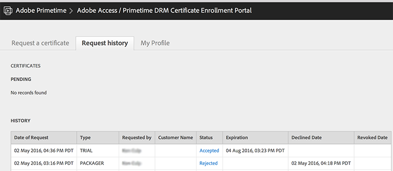

# Receber Provisionamento (Contas etc.) {#get-provisioned-accounts-etc}

Para começar a usar o Primetime DRM Cloud, viabilizado pelo ExpressPlay, é necessário configurar contas do Adobe Cert e do ExpressPlay com a ajuda do representante do Adobe.

1. Entre em contato com o representante da Adobe e solicite as contas Adobe Cert e ExpressPlay necessárias para implementar o Multi-DRM com TVSDK.

   Forneça ao representante da Adobe o endereço de email que você usará como ponto de contato. O Adobe cria duas contas para você:

   * ***Conta do Portal de Certificados*** - ( https://certportal.primetime.adobe.com) : A *Equipe de gerenciamento de registro de certificado de acesso ao Adobe / Primetime DRM* O envia um email para os endereços que você forneceu. O email inclui o URL do portal de certificados Adobe, juntamente com um link para a documentação de registro do certificado Adobe (os documentos mais recentes estão aqui: [Guia de Registro de Certificado](../../../digital-rights-management/certificate-enrollment-guide/about-certs.md)).

   * ***Conta ExpressPlay*** - O Adobe envia um email contendo um link que você usa para registrar-se na sua conta de administrador ExpressPlay.

1. Faça logon no portal de certificados Adobe usando sua Adobe ID (use o mesmo endereço de email fornecido ao representante da Adobe). Se você ainda não tiver uma Adobe ID, poderá criar rapidamente uma seguindo as *Obter uma Adobe ID* link do portal de certificados:

   <!---->

   

1. No portal de certificados Adobe, solicite uma *Avaliação* certificado.

   Para a avaliação de vários DRMs, um único certificado de avaliação cobrirá todos esses aspectos da proteção de conteúdo: embalagem, licenciamento e transporte. Você precisará fornecer o seu próprio [CSR](../../../digital-rights-management/certificate-enrollment-guide/request-certs/gen-cert-signing-req.md) para fazer uma solicitação de certificado:
   <!---->

   

   O Adobe enviará um email indicando a aceitação ou rejeição de sua solicitação de certificado. Você pode ver o status da(s) solicitação(ões) de certificado no *Histórico de solicitações* no portal de certificados:
   <!---->

   

1. Crie sua conta de administrador do ExpressPlay.

   Siga o link para o ExpressPlay que o Adobe forneceu. Isso abre o *Criar uma conta* página no ExpressPlay. Preencha as informações necessárias e envie o formulário. Você receberá um email do `operations@expressplay.com` contendo um link de ativação válido por uma semana. Após a ativação, configure o serviço ExpressPlay:
   <!---->

   

   Ao criar seu serviço, você verá sua própria página de Administrador. Junto com alguns campos de rastreamento de atividades, você verá seus campos de Produção e Teste *autenticadores do cliente* (Chaves de API) e seus URLs de serviço de Produção e Teste:

   <!---->

    

1. Se você estiver usando o FairPlay, há etapas adicionais envolvidas (no site do desenvolvedor do Apple) para se configurar com o ExpressPlay. Consulte [Habilitar o serviço ExpressPlay para FairPlay](../../multi-drm-workflows/p-l-and-p/fairplay-workflow.md#enable-expressplay-service-for-fairplay) para obter instruções.
