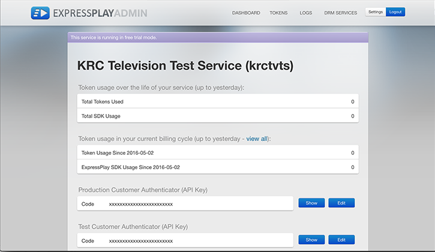

# Chaves, IDs e autenticadores{#keys-ids-and-authenticators}

Para implementar o DRM, você precisa de certificados e chaves específicos, incluindo uma chave de criptografia de conteúdo ou CEK para criptografar seu conteúdo, um autenticador do cliente para proteger as comunicações com servidores ExpressPlay e CEKSIDs para identificar suas chaves de criptografia de conteúdo armazenadas em um sistema de gerenciamento de chaves.

Você precisa desses itens para empacotar, licenciar e reproduzir seu conteúdo protegido:

## Chave de criptografia do conteúdo {#section_8D16D36BAE3B4D1F92A0C43567D782D0}

A Chave de criptografia de conteúdo (CEK) é uma cadeia de 16 bytes usada para criptografar o conteúdo.

**O que é o CEK?** - O CEK é a chave que seu empacotador usa para criptografar seu conteúdo. É uma string hexadecimal codificada de 16 bytes.

**De onde vem o CEK?** - Você (o provedor de conteúdo) cria essa chave sozinho, usando uma ferramenta como OpenSSL ou Notepad++. Por exemplo:

```
openssl rand 16 -hex > cek_hex_file
```

ou (para o Adobe Offline Packager):

1. Gere a string hexadecimal codificada de 16 bytes, como acima, ou use outra ferramenta. Será semelhante a:

   ```
   7debe705d938c76bfd886f077b8fa5f7
   ```

1. Abra o Notepad++ e cole na sequência hexadecimal de 16 bytes.
1. Converta esse valor de ASCII hexadecimal pela codificação Base64 do valor para criar seu [!DNL keyfile.bin]. (Isso é abordado em [](../../multi-drm-workflows/quick-start/package-your-content.md).)

**Mesma chave, nome diferente?** - Sim, você pode ver o CEK referenciado por outros nomes em outros locais, como:

* ** [!DNL [algum arquivo].bin]** - O Adobe Offline Packager se refere ao CEK como [!DNL [algum arquivo].bin]; por exemplo, * [!DNL Keyfile.bin]* - Este é o seu CEK conforme usado pelo Adobe Offline Packager, na forma de um arquivo na máquina usada para empacotar conteúdo.

  Você pode usar &quot;Base64&quot; para sua string hexadecimal CEK aleatória e salvá-la como um arquivo (por exemplo, [!DNL keyfile.bin]), normalmente localizado no [!DNL creds] diretório abaixo [!DNL offlinepkgr/]. No arquivo de configuração do Packager (por exemplo, você pode chamá-lo de [!DNL widevine.xml] se estiver empacotando para o Widevine (DRM), consulte seu CEK no arquivo de configuração da seguinte maneira:

  ```
  <config>  
    <in_path>sample.mp4</in_path>  
    <out_type>dash</out_type>
    <b><key_file_path>keyfile.bin</key_file_path></b> // This is your CEK  
    […] 
  </config> 
  ```

* **Chave de conteúdo** - Você também pode ver o CEK chamado de Chave de conteúdo em chamadas ( `&contentKey=`), em mensagens de erro, em tíquetes de suporte e em outra documentação.

**Quando/onde usá-lo?**

1. Primeiro, você precisa ter o CEK disponível na máquina em que está fazendo sua embalagem. Sua ferramenta de empacotamento usa seu CEK para criptografar seu conteúdo.
1. Em segundo lugar, você precisa armazenar o CEK em alguma forma de Sistema de Gerenciamento de Chaves (KMS), com cada CEK associado ao seu próprio [Chave de criptografia do conteúdo](../../multi-drm-workflows/glossary/glossary-cek.md). Você pode criar seu próprio KMS ou usar [Armazenamento de chaves do ExpressPlay](https://www.expressplay.com/developer/key-storage/). Isso permite que sua loja (seu servidor de direitos, que lida com o direito do cliente e a provisão do token de licença) obtenha um token de licença para o cliente do KMS usando uma ID de chave em vez do CEK real (isso é muito mais seguro).

## ID de armazenamento da chave de criptografia do conteúdo {#section_0C94F54970E04BDB82DE3C8A33A62CD4}

A ID de armazenamento da chave de criptografia de conteúdo (CEKSID) identifica exclusivamente a chave armazenada que descriptografa um conteúdo de vídeo criptografado.

**O que é o CEKSID?** - O CEKSID é o identificador exclusivo de uma Chave de criptografia de conteúdo (CEK). O CEK é necessário para desbloquear o conteúdo protegido; o CEKSID é necessário para acessar o CEK de onde ele está armazenado. Ao testar sua configuração, você pode fornecer um CEKSID e um CEK aleatórios no momento do empacotamento, desde que use as mesmas informações para as verificações de licenciamento e reprodução.

**De onde ela vem?** - Você (o provedor de conteúdo) pode criar essa ID sozinho ou você pode usar um serviço como [Armazenamento de chaves do ExpressPlay](https://www.expressplay.com/developer/key-storage/) para gerar CEKSIDs para cada um dos CEKs (e armazenar ambos). Além disso, você pode usar CEKSIDs gerados aleatoriamente ou empregar um esquema que atenda ao seu modelo de negócios. Por exemplo, você pode usar CEKSIDs que são cadeias de caracteres significativas em vez de cadeias de caracteres hexadecimais aleatórias (o nome da ID pode consistir em assuntos, datas, horas etc.)

**Como se chama o CEKSID?** - É por vezes referido como um *ID de conteúdo*.

## Autenticador do cliente {#section_F9DDBAA54C544D82A42320CBEEB6CD74}

O autenticador do cliente é uma chave que você obtém do ExpressPlay ao configurar uma conta de administrador lá. O autenticador é usado em comunicações com servidores ExpressPlay.

**Quais são os autenticadores do cliente?** - Os dois autenticadores de clientes compõem o par de IDs — um para teste, um para produção — que o ExpressPlay registra para você quando você se inscreve no serviço. Eles estão sempre disponíveis para você em sua página de administração do ExpressPlay:
<!--<a id="fig_c5h_xdl_wv"></a>-->



**Quando devo usar isto?** - Você inclui isso em todas as chamadas para servidores ExpressPlay — por exemplo, servidores de licença, [Armazenamento de chaves ExpressPlay](https://www.expressplay.com/developer/key-storage/), e outras chamadas.
