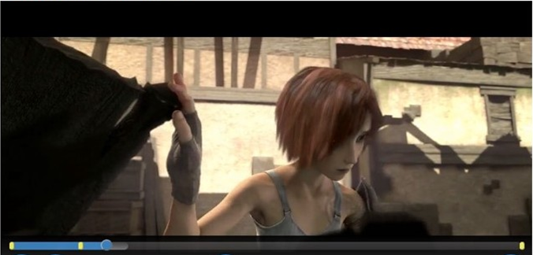

# Inspecione a linha do tempo de reprodução{#inspect-the-playback-timeline}

Você pode obter uma descrição da linha do tempo associada ao item selecionado no momento que está sendo reproduzido pelo TVSDK do navegador. Essa descrição é útil quando seu aplicativo exibe um controle de barra de depuração personalizado no qual as seções de conteúdo que correspondem ao conteúdo do anúncio são identificadas.

Esta é uma amostra da implementação:
<!---->

{width=&quot;676pt&quot;}

