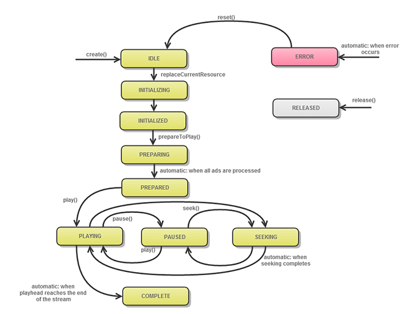

# Ciclo de vida do objeto MediaPlayer{#mediaplayer-object-lifecycle}

Do momento em que você cria a ocorrência de MediaPlayer ao momento em que você a encerra (reutiliza ou remove), essa ocorrência conclui uma série de transições entre os status.

Algumas operações são permitidas somente quando o reprodutor está em um estado específico. Por exemplo, chamar `play` em IDLE não é permitido. Você pode chamar esse status somente depois que o reprodutor atingir o estado PREPARADO.

Para trabalhar com status:

* Você pode recuperar o estado atual do `MediaPlayer` usando o `MediaPlayer.status` propriedade.

  ```
  function get status():String;
  ```

* A lista de status é definida em `MediaPlayer.PlayerStatus`.

Diagrama de transição de estado para o ciclo de vida de um `MediaPlayer` instância:
<!--<a id="fig_1C55DE3F186F4B36AFFDCDE90379534C"></a>-->



A tabela a seguir fornece detalhes adicionais:

<table id="table_426F0093E4214EA88CD72A7796B58DFD"> 
 <thead> 
  <tr> 
   <th colname="col1" class="entry"> <span class="codeph"> MediaPlayerStatus </span> </th> 
   <th colname="col2" class="entry"> Ocorre quando </th> 
  </tr> 
 </thead>
 <tbody> 
  <tr> 
   <td colname="col1"> <span class="codeph"> OCIOSO </span> </td> 
   <td colname="col2"> <p> Seu aplicativo solicitou um novo reprodutor de mídia instanciando <span class="codeph"> MediaPlayer </span>. O reprodutor recém-criado está aguardando que você especifique um item de reprodutor de mídia. </p> </td> 
  </tr> 
  <tr> 
   <td colname="col1"> <span class="codeph"> INICIALIZANDO </span> </td> 
   <td colname="col2"> <p>Seu aplicativo chamou <span class="codeph"> MediaPlayer.replaceCurrentResource </span>e o reprodutor de mídia está carregando. </p> </td> 
  </tr> 
  <tr> 
   <td colname="col1"> <span class="codeph"> INICIALIZADO </span> </td> 
   <td colname="col2"> <p>O TVSDK definiu com êxito o item do reprodutor de mídia. </p> </td> 
  </tr> 
  <tr> 
   <td colname="col1"> <span class="codeph"> PREPARANDO </span> </td> 
   <td colname="col2"> <p>Seu aplicativo chamou <span class="codeph"> MediaPlayer.prepareToPlay </span>. O reprodutor de mídia está carregando o item de reprodutor de mídia e os recursos associados. </p> <p>Dica: pode ocorrer algum buffering na mídia principal. </p> <p>O TVSDK está preparando o fluxo de mídia e tentando executar a resolução e a inserção de anúncios (se habilitada). </p> <p>Dica: para definir a hora de início como um valor diferente de zero, chame <span class="codeph"> prepareToPlay(startTime) </span> com o tempo em milissegundos. </p> </td> 
  </tr> 
  <tr> 
   <td colname="col1"> <span class="codeph"> PREPARADO </span> </td> 
   <td colname="col2"> <p>O conteúdo está preparado e os anúncios foram inseridos na linha do tempo, ou o procedimento de publicidade falhou. O buffering ou a reprodução podem começar. </p> </td> 
  </tr> 
  <tr> 
   <td colname="col1"> <span class="codeph"> REPRODUÇÃO </span> </td> 
   <td colname="col2"> <p>Seu aplicativo chamou <span class="codeph"> play </span>, portanto, o TVSDK está tentando reproduzir o vídeo. Alguns buffering pode ocorrer antes que o vídeo seja reproduzido. </p> </td> 
  </tr> 
  <tr> 
   <td colname="col1"> <span class="codeph"> PAUSADO </span> </td> 
   <td colname="col2"> <p>À medida que o aplicativo é reproduzido e pausa a mídia, o reprodutor de mídia se move entre esse estado e a função REPRODUZINDO. </p> </td> 
  </tr> 
  <tr> 
   <td colname="col1"> <span class="codeph"> BUSCANDO </span> </td> 
   <td colname="col2"> <p>O reprodutor de mídia está procurando a posição correta durante uma pausa ou reprodução. Para determinar quando a busca foi iniciada ou encerrada, acompanhe o <span class="codeph"> SeekEvent.SEEK_BEGIN </span> e <span class="codeph"> SeekEvent.SEEK_END </span> eventos. </p> </td> 
  </tr> 
  <tr> 
   <td colname="col1"> <span class="codeph"> CONCLUÍDO </span> </td> 
   <td colname="col2"> <p>O reprodutor atingiu o fim do fluxo e a reprodução foi interrompida. </p> </td> 
  </tr> 
  <tr> 
   <td colname="col1"> <span class="codeph"> LANÇADO </span> </td> 
   <td colname="col2"> <p>Seu aplicativo lançou o reprodutor de mídia, que também libera os recursos associados. Não é mais possível usar esta instância </p> </td> 
  </tr> 
  <tr> 
   <td colname="col1"> <span class="codeph"> ERRO </span> </td> 
   <td colname="col2"> <p>Ocorreu um erro durante o processo. Um erro também pode afetar o que o aplicativo pode fazer a seguir. </p> </td> 
  </tr> 
 </tbody> 
</table>

>[!TIP]
>
>Você pode usar o status para fornecer feedback sobre o processo (por exemplo, um ponteiro enquanto aguarda a próxima alteração de status) ou para dar o próximo passo na reprodução da mídia, como aguardar o status apropriado antes de chamar o próximo método.
